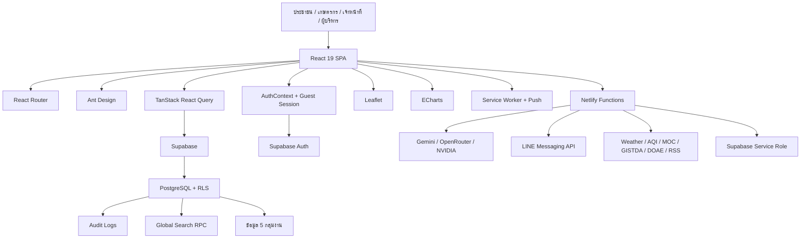
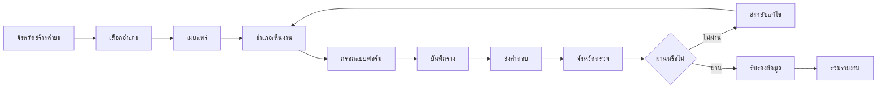
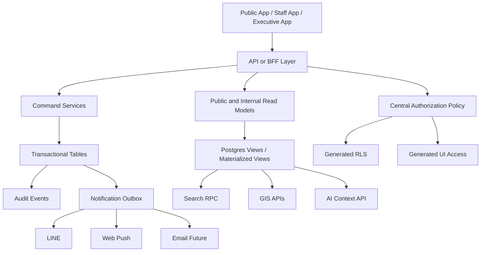

# NPT Smart Agri Dashboard

## รายงานรีวิวระบบและโค้ดทั้งโปรเจกต์ ฉบับสถาปัตยกรรม ผลิตภัณฑ์ ความปลอดภัย และแผนพัฒนา

**วันที่ตรวจ:** 17 กรกฎาคม 2569  
**Repository:** `dragonfly13110/npt_dashboard`  
**Branch:** `main`  
**Commit ที่ใช้อ้างอิง:** `c1d3e93c3643690e7b1450323fe0f43c54b3a3b3`  
**Commit message:** `perf: remove unused soil geometry GIN index`  
**รูปแบบการตรวจ:** Static code review ผ่าน GitHub repository โดยตรวจโครงสร้างไฟล์ เส้นทางหน้าเว็บ นโยบายสิทธิ์ SQL ฟังก์ชันฝั่ง Frontend และ Netlify Functions เอกสารระบบ ชุดทดสอบ และการตั้งค่า Deploy

> ข้อจำกัดของรายงาน: การตรวจครั้งนี้อ่านจากโค้ดใน GitHub โดยตรง แต่ไม่ได้รันระบบจริงในเครื่อง ไม่ได้เชื่อมฐานข้อมูล Production และไม่ได้ยืนยันว่าคำสั่ง `lint`, `test`, `build` ผ่านบน commit นี้ จึงแยกสิ่งที่ยืนยันจากโค้ดออกจากสิ่งที่ต้องทดสอบในระบบจริง

---

# สารบัญ

1. บทสรุปสำหรับผู้บริหาร
2. คะแนนสุขภาพระบบ
3. ระบบนี้ทำอะไรได้บ้าง
4. สถาปัตยกรรมปัจจุบัน
5. รายการหน้าและเส้นทาง
6. รายการฟังก์ชันตามกลุ่มผู้ใช้
7. รายการโมดูลข้อมูล
8. รายการ Netlify Functions และระบบเบื้องหลัง
9. จุดแข็งของโปรเจกต์
10. ข้อผิดพลาดระดับวิกฤต
11. ประเด็นระดับสูง
12. ประเด็นระดับกลาง
13. รีวิว Smart Map
14. รีวิว Dashboard และ Landing Page
15. รีวิวระบบสิทธิ์และฐานข้อมูล
16. รีวิว Data Request Workflow
17. รีวิวความปลอดภัย
18. รีวิวประสิทธิภาพ
19. รีวิวคุณภาพโค้ด
20. รีวิวการทดสอบและ CI/CD
21. ช่องว่างระหว่างเอกสารกับโค้ดจริง
22. สถาปัตยกรรมเป้าหมาย
23. Roadmap 30 วัน, 90 วัน และ 6 เดือน
24. Backlog จัดลำดับความสำคัญ
25. เกณฑ์รับงานและ KPI
26. บทสรุปสุดท้าย

---

# 1. บทสรุปสำหรับผู้บริหาร

NPT Smart Agri Dashboard เติบโตจากเว็บแดชบอร์ดทั่วไปมาเป็นแพลตฟอร์มข้อมูลการเกษตรระดับจังหวัดที่มีขอบเขตกว้างมาก ครอบคลุมหน้าเผยแพร่สาธารณะ ระบบเจ้าหน้าที่ ระบบผู้บริหาร แผนที่เชิงพื้นที่ การนำเข้าข้อมูล การค้นหาข้ามฐานข้อมูล AI Chatbot, LINE Bot, ระบบแจ้งเตือน PWA และเครื่องมือดูแลคุณภาพข้อมูล

มูลค่าหลักของระบบมีความชัดเจน:

- รวมข้อมูลจากหลายกลุ่มงานไว้ที่เดียว
- ลดการเปิดไฟล์ Excel หลายชุด
- ช่วยให้ผู้บริหารเห็นภาพรวมรายจังหวัดและรายอำเภอ
- เปิดข้อมูลสาธารณะให้ประชาชนเข้าถึงได้
- ใช้แผนที่และ AI ช่วยค้นหาและตีความข้อมูล
- มีโครงสร้างสิทธิ์ ผู้ใช้ Audit Log และ Data Quality ซึ่งเกินระดับเว็บทดลองทั่วไป

อย่างไรก็ตาม ระบบอยู่ในช่วงที่ฟังก์ชันโตเร็วกว่าโครงสร้างกำกับ ปัญหาหลักจึงไม่ใช่ระบบมีฟังก์ชันน้อย แต่เป็นฟังก์ชันและนโยบายหลายชุดเริ่มไม่ตรงกัน เช่น:

1. สิทธิ์ใน React, Dataset Catalog และ SQL ใช้รายการตารางคนละชุด
2. Data Request จังหวัดสู่อำเภอใช้ role ไม่ตรงกัน จนอาจใช้งานไม่ได้จริง
3. Guest Session มี fallback secret ที่ไม่ควรใช้
4. Local development และ Production API บางตัวคืนข้อมูลคนละรูปแบบ
5. Dashboard ดึงข้อมูลหลายตารางแบบรอทีละคำสั่ง
6. หน้า Landing มีช่องค้นหาที่ส่งผู้ใช้สาธารณะเข้าสู่เส้นทางภายใน
7. Smart Map มีป้ายประเภท marker ผิดจริงอย่างน้อยหนึ่งจุด
8. เอกสารระบบหลายฉบับล้าสมัยเมื่อเทียบกับโค้ด
9. มี SQL หลายไฟล์ที่สามารถทับ policy กันตามลำดับการรัน
10. มีทั้ง `pnpm-lock.yaml` และ `package-lock.json` ทำให้สภาพแวดล้อม build มีโอกาสไม่ตรงกัน

**คำวินิจฉัยภาพรวม:** ระบบมีศักยภาพสูงและฟังก์ชันมากกว่าระบบข้อมูลจังหวัดทั่วไป แต่ยังควรถือเป็น **Beta ที่ใช้งานจริงได้บางส่วน** จนกว่าจะปิดงานด้านสิทธิ์ การจัดลำดับ migration, public data privacy, performance และ CI protection

---

# 2. คะแนนสุขภาพระบบ

| ด้าน                       | คะแนนเต็ม 10 | ความเห็น                                                                         |
| -------------------------- | -----------: | -------------------------------------------------------------------------------- |
| คุณค่าต่อภารกิจงาน         |          9.2 | แก้ปัญหาข้อมูลกระจัดกระจายได้ตรงจุด                                              |
| ความครบของฟังก์ชัน         |          9.0 | มี Public, Internal, GIS, AI, LINE, PWA, Admin                                   |
| การออกแบบผลิตภัณฑ์         |          7.8 | วิสัยทัศน์ดี แต่การเดินทางของผู้ใช้บางส่วนยังไม่ต่อเนื่อง                        |
| สถาปัตยกรรม Frontend       |          7.2 | มี lazy loading, service, hooks, feature folder แต่ไฟล์หลักบางตัวใหญ่มาก         |
| สถาปัตยกรรม Backend        |          6.8 | Serverless เหมาะกับโครงการ แต่ฟังก์ชันและ policy กระจายหลายจุด                   |
| ความปลอดภัย                |          6.0 | มี RLS, CORS, privacy filter, audit แต่มี policy drift และ guest secret fallback |
| การคุ้มครองข้อมูลส่วนบุคคล |          6.5 | มีระบบกรอง แต่ยังเป็น deny-list และบาง endpoint ใช้ service role                 |
| ประสิทธิภาพ                |          6.4 | มี cache และ lazy loading แต่ dashboard ยิง query จำนวนมาก                       |
| คุณภาพโค้ด                 |          6.7 | มีแนวคิดกลางที่ดี แต่เกิด duplication และไฟล์ขนาดใหญ่                            |
| การทดสอบ                   |          7.6 | มี Unit, Integration, E2E หลายชุด เป็นจุดแข็ง                                    |
| CI/CD                      |          6.7 | มี GitHub Actions แต่ควรผูก branch protection                                    |
| เอกสาร                     |          7.0 | เอกสารเยอะ แต่บางฉบับไม่ตรงกับโค้ดล่าสุด                                         |
| ความพร้อม Production       |          6.2 | ควรแก้ Critical และ High ก่อนประกาศเป็นระบบหลัก                                  |

**คะแนนรวมโดยประมาณ: 7.2/10**

---

# 3. ระบบนี้ทำอะไรได้บ้างในปัจจุบัน

## 3.1 Public Data Portal

- Landing Page
- Interactive Dashboard
- Smart Map
- คู่มือออนไลน์และบทความ
- Business Model Canvas
- ข้อมูลแปลงใหญ่
- Smart Farmer และ Young Smart Farmer
- กลุ่มส่งเสริมอาชีพ
- กลุ่มยุวเกษตรกร
- วิสาหกิจชุมชน
- ท่องเที่ยวเชิงเกษตร
- พื้นที่การเกษตร
- มาตรฐาน GAP
- ราคาสินค้าเกษตร
- AI พยากรณ์โรคและแมลง
- จุดความร้อน
- Data Dictionary
- Chatbot หน้า Landing
- ข่าวเกษตร
- สภาพอากาศ
- PM2.5 และ AQI
- ความชื้นดิน
- เขื่อนและอ่างเก็บน้ำ
- ศูนย์บริการใกล้ผู้ใช้
- แบบประเมินเว็บไซต์
- ลิงก์หน่วยงานและบริการภายนอก

## 3.2 Internal Dashboard

- Dashboard รวม
- Situation Room
- AI Chatbot ภายใน
- Global Search
- Data Dictionary
- Data Requests
- Farmer Forum
- โปรไฟล์และ LINE account linking
- CRUD เพิ่ม แก้ไข ลบ
- CSV/Excel Import
- CSV Export
- Custom Fields
- Audit History
- PDF Print
- Data Quality
- Visitor Analytics
- Website Evaluations
- User Management
- Audit Log
- Recent Activities

## 3.3 Smart Map

- Leaflet และ React Leaflet
- Basemap selector
- ขอบเขตอำเภอและตำบล
- Choropleth ตามตัวชี้วัด
- พื้นที่การเกษตร
- ครัวเรือนเกษตรกร
- วิสาหกิจชุมชน
- แปลงใหญ่
- จุดความร้อน
- ศพก.
- กลุ่มยุวเกษตรกร
- กลุ่มส่งเสริมอาชีพ
- กลุ่มแม่บ้านเกษตรกร
- แปลงพยากรณ์
- ชั้นชุดดิน
- สภาพอากาศและ PM2.5 รายอำเภอ
- Drill-down จังหวัด อำเภอ ตำบล
- Detail Panel
- Comparison Dialog
- AI Insight
- Simulation บางประเภท
- BBox filtering
- Layer status

## 3.4 AI, Search, LINE และ PWA

- Internal AI Chatbot
- Landing Chatbot
- LINE AI Bot
- Model selector
- Smart Table และ Smart Chart
- Intent extraction
- Context จากฐานข้อมูล
- Global Search RPC
- Fallback Search หลายตาราง
- Search cache และ recent search
- Prompt Guard
- Token budget
- Key pool
- Internet grounding
- LINE account linking
- Service Worker
- Web App Manifest
- Web Push
- Agricultural alerts

---

# 4. สถาปัตยกรรมปัจจุบัน



---

# 5. รายการหน้าและเส้นทาง

## Public Routes

| Route                                | ฟังก์ชัน              |
| ------------------------------------ | --------------------- |
| `/`                                  | Landing Page          |
| `/manual`                            | รายการคู่มือ          |
| `/manual/:slug`                      | บทความคู่มือ          |
| `/bmc`                               | Business Model Canvas |
| `/interactive-dashboard`             | Dashboard สาธารณะ     |
| `/smart-map`                         | Smart Map             |
| `/login`                             | เข้าสู่ระบบ           |
| `/public/large-plots`                | แปลงใหญ่              |
| `/public/smart-farmers`              | Smart Farmers         |
| `/public/smart-farmer-sf`            | Smart Farmer SF       |
| `/public/young-smart-farmer-ysf`     | Young Smart Farmer    |
| `/public/agricultural-career-groups` | กลุ่มส่งเสริมอาชีพ    |
| `/public/young-farmer-groups`        | กลุ่มยุวเกษตรกร       |
| `/public/community-enterprises`      | วิสาหกิจชุมชน         |
| `/public/agri-tourism`               | ท่องเที่ยวเกษตร       |
| `/public/agricultural-areas`         | พื้นที่การเกษตร       |
| `/public/certifications`             | มาตรฐาน GAP           |
| `/public/agricultural-prices`        | ราคาสินค้าเกษตร       |
| `/public/disease-forecast`           | พยากรณ์โรคและแมลง     |
| `/public/fire-hotspots`              | จุดความร้อน           |
| `/public/data-dictionary`            | พจนานุกรมข้อมูล       |

## Internal Routes

### ระบบกลาง

- `/dashboard`
- `/dashboard/profile`
- `/dashboard/situation-room`
- `/dashboard/chatbot`
- `/dashboard/data-dictionary`
- `/dashboard/search`
- `/dashboard/data-requests`
- `/dashboard/community/forum`

### ฝ่ายบริหารทั่วไป

- `/dashboard/admin/overview`
- `/dashboard/admin/personnel`
- `/dashboard/admin/assets`
- `/dashboard/admin/budgets`
- `/dashboard/admin/users`
- `/dashboard/admin/data-quality`
- `/dashboard/admin/audit-log`
- `/dashboard/admin/recent-activities`
- `/dashboard/admin/visitors`
- `/dashboard/admin/website-evaluations`

### กลุ่มยุทธศาสตร์และสารสนเทศ

- `/dashboard/strategy/overview`
- `/dashboard/strategy/farmer-registry`
- `/dashboard/strategy/parcel-drawing-progress`
- `/dashboard/strategy/agricultural-areas`
- `/dashboard/strategy/agricultural-prices`
- `/dashboard/strategy/learning-centers`
- `/dashboard/strategy/daily-weather`

### กลุ่มส่งเสริมและพัฒนาการผลิต

- `/dashboard/production/overview`
- `/dashboard/production/large-plots`
- `/dashboard/production/certifications`
- `/dashboard/production/crop-production`
- `/dashboard/production/production-costs`

### กลุ่มส่งเสริมและพัฒนาเกษตรกร

- `/dashboard/development/overview`
- `/dashboard/development/community-enterprises`
- `/dashboard/development/smart-farmers`
- `/dashboard/development/smart-farmer-sf`
- `/dashboard/development/young-smart-farmer-ysf`
- `/dashboard/development/agricultural-career-groups`
- `/dashboard/development/housewife-farmer-groups`
- `/dashboard/development/young-farmer-groups`
- `/dashboard/development/agri-tourism`
- `/dashboard/development/disasters`

### กลุ่มอารักขาพืช

- `/dashboard/protection/overview`
- `/dashboard/protection/pest-outbreaks`
- `/dashboard/protection/disease-forecast`
- `/dashboard/protection/pest-centers`
- `/dashboard/protection/plant-doctors`
- `/dashboard/protection/soil-fertilizer`
- `/dashboard/protection/soil-series`
- `/dashboard/protection/fire-hotspots`

---

# 6. รายการฟังก์ชันตามกลุ่มผู้ใช้

## การจัดการข้อมูล

- Server-side pagination
- Search, Filter, Sort
- District/Subdistrict cascading filter
- Add, Edit, Delete
- Read-only mode
- Column picker
- Detail drawer
- Custom field definitions
- CSV/Excel import
- CSV export
- Audit history
- Public field filtering
- React Query cache
- Import policy
- Data transformation before save

## Dashboard

- KPI cards
- Group summary
- Data count per dataset
- District summary
- ECharts
- Weather, AQI, prices
- Farmer institutes
- Tourism
- Agriculture area
- Large plot summary
- Visitor counter
- PDF print

## ผู้ดูแลระบบ

- User management
- Default group account creation
- Default district account creation
- Role and department assignment
- Audit log
- Recent activity
- Data quality
- Website evaluations
- Visitor analytics
- Personnel, asset and budget management

---

# 7. รายการโมดูลข้อมูล

## ฝ่ายบริหารทั่วไป

`profiles`, `personnel`, `assets`, `budgets`, `audit_logs`, `site_statistics`, visitor events, website evaluations, data quality stats

## กลุ่มยุทธศาสตร์และสารสนเทศ

`farmer_registry`, `farmer_registry_subdistricts`, `farmer_registry_snapshots`, `farmer_registry_subdistrict_snapshots`, `agricultural_areas`, `gis_areas`, `learning_centers`, `daily_weather`, `geoplots_parcel_progress`, `geoplots_parcel_subdistrict_progress`

## กลุ่มส่งเสริมและพัฒนาการผลิต

`large_plots`, `certifications`, `crop_production`, `production_costs`

## กลุ่มส่งเสริมและพัฒนาเกษตรกร

`community_enterprises`, `smart_farmers`, `smart_farmer_sf`, `young_smart_farmer_ysf`, `agricultural_career_groups`, `farmer_groups`, `housewife_farmer_groups`, `young_farmer_groups`, `young_farmer_groups_detailed`, `farmer_institutes`, `agri_tourism`, `disasters`

## กลุ่มอารักขาพืช

`forecast_plots`, `ai_disease_forecasts`, `pest_outbreaks`, `pest_centers`, `plant_doctors`, `soil_fertilizer_centers`, `soil_series`, `biocontrol_stock`, `fire_hotspots`

## ระบบกลาง

`forum_posts`, `forum_comments`, `data_requests`, `data_request_assignments`, `data_request_responses`, LINE linking/conversation tables, API rate limit tables, push subscription tables และ monitoring tables

---

# 8. รายการ Netlify Functions และระบบเบื้องหลัง

## AI และ Chatbot

- `ai-proxy.js`
- `kku-proxy.js`
- `line-webhook.js`
- `line-link-code.js`
- LINE AI libraries
- Gemini client
- AI key pool
- Prompt guard
- Conversation store
- Knowledge retrieval
- Grounding

## Public Data API

- `public-certifications.js`
- `public-farmer-institutes-v2.js`
- `public-smart-map-summary.js`
- `public-smart-map-points.js`
- `public-smart-map-soil.js`
- `public-smart-map-weather.js`
- `public-smart-map-layer-status.js`
- `data-dictionary.js`
- `data-quality-stats.js`
- `guest-session.js`
- `track-visit.js`

## External API Proxies

- `wp-proxy.js`
- `rss-proxy.js`
- `moc-price-proxy.js`
- `bangchak-oil-price-proxy.js`
- `gistda-proxy.js`
- `doae-hq-proxy.js`
- `doae-npt-proxy.js`
- `doae-esc-proxy.js`
- `ictc-proxy.js`
- `agritec-proxy.js`

## Sync และ Background Jobs

- `sync-weather.js`
- `sync-hotspots.js`
- `sync-farmer-registry.js`
- `sync-geoplots-progress.js`
- `forecast-disease-insect.js`
- `forecast-disease-insect-daily.js`
- `forecast-disease-insect-background.js`
- `push-alerts.js`

## Admin Functions

- `create-default-data-users.js`
- user update/delete functions
- data quality endpoint
- system operation functions

> จำนวนฟังก์ชันจริงมากกว่าเอกสารเดิมที่ระบุ 19 ฟังก์ชันอย่างชัดเจน ควรสร้าง API inventory อัตโนมัติจากโค้ด

---

# 9. จุดแข็งของโปรเจกต์

1. **วิสัยทัศน์ตรงกับงานจริง:** รวมข้อมูล ค้นหา วิเคราะห์ สั่งงาน และเผยแพร่
2. **เทคโนโลยีเหมาะกับทีมเล็ก:** React, Supabase, Netlify ลดภาระดูแล Server
3. **เริ่มมี Single Source of Truth:** `datasetCatalog` รวมชื่อ ตาราง route และ metadata
4. **มี Public Privacy Layer:** regex, per-table private fields, public tests และ safe select
5. **มีชุดทดสอบจำนวนมาก:** AI, LINE, Smart Map, PWA, privacy, security, E2E
6. **Smart Map เริ่มแยกเป็น feature module:** page, screen, canvas, panels, hooks, services และ tests
7. **มี Monitoring:** Error Boundary, Sentry, critical error alert และ log sanitizer
8. **มี Data Quality และ Data Dictionary:** เป็นฐานสำคัญของระบบข้อมูลระดับองค์กร
9. **มี Audit Trail:** ช่วยตรวจสอบการเปลี่ยนแปลงข้อมูล
10. **มีการคิดเรื่อง PWA และ LINE:** ทำให้ระบบเข้าถึงเจ้าหน้าที่และเกษตรกรได้หลายช่องทาง

---

# 10. ข้อผิดพลาดและความเสี่ยงระดับวิกฤต

## CRITICAL-01: Data Request Workflow ใช้ role ไม่ตรงกัน

### สิ่งที่พบ

- Route `/dashboard/data-requests` อนุญาตเฉพาะ `admin` และ `editor`
- บัญชีอำเภอถูกสร้างเป็น `district_editor`
- SQL `data_requests.sql` อนุญาตผู้ตอบอำเภอเฉพาะ role `editor`
- SQL `rls_role_hardening.sql` มี policy Admin-only สำหรับ Data Request
- ลำดับการรัน SQL สามารถทำให้ policy สำหรับผู้ตอบอำเภอหายไป

### ผลกระทบ

- เจ้าหน้าที่อำเภอเข้าสู่หน้าไม่ได้
- อ่าน assignment ไม่ได้
- บันทึก response ไม่ได้
- ฟังก์ชันจังหวัดสั่งงานให้อำเภอตอบข้อมูลมีโอกาสใช้งานไม่ได้จริง

### แนวทางแก้

1. กำหนด role model ใหม่:
   - `admin`: สร้าง เผยแพร่ ตรวจ และปิดคำขอ
   - `editor`: เจ้าหน้าที่จังหวัดดูภาพรวมตามสิทธิ์
   - `district_editor`: อ่าน assignment ของอำเภอตนเองและส่ง response
2. แก้ Route Guard ให้รองรับ `district_editor`
3. เขียน migration ใหม่เพียงชุดเดียว
4. ลบ policy เก่าทุกชื่อก่อนสร้างใหม่
5. เพิ่ม RLS test ด้วยบัญชีทุก role
6. เพิ่ม E2E flow ตั้งแต่จังหวัดสร้างถึงอำเภอส่งคำตอบ

**Priority: P0 ต้องแก้ก่อนใช้งานจริง**

---

## CRITICAL-02: Guest Session ใช้ Supabase anon key เป็น fallback secret

### สิ่งที่พบ

`guest-session.js` เลือก secret ตามลำดับ:

1. `GUEST_SESSION_SECRET`
2. `SUPABASE_SERVICE_ROLE_KEY`
3. `VITE_SUPABASE_ANON_KEY`

Anon key ถูกส่งไปฝั่งเบราว์เซอร์โดยธรรมชาติ จึงไม่ควรใช้เป็น HMAC secret

### ผลกระทบ

- ผู้ใช้สามารถสร้างลายเซ็น Guest cookie เองได้หากรู้ anon key
- Guest cookie ทำให้ Frontend สร้าง fake user และผ่าน `ProtectedRoute`
- แม้ RLS ยังช่วยป้องกันการเขียน แต่หน้า Internal บางส่วนอาจถูกเปิดหรือเกิดข้อมูลรั่วจาก endpoint อื่น

### แนวทางแก้

- ห้าม fallback ไป anon key
- ไม่ควร fallback ไป service role เพราะการ rotate key จะกระทบ session
- บังคับ `GUEST_SESSION_SECRET` อย่างน้อย 32 bytes
- หากไม่มี secret ให้ตอบ 503
- แยก Public Route ออกจาก ProtectedRoute โดยไม่สร้าง fake user
- Guest ควรเป็น anonymous public context
- เพิ่ม test ว่า cookie ปลอมไม่ผ่าน

**Priority: P0**

---

## CRITICAL-03: Authorization มีหลายแหล่งและไม่ตรงกัน

### แหล่งสิทธิ์ที่พบ

- `AuthContext.jsx`
- `datasetCatalog.js`
- `datasetCatalog.json`
- `rls_role_hardening.sql`
- `group_and_district_user_access.sql`
- RLS ใน SQL ของแต่ละ feature
- Route guards ใน `App.jsx`
- Sidebar visibility
- CRUD permission logic

### ตัวอย่าง mismatch

| ตาราง/ฟังก์ชัน      | UI หรือ Catalog                                     | SQL                            |
| ------------------- | --------------------------------------------------- | ------------------------------ |
| `farmer_institutes` | Development editor แก้ได้                           | ไม่อยู่ใน `can_write_table`    |
| `learning_centers`  | อยู่ทั้ง Strategy และ Production ใน mapping บางชุด  | SQL ให้เขียนเฉพาะ Strategy     |
| `disasters`         | อยู่ทั้ง Strategy และ Development ใน mapping บางชุด | SQL ให้ Development            |
| `geoplots_*`        | SQL ให้ Strategy เขียน                              | mapping UI บางชุดไม่มี         |
| Data Requests       | UI Admin/Editor                                     | บัญชีอำเภอเป็น District Editor |
| Guest admin pages   | Route อนุญาต Guest                                  | RLS บางตารางไม่ให้ anon อ่าน   |

### ผลกระทบ

- ปุ่มแก้ไขแสดง แต่บันทึกไม่ผ่าน
- เมนูเปิดได้แต่ข้อมูลว่าง
- ผู้ใช้ได้รับ permission error ที่ไม่เข้าใจ
- เพิ่มตารางใหม่แล้วต้องแก้หลายจุด
- สิทธิ์ใน Production อาจต่างจากที่ทีมคิด

### แนวทางแก้

สร้าง Authorization Matrix กลาง:

```text
dataset_access_policy
- dataset_key
- read_roles
- write_roles
- delete_roles
- write_departments
- row_scope
- public_access_mode
- public_fields
```

จากนั้น generate:

- TypeScript policy ฝั่ง Frontend
- SQL policy
- Sidebar visibility
- Route access
- Data Dictionary access note
- Automated consistency tests

**Priority: P0**

---

## CRITICAL-04: SQL Migration ไม่มีลำดับเดียวที่เชื่อถือได้

### สิ่งที่พบ

มี SQL หลายไฟล์นิยาม function และ policy ชื่อเดียวกัน เช่น:

- `current_profile_role`
- `current_profile_department`
- `Role read`
- `Role insert`
- `Admin full access data_requests`

เอกสารบางส่วนระบุให้ copy ไปรันใน Supabase SQL Editor ด้วยตนเอง

### ผลกระทบ

- Staging และ Production มี policy ไม่เหมือนกัน
- รันไฟล์เก่าหลังไฟล์ใหม่แล้วสิทธิ์ย้อนกลับ
- Debug ยาก เพราะ GitHub ไม่บอก DB state จริง
- Rollback ไม่ชัด
- Local ผ่านแต่ Production พัง

### แนวทางแก้

- ใช้ `supabase/migrations/YYYYMMDDHHMM_name.sql`
- ห้ามแก้ migration ที่ apply แล้ว
- สร้าง baseline migration
- CI รัน Supabase local แล้ว apply ทุก migration จากศูนย์
- เพิ่ม `db:reset`, `db:test`, `db:diff`
- export schema จาก Production มาเทียบกับ repository

**Priority: P0**

---

## CRITICAL-05: Public data privacy ยังพึ่ง deny-list มากเกินไป

### สิ่งที่พบ

`dataPrivacy.js` ใช้ regex และรายการชื่อฟิลด์ที่ถือเป็นข้อมูลส่วนตัว

ข้อจำกัด:

- ฟิลด์ใหม่อาจไม่ตรง pattern
- ชื่อฟิลด์ภาษาไทยอาจหลุด
- ข้อมูลอ่อนไหว เช่น รายได้ ต้องพิจารณาเฉพาะบริบท
- Public endpoint บางตัวใช้ service role แล้วเลือก column เอง

### ผลกระทบ

- เพิ่ม column ใหม่แล้วอาจเผยแพร่โดยไม่ตั้งใจ
- เปลี่ยนชื่อ field แล้ว policy เปลี่ยน
- เสี่ยงต่อ PDPA และความเชื่อมั่น

### แนวทางแก้

ใช้ allow-list ต่อ dataset:

```json
{
  "certifications": {
    "publicFields": [
      "crop_name",
      "plot_type",
      "area_rai",
      "cert_date",
      "exp_date",
      "plot_subdistrict",
      "plot_district"
    ]
  }
}
```

และ:

- สร้าง public database views
- ให้ endpoint สาธารณะ query view เท่านั้น
- หลีกเลี่ยง service role ใน public function
- เพิ่ม data classification: Public, Internal, Restricted, Sensitive
- เพิ่ม privacy snapshot test ทุก public endpoint

**Priority: P0 ถึง P1**

---

# 11. ประเด็นระดับสูง

## HIGH-01: Local API และ Production API คืนข้อมูลไม่เหมือนกัน

`vite.config.js` มี local public certifications handler ที่เติม `farmer_name`, `plot_code`, `farmer_key` แต่ Production function คืนข้อมูลอีก shape หนึ่ง

### ผลกระทบ

- Local ใช้งานได้ แต่ Production พัง
- Test local ไม่จับ contract bug
- Frontend ต้องรองรับข้อมูลหลายรูปแบบ

### แก้ไข

- ย้าย handler ไป shared module
- ให้ Vite และ Netlify เรียก function เดียวกัน
- หรือใช้ `netlify dev`
- ทำ API contract test

---

## HIGH-02: Dashboard นับข้อมูลแบบรอทีละตาราง

`useDashboardData` ใช้ `for...of` และ await count ทีละตาราง ก่อนดึงกราฟ แผนที่ และข้อมูลชุดอื่น

### ผลกระทบ

หากมี 25 ตารางและแต่ละ request ใช้ 100 ms เฉพาะ count อาจเสียประมาณ 2.5 วินาที

### แก้ไขที่แนะนำ

- สร้าง RPC `get_dashboard_overview`
- คืน count และ KPI ทุกกลุ่มงานในคำสั่งเดียว
- ใช้ materialized summary หากข้อมูลใหญ่
- ชั่วคราวใช้ `Promise.allSettled` พร้อมจำกัด concurrency

---

## HIGH-03: Error ถูกเปลี่ยนเป็นค่า 0

เมื่อ count query error ระบบใส่ `count: 0`

### ผลกระทบ

ผู้บริหารอาจเข้าใจว่าไม่มีข้อมูล ทั้งที่จริง API, RLS หรือ network มีปัญหา

### แก้ไข

แยกสถานะ:

```text
value
status: valid | stale | unavailable | forbidden
lastUpdatedAt
source
```

UI ต้องแยก “0 รายการ”, “ไม่มีข้อมูล” และ “ดึงข้อมูลไม่ได้”

---

## HIGH-04: Landing Search ส่งผู้ใช้ไปเส้นทางภายใน

ช่องค้นหาหน้า Landing navigate ไป `/dashboard/search`

### ผลกระทบ

- ผู้ใช้สาธารณะถูกพาไป Login
- ประสบการณ์ไม่ต่อเนื่อง
- ผู้ใช้เข้าใจว่าค้นหาเสีย

### แก้ไข

- สร้าง `/public/search`
- หรือแสดงผลผ่าน Landing Chatbot
- หรือระบุชัดว่าเป็นค้นหาภายในสำหรับเจ้าหน้าที่

---

## HIGH-05: Guest ถูกจำลองเป็น Internal User

`AuthContext` สร้าง `{ id: 'guest', email: 'guest@example.com' }` จึงผ่าน `ProtectedRoute`

### ผลกระทบ

- Guest เข้า shell ภายในได้
- Route guard ซับซ้อน
- บางหน้าเปิดได้แต่ข้อมูลถูก RLS ปฏิเสธ
- เกิดหน้าว่างและ error

### แก้ไข

- `user` ต้องหมายถึง Supabase authenticated user เท่านั้น
- Public pages ต้องอยู่นอก ProtectedRoute
- ไม่ต้องใช้ fake internal user สำหรับ public browsing

---

## HIGH-06: Smart Map ป้ายกลุ่มแม่บ้านผิด

ใน `markersFromFeatures` กลุ่ม `housewife_group` ถูกตั้ง type label เป็น “กลุ่มอาชีพการเกษตร”

### แก้ไข

```js
const TYPE_LABELS = {
  young_farmer: 'กลุ่มยุวเกษตรกร',
  career_group: 'กลุ่มส่งเสริมอาชีพการเกษตร',
  housewife_group: 'กลุ่มแม่บ้านเกษตรกร',
};
```

เพิ่ม unit test ทุก layer

---

## HIGH-07: Smart Map core ยังใหญ่เกินไป

`SmartMapScreen.jsx` มากกว่า 1,000 บรรทัดและยังรวม config, adapters, state, AI, simulation และ UI orchestration

### แก้ไข

```text
smart-map/
  domain/
    layerDefinitions.ts
    metricDefinitions.ts
    markerAdapters.ts
    weatherDomain.ts
  hooks/
    useMapSelection.ts
    useVisibleLayers.ts
    useMapComparison.ts
    useMapSimulation.ts
  state/
    smartMapReducer.ts
  components/
  services/
```

---

## HIGH-08: Public Certifications โหลดทั้งตารางทุก request

Function ทำ exact count และวน page จนครบทุก record

### ผลกระทบ

- Response ใหญ่ขึ้นเรื่อยๆ
- Serverless ใช้เวลานาน
- หน้าเว็บช้า
- ไม่มี cursor/filter ฝั่ง server

### แก้ไข

- Summary endpoint
- Paginated detail endpoint
- Filter ตาม district, subdistrict, crop, status, year
- ETag และ CDN cache
- Public materialized view

---

## HIGH-09: มีทั้ง pnpm และ npm lockfile

พบ `pnpm-lock.yaml` และ `package-lock.json` ขณะที่ CI ใช้ pnpm แต่ Netlify command ใช้ npm

### แก้ไข

- เลือก pnpm
- ลบ `package-lock.json`
- เพิ่ม `"packageManager": "pnpm@11.x"`
- ใช้ `pnpm run build:netlify`
- เปิด Corepack

---

## HIGH-10: CSP ยังเปิด `unsafe-inline` และ `unsafe-eval`

### ผลกระทบ

ลดประสิทธิภาพการป้องกัน XSS

### แก้ไข

- ตรวจ dependency ที่ต้องใช้ `unsafe-eval`
- ใช้ nonce/hash
- เพิ่ม CSP report-only ก่อนบังคับ
- เพิ่ม HSTS และ Permissions-Policy

---

## HIGH-11: CSV Formula Injection

CSV export escape comma และ quote แต่ไม่ได้ป้องกันค่าที่ขึ้นต้นด้วย `=`, `+`, `-`, `@`

### แก้ไข

เติม `'` หน้าค่าดังกล่าวก่อน export และเพิ่ม test

---

## HIGH-12: เอกสารบอกเลี่ยง xlsx แต่ระบบยังใช้ xlsx

Dependency `xlsx` ยังอยู่และถูก dynamic import ใน browser รวมถึง import scripts

### แก้ไข

- ตัดสินใจว่าจะรองรับ Excel อย่างเป็นทางการหรือไม่
- ตรวจ security advisory และ pin version
- จำกัด file size, sheet count, rows และ columns
- เพิ่ม schema validation และ import preview

---

# 12. ประเด็นระดับกลางและงานเก็บรายละเอียด

| ID   | ประเด็น                                             | ข้อเสนอ                                                    |
| ---- | --------------------------------------------------- | ---------------------------------------------------------- |
| M-01 | `AuthContext` มี mapping ซ้ำกับ `datasetCatalog`    | Import จาก source เดียว                                    |
| M-02 | `fetchProfile` fallback เป็น Viewer เมื่อเกิด error | แยก Not Found, Network, JWT และ fail-closed                |
| M-03 | ชื่อ `PUBLIC_READ_TABLES` สื่อว่าทั้งตาราง public   | เปลี่ยนเป็น dataset visibility และ public view             |
| M-04 | PII fields ซ้ำใน JSON ทุก dataset                   | Base policy และ per-table override                         |
| M-05 | เบอร์โทร ที่อยู่ Facebook ฝังใน Landing             | ย้ายไป CMS หรือ public settings                            |
| M-06 | `vite.config.js` ใหญ่มากและทำหน้าที่ local backend  | ให้ Vite ทำ build/dev config เท่านั้น                      |
| M-07 | `App.jsx` มี route จำนวนมาก                         | แยก route config ตาม module                                |
| M-08 | Dashboard import CSS ของ Landing                    | แยก theme และ layout styles                                |
| M-09 | Inline style จำนวนมาก                               | ใช้ design token และ CSS module                            |
| M-10 | Cache invalidation กระจาย                           | สร้าง query key factory ต่อ domain                         |
| M-11 | Search fallback ยิงทุก dataset                      | ใช้ hint, concurrency limit, timeout                       |
| M-12 | Staff search result เก็บใน sessionStorage           | หลีกเลี่ยง raw PII cache และ clear on logout               |
| M-13 | Visitor flag ถูก set แม้ API ล้ม                    | Set เมื่อ success หรือ retry                               |
| M-14 | PDF พึ่ง browser print                              | เพิ่ม versioned template และ server report สำหรับงานทางการ |
| M-15 | Smart Map มี layer disabled แต่เอกสารบอกว่ามี       | แก้ข้อมูลหรือปรับเอกสาร                                    |
| M-16 | District centroid hardcoded                         | คำนวณจาก GeoJSON                                           |
| M-17 | ภาษา UI ผสมไทยอังกฤษ                                | สร้าง language guide                                       |
| M-18 | Roadmap ล้าสมัย                                     | Generate status จาก repository                             |
| M-19 | `CrudTable.jsx` ใหญ่กว่า 1,000 บรรทัด               | แยก data hook, form, filter, detail และ column manager     |
| M-20 | Exact count ถูกใช้หลายจุด                           | ใช้ estimated count หรือ summary tableเมื่อเหมาะสม         |
| M-21 | Public endpoint ส่ง raw error message               | ส่ง error code และ log รายละเอียดฝั่ง server               |
| M-22 | Service role ถูกใช้ใน public endpoints              | ใช้ anon + RLS/public view                                 |
| M-23 | `X-XSS-Protection` เป็น header เก่า                 | เน้น CSP และ modern headers                                |
| M-24 | ไม่มี immutable cache สำหรับ `/assets/*`            | เพิ่ม `max-age=31536000, immutable`                        |
| M-25 | Netlify externalizes Playwright                     | ตรวจว่าจำเป็นใน Production function หรือไม่                |

---

# 13. รีวิว Smart Map

## สิ่งที่ทำดี

- แยก page wrapper ออกจาก feature
- ใช้ React Query และ AbortSignal
- มี query key ชัด
- มี BBox filtering
- แยก API summary, points, soil, weather และ layer status
- มี Error Boundary
- มี unit tests
- มี drill-down
- มี detail panel และ compare dialog
- ชั้นข้อมูลตอบโจทย์งานเกษตร

## สิ่งที่ควรแก้ก่อน

1. แก้ type label กลุ่มแม่บ้าน
2. แยก `SmartMapScreen`
3. ทำ layer registry กลาง
4. ทุก layer ต้องมี owner, source, freshness, coverage, privacy level และ legend
5. แสดงวันที่ปรับปรุงข้อมูล
6. แสดงสถานะข้อมูล: พร้อม, บางส่วน, ไม่มีพิกัด, แหล่งข้อมูลขัดข้อง
7. เก็บ state ใน URL: district, subdistrict, metric, layers และ bbox
8. เพิ่ม shareable map link
9. เพิ่ม export PNG/PDF
10. เพิ่ม mobile bottom sheet

## โครงสร้าง Layer ที่แนะนำ

```ts
type MapLayerDefinition = {
  key: string;
  label: string;
  source: string;
  owner: string;
  geometryType: 'point' | 'polygon' | 'raster';
  public: boolean;
  freshnessField?: string;
  requiredFields: string[];
  status: 'ready' | 'partial' | 'disabled';
};
```

## Smart Map เวอร์ชันถัดไป

### Situation Layers

- พื้นที่เกษตร
- ครัวเรือน
- ผลผลิต
- ภัยพิบัติ
- จุดความร้อน
- โรคและแมลง
- PM2.5
- น้ำ

### Infrastructure Layers

- ศพก.
- ศจช.
- ศดปช.
- แปลงใหญ่
- กลุ่มเกษตรกร
- ตลาด
- แหล่งน้ำ
- สำนักงานเกษตร

### Management Layers

- งานค้าง
- ความครบถ้วนพิกัด
- อายุข้อมูล
- พื้นที่ที่ไม่มีข้อมูล
- อำเภอที่ต้องติดตาม

---

# 14. รีวิว Dashboard และ Landing Page

## Dashboard ภายใน

### จุดดี

- รวม live widget กับข้อมูลฐาน
- มี PDF
- มี KPI และ group summary
- ใช้ component ร่วม
- มี cache

### จุดที่ควรเปลี่ยน

Dashboard ผู้บริหารกับ Dashboard เจ้าหน้าที่ไม่ควรเป็นหน้าเดียวกันทั้งหมด ควรมี 3 mode:

1. **Executive**
   - KPI 8 ถึง 12 ตัว
   - การเปลี่ยนแปลง
   - Alert
   - District ranking
   - Action required
2. **Operations**
   - งานค้าง
   - Data freshness
   - Data request
   - Import status
   - Error
3. **Public**
   - ภาพรวมที่ปลอดภัย
   - ข่าว
   - อากาศ
   - ราคา
   - แผนที่

## Landing Page

### จุดดี

- เนื้อหาครบ
- lazy-load widget
- มี audience segmentation
- มีหน่วยงานติดต่อ
- มี external tools
- มี chatbot และข่าว

### ปัญหา

- หน้าใหญ่และมี state มาก
- ข้อมูลติดต่อฝังใน source
- ช่องค้นหาพาเข้า Internal Search
- มี widget มากจนผู้ใช้ไม่รู้ว่าควรเริ่มตรงไหน
- Public value proposition กับ Staff login แข่งกัน
- ขึ้นกับ API ภายนอกหลายแหล่ง

### โครงสร้าง Landing ที่แนะนำ

1. Hero: ระบบช่วยอะไร
2. KPI จังหวัด 4 ถึง 6 ตัว
3. ปุ่มหลัก: ดูแผนที่, ดูข้อมูล, ถาม AI
4. Situation today: อากาศ, PM2.5, ราคา, alert
5. Explore by topic
6. แหล่งบริการเกษตร
7. ข่าว
8. แหล่งที่มาและวันที่ปรับปรุง
9. Staff login
10. Footer

---

# 15. รีวิวระบบสิทธิ์และฐานข้อมูล

## Role ปัจจุบัน

- `guest`
- `viewer`
- `editor`
- `district_editor`
- `admin`

## โมเดลที่ควรใช้

### Guest

- เห็นเฉพาะ public views และ public endpoints
- ไม่มี internal shell
- ไม่มี raw row ที่มีบุคคล

### Viewer

- อ่านข้อมูลภายในตามนโยบายองค์กร
- สิทธิ์ export ควรกำหนดแยก
- ไม่แก้ไข

### Editor

- เขียนเฉพาะ domain ของตน
- อ่าน cross-domain ตามนโยบาย
- ไม่ลบ หรือใช้ soft-delete

### District Editor

- เห็นข้อมูลที่จังหวัดเปิดให้
- แก้เฉพาะ district-scoped rows
- ตอบ Data Request ของอำเภอตน
- ไม่แก้ข้อมูลอำเภออื่น

### Admin

- จัดการ user และ policy
- ลบหรือ restore
- ดู audit และ system config

## Capability ที่ควรมี

- `dataset.read`
- `dataset.write`
- `dataset.export`
- `dataset.publish`
- `user.manage`
- `audit.read`
- `data_request.create`
- `data_request.respond`
- `quality.manage`
- `notification.send`

Role เพียงอย่างเดียวเริ่มไม่พอเมื่อระบบโต

---

# 16. รีวิว Data Request Workflow

## Product Flow ที่ควรเป็น



## สถานะที่แนะนำ

### Request

- draft
- published
- in_progress
- review
- completed
- closed
- cancelled

### Assignment

- pending
- opened
- draft
- submitted
- revision_requested
- accepted
- overdue

## ฟังก์ชันที่ควรเพิ่ม

- Autosave
- Draft recovery
- Due date reminder
- Completion percentage
- Attachment
- Validation
- Revision comments
- District dashboard
- Consolidated view
- Export รวม
- Audit trail
- LINE/PWA notification
- Template reuse
- Versioned schema

---

# 17. รีวิวความปลอดภัย

## สิ่งที่มีอยู่แล้ว

- Supabase Auth
- RLS
- Server-side admin verification บาง endpoint
- CORS allow-list
- Error sanitization
- Audit log
- Sentry
- Privacy filter
- Prompt guard
- API rate limit schema
- LINE signature verification
- CSP และ security headers

## สิ่งที่ต้องทำ

### Identity

- บังคับ MFA สำหรับ Admin
- session timeout ตามความเสี่ยง
- revoke sessions เมื่อเปลี่ยน role
- password reset policy
- ลด shared accounts
- ใช้บัญชีบุคคลและ assignment role

### Authorization

- policy source เดียว
- RLS tests
- no service-role public read
- row scope ตาม district
- column scope ผ่าน public view

### API

- JWT validation
- role validation
- method validation
- body size limit
- schema validation
- timeout
- persistent rate limit
- request ID
- audit event
- ไม่คืน raw error message สู่ public

### Data

- data classification
- retention policy
- backup
- restore drill
- deletion workflow
- export logging
- masking
- publication approval

### Frontend

- ลด CSP unsafe
- neutralize CSV formula
- sanitize generated HTML
- ไม่เก็บ PII ใน browser cache
- clear cache on logout
- dependency audit

---

# 18. รีวิวประสิทธิภาพ

## จุดที่ดี

- Lazy page imports
- Lazy widgets
- React Query
- Query cancellation
- Search cache
- CRUD pagination
- BBox filtering
- Serverless caching บาง endpoint

## คอขวด

1. Dashboard serial counts
2. ดึง raw dataset เพื่อ aggregate ฝั่ง client
3. Public certifications full table
4. Global Search fallback ทุกตาราง
5. Exact count หลายจุด
6. Landing widget เยอะ
7. Vite และ Production handler ซ้ำ
8. Inline CSS และ style duplication
9. External API หลายแหล่งในหน้าเดียว
10. ไม่มี asset immutable caching ชัดเจน

## เป้าหมาย

| Metric                      |           เป้าหมาย |
| --------------------------- | -----------------: |
| LCP หน้า Landing            | ต่ำกว่า 2.5 วินาที |
| INP                         |     ต่ำกว่า 200 ms |
| CLS                         |        ต่ำกว่า 0.1 |
| Dashboard API calls initial |          ต่ำกว่า 8 |
| Smart Map initial payload   |       ต่ำกว่า 1 MB |
| Public endpoint p95         |     ต่ำกว่า 800 ms |
| Search p95                  | ต่ำกว่า 1.2 วินาที |
| Error rate                  |         ต่ำกว่า 1% |

## แผนแก้

- Summary RPC
- Materialized views
- API aggregation
- Prefetch เฉพาะที่จำเป็น
- Skeleton ที่รักษาขนาด layout
- Image optimization
- Cache headers
- Bundle analyzer
- Split ECharts และ map chunk
- Virtualized tables
- จำกัด external widgets above the fold

---

# 19. รีวิวคุณภาพโค้ด

## ไฟล์ที่ควรแบ่งต่อ

- `src/App.jsx`
- `src/pages/LandingPage.jsx`
- `src/pages/Dashboard.jsx`
- `src/features/smart-map/components/SmartMapScreen.jsx`
- `src/components/DataTable/CrudTable.jsx`
- `vite.config.js`

## เป้าหมาย

- Component ไม่เกิน 300 ถึง 400 บรรทัดโดยทั่วไป
- Domain logic ไม่อยู่ใน JSX
- API contract มี schema
- Supabase types generate อัตโนมัติ
- Policy มี source เดียว
- Feature folder มี owner
- มี ADR สำหรับการตัดสินใจใหญ่

## TypeScript Migration ที่แนะนำ

เริ่มจาก:

1. `domain/datasetCatalog`
2. `dataPrivacy`
3. `smart-map/services`
4. `smart-map/domain`
5. `globalSearchService`
6. `AuthContext`
7. Netlify public endpoints
8. CRUD props และ form schema

ไม่จำเป็นต้องแปลงทั้งระบบครั้งเดียว

---

# 20. รีวิวการทดสอบและ CI/CD

## สิ่งที่มี

GitHub Actions ปัจจุบันทำ:

- checkout
- pnpm
- Node 22
- frozen lockfile
- ESLint
- Unit tests
- Production build

ชุดทดสอบที่พบครอบคลุม:

- HTTP security
- AI proxy
- Prompt guard
- LINE webhook, store, tools และ linking
- Public privacy
- Smart Map summary, points, weather, soil และ layers
- PWA assets, Service Worker และ Push Alerts
- Data fetchers
- Error Boundary
- Search parser
- Monitoring
- API rate limit schema
- E2E main flows, fallback pages และ community enterprises

## จุดที่ยังขาด

- ไม่พบ status check ของ commit ล่าสุดจาก connector
- ยังไม่ยืนยัน branch protection
- CI ไม่ได้รัน E2E ใน workflow ที่ตรวจ
- CI ไม่ได้ apply Supabase migrations จากฐานว่าง
- CI ไม่ได้ตรวจ API contracts
- CI ไม่ได้ตรวจ bundle budget
- ยังไม่เห็น staging approval flow ที่ชัดเจน

## Pipeline ที่แนะนำ

```text
Pull Request
  1. Format check
  2. ESLint
  3. Type check
  4. Unit tests
  5. Supabase migration reset
  6. RLS integration tests
  7. Build
  8. Preview deploy
  9. Playwright smoke
  10. Lighthouse budget
  11. Security/dependency scan
  12. Review approval
  13. Production deploy
  14. Post-deploy smoke
```

## Branch Protection

- Require PR
- Require CI
- Require one approval
- Block force push
- Block direct push to main
- Require up-to-date branch

---

# 21. ช่องว่างระหว่างเอกสารกับโค้ดจริง

| เอกสารหรือคำอธิบายเดิม               | โค้ดปัจจุบัน                                            |
| ------------------------------------ | ------------------------------------------------------- |
| ระบุ 19 Netlify Functions            | มีมากกว่านั้นมาก รวม LINE, PWA, Smart Map API และ Admin |
| Viewer เห็นเฉพาะกลุ่มตน              | SQL รุ่นใหม่ให้ authenticated อ่านหลายตารางทั้งหมด      |
| Smart Map มี Agri Tourism และ GIS    | สอง layer ถูก disabled เพราะข้อมูลไม่พร้อม              |
| Roadmap บอกยังไม่มี Lazy Loading     | ปัจจุบันมีแล้ว                                          |
| Roadmap บอกยังไม่มี PWA              | ปัจจุบันมี Service Worker และ Push                      |
| Roadmap บอกยังไม่มี CI               | มี `.github/workflows/ci.yml`                           |
| เอกสารแนะนำ CSV-first และเลี่ยง xlsx | โค้ดยังใช้ xlsx                                         |
| Existing full review เป็นปัจจุบัน    | เป็น diff artifact และข้อมูลเก่ากว่าโค้ดมาก             |

## แนวทางจัดเอกสาร

- สร้าง `docs/current/`
- เอกสารทุกฉบับมี `owner` และ `reviewed_at`
- ย้ายเอกสารเก่าไป `docs/archive/`
- Generate route, API และ table inventory จากโค้ด
- CI ตรวจ broken links และ stale version

---

# 22. สถาปัตยกรรมเป้าหมาย



## หลักการออกแบบ

- Public App ไม่พึ่ง internal session
- Staff App ใช้ Supabase Auth
- Executive App ใช้ read model ที่สรุปแล้ว
- Public API query public views
- Write ผ่าน validated command
- Authorization policy มี source เดียว
- Notification ผ่าน outbox
- Summary คำนวณฝั่งฐานข้อมูล
- AI ใช้ curated data tools
- เอกสาร generate จาก catalog

## โครงสร้างโฟลเดอร์ที่แนะนำ

```text
src/
  app/
    App.tsx
    providers/
    routes/
    theme/
  features/
    auth/
    public-portal/
    executive-dashboard/
    operations-dashboard/
    smart-map/
    global-search/
    chatbot/
    data-requests/
    data-quality/
    user-management/
    datasets/
      strategy/
      production/
      development/
      protection/
      administration/
  shared/
    api/
    components/
    hooks/
    lib/
    types/
    constants/
  domain/
    datasets/
    authorization/
    privacy/
    geography/

netlify/
  functions/
    handlers/
    lib/
      auth/
      validation/
      responses/
      rate-limit/
      observability/
    public/
    internal/
    admin/
    scheduled/

supabase/
  migrations/
  tests/
  seed/
  functions/
  views/
```

---

# 23. Roadmap การพัฒนา

## 23.1 ระยะเร่งด่วน 30 วัน

### สัปดาห์ที่ 1: ปิดความเสี่ยงสิทธิ์

- แก้ Guest secret
- แยก Guest ออกจาก authenticated user
- แก้ Data Request role
- สร้าง Authorization Matrix
- สร้าง migration ใหม่
- เพิ่ม RLS tests
- ตรวจ public endpoints ทุกตัว
- ปิด service role ที่ไม่จำเป็น

### สัปดาห์ที่ 2: แก้ bug ที่ผู้ใช้เห็น

- Smart Map housewife label
- Public search route
- Local/Production certifications contract
- Guest internal routes
- Data Request E2E
- แยก error จากค่า 0
- อัปเดตเอกสารปัจจุบัน

### สัปดาห์ที่ 3: Performance

- Dashboard summary RPC
- Parallelize query ที่เหลือ
- Public certifications pagination
- Asset cache headers
- Bundle analysis
- ลด Landing widgets above the fold

### สัปดาห์ที่ 4: Release discipline

- เลือก pnpm
- ลบ package-lock
- Branch protection
- CI RLS test
- CI E2E smoke
- Staging environment
- Production checklist
- Backup and restore drill

## 23.2 ระยะ 31 ถึง 90 วัน

### Architecture

- แยก route config
- แยก SmartMapScreen
- แยก CrudTable
- Shared API handlers
- TypeScript core
- Schema validation ด้วย Zod หรือเทียบเท่า

### Data Governance

- Data classification
- Public views
- Dataset owner
- Freshness SLA
- Data quality rules
- Publication workflow
- Metadata catalog

### UX

- Role-based home
- District workspace
- Executive action center
- Public search
- Shareable map
- Mobile bottom sheet
- Consistent empty, error และ stale states

### Operations

- Monitoring dashboard
- API latency and error metrics
- Alert on stale sync
- Scheduled data quality scan
- Release notes
- Incident runbook

## 23.3 ระยะ 3 ถึง 6 เดือน

- Data Request version 2
- Notification center
- LINE/PWA reminders
- Executive scheduled report
- Automated monthly snapshots
- Map time-series
- District comparison
- Saved reports
- Public open-data download
- API documentation
- Data lineage
- Quality score per dataset
- Admin feature flags
- Multi-province readiness assessment

## 23.4 ระยะ 6 ถึง 12 เดือน

### Decision Support

- Early warning
- Anomaly detection
- Trend and forecast
- Recommended action
- Priority area scoring

### Field Operations

- Mobile data collection
- Offline draft
- Geotagged photo
- Field visit record
- Task assignment

### Open Data

- Public data catalog
- Download center
- Partner API
- Dataset version
- License and citation

### Province Platform

- Configurable province
- District catalog
- Theme and branding
- Module toggle
- Reusable deployment template

---

# 24. Backlog แบบจัดลำดับความสำคัญ

| ID    | งาน                               | ระดับ | ผลกระทบ | ความยาก |
| ----- | --------------------------------- | ----- | ------- | ------- |
| P0-01 | แก้ Data Request role และ RLS     | P0    | สูงมาก  | กลาง    |
| P0-02 | บังคับ Guest Session secret       | P0    | สูงมาก  | ต่ำ     |
| P0-03 | แยก Guest ออกจาก ProtectedRoute   | P0    | สูงมาก  | กลาง    |
| P0-04 | รวม migration เป็นลำดับ           | P0    | สูงมาก  | สูง     |
| P0-05 | สร้าง Authorization Matrix        | P0    | สูงมาก  | สูง     |
| P0-06 | Audit public endpoints และ PII    | P0    | สูงมาก  | กลาง    |
| P1-01 | แก้ Smart Map label               | P1    | กลาง    | ต่ำ     |
| P1-02 | แก้ Landing Search                | P1    | สูง     | ต่ำ     |
| P1-03 | รวม Local/Production API contract | P1    | สูง     | กลาง    |
| P1-04 | Dashboard summary RPC             | P1    | สูง     | กลาง    |
| P1-05 | แยก error จาก zero                | P1    | สูง     | กลาง    |
| P1-06 | Public certifications pagination  | P1    | สูง     | กลาง    |
| P1-07 | เลือก package manager             | P1    | กลาง    | ต่ำ     |
| P1-08 | Branch protection                 | P1    | สูง     | ต่ำ     |
| P1-09 | RLS integration tests             | P1    | สูง     | กลาง    |
| P1-10 | CSV formula protection            | P1    | กลาง    | ต่ำ     |
| P2-01 | Split SmartMapScreen              | P2    | กลาง    | สูง     |
| P2-02 | Split App routes                  | P2    | กลาง    | กลาง    |
| P2-03 | Split Vite config                 | P2    | กลาง    | กลาง    |
| P2-04 | TypeScript core                   | P2    | กลาง    | สูง     |
| P2-05 | Public views                      | P2    | สูง     | สูง     |
| P2-06 | Role-based dashboard              | P2    | สูง     | สูง     |
| P2-07 | Data freshness metadata           | P2    | สูง     | กลาง    |
| P2-08 | API observability                 | P2    | สูง     | กลาง    |
| P2-09 | Tighten CSP                       | P2    | กลาง    | กลาง    |
| P2-10 | Asset cache policy                | P2    | กลาง    | ต่ำ     |
| P3-01 | CMS/config contacts               | P3    | ต่ำ     | ต่ำ     |
| P3-02 | UI language guide                 | P3    | ต่ำ     | ต่ำ     |
| P3-03 | Dark mode consistency             | P3    | ต่ำ     | กลาง    |
| P3-04 | Open Data Center                  | P3    | สูง     | สูง     |
| P3-05 | Multi-province architecture       | P3    | สูง     | สูง     |

---

# 25. เกณฑ์รับงานและวิธีทดสอบ

## Authorization

- มี test user ทุก role
- ตารางทุกตัวมี read/write/delete test
- UI permission ตรงกับ RLS
- ไม่มีปุ่มที่กดแล้วโดน permission error
- Guest อ่านได้เฉพาะ public view

## Data Request

- Admin สร้าง
- District editor รับ
- Save draft
- Submit
- Revision
- Accept
- Audit trail
- Notification
- Cross-district isolation

## Public Privacy

- Snapshot field list ของทุก endpoint
- ห้ามมีชื่อ โทรศัพท์ ที่อยู่ เลขบัตร และอีเมล
- รายได้พิจารณาตาม policy
- Endpoint ใช้ public view
- Service role exception ต้องมีเอกสารอนุมัติ

## Performance

- API call count test
- Response size test
- Lighthouse budget
- Map layer load test
- Scenario 1,000, 10,000 และ 100,000 records

## Reliability

- External API down
- Supabase timeout
- Partial data
- Stale data
- Rate limited
- Offline PWA
- Service Worker upgrade

---

# 26. KPI ที่ควรใช้วัดผล

## การใช้งาน

- Monthly active staff
- Active districts
- Public users
- Search queries
- AI successful answers
- Map sessions
- PWA installs

## ลดภาระงาน

- เวลาทำรายงานก่อนและหลัง
- จำนวนไฟล์ Excel ที่ลดลง
- เวลาค้นหาข้อมูล
- จำนวนคำขอข้อมูลผ่านระบบ
- อัตราส่งตรงเวลา
- จำนวนข้อมูลซ้ำ

## คุณภาพข้อมูล

- Completeness
- Validity
- Uniqueness
- Freshness
- Geocoding coverage
- Dataset with owner
- Dataset meeting SLA

## ความเสถียร

- Uptime
- Error rate
- p95 latency
- Failed sync
- Stale data alerts
- Failed imports

## ผลลัพธ์ต่อการบริหาร

- จำนวนการประชุมที่ใช้ Dashboard
- จำนวน alert ที่มี action
- จำนวนพื้นที่ที่ได้รับการติดตาม
- ระยะเวลาจากข้อมูลถึงการตัดสินใจ

---

# 27. ข้อเสนอให้ระบบดูเป็น Government Data SaaS

## หน้าแรกภายในตามบทบาท

### Executive Home

- สถานการณ์วันนี้
- KPI
- Risk and Alert
- District ranking
- Action items
- Briefing PDF

### Provincial Staff Home

- งานค้าง
- ข้อมูลล่าสุด
- Data quality
- Request status
- Quick import
- Search

### District Home

- งานของอำเภอ
- Deadline
- รายงานอำเภอ
- ข้อมูลที่ต้องแก้
- ติดต่อจังหวัด

### Admin Home

- System health
- User activity
- Failed jobs
- API usage
- Security event
- Backup

## ทุก Widget ควรมี

- ชื่อและคำอธิบาย
- แหล่งข้อมูล
- วันที่ปรับปรุง
- สถานะ
- ปุ่มดูรายละเอียด
- Export
- Owner
- Error fallback

## Design System

- Design tokens กลาง
- 8px spacing scale
- Card 3 ระดับ
- Status color มาตรฐาน
- Empty, Error, Stale และ Loading states
- Accessible contrast
- Mobile navigation

---

# 28. บทสรุปสุดท้าย

NPT Smart Agri Dashboard เป็นระบบที่มีคุณค่าจริงและมีฐานฟังก์ชันแข็งแรง จุดเด่นคือขอบเขตงานครอบคลุมข้อมูล การวิเคราะห์ แผนที่ AI และการบริหารระบบ ซึ่งหาได้ยากในโครงการระดับจังหวัด

สิ่งที่ต้องระวังคือระบบเติบโตเร็วมากจนเกิดกฎซ้ำหลายชุด โดยเฉพาะสิทธิ์ผู้ใช้ นโยบายฐานข้อมูล Public Privacy และ SQL migrations หากยังเพิ่มฟังก์ชันต่อโดยไม่จัดระเบียบส่วนนี้ ความเสี่ยงจะเพิ่มเร็วกว่าคุณค่าที่ได้

ลำดับที่เหมาะสมต่อจากนี้:

1. หยุดเพิ่มฟังก์ชันใหม่ชั่วคราวในส่วนสิทธิ์และข้อมูล
2. แก้ Data Request และ Guest Session
3. รวม Authorization และ Migration
4. ทำ Public Privacy Audit
5. ลดจำนวน query ของ Dashboard
6. ทำ Local และ Production ให้ใช้ API contract เดียวกัน
7. บังคับ CI และ Branch Protection
8. ค่อยเดินหน้าสู่ Executive Dashboard, District Workspace และ Early Warning

เมื่อแก้ P0 และ P1 ครบ ระบบนี้จะขยับจากโปรเจกต์ที่มีฟังก์ชันเยอะ ไปเป็นแพลตฟอร์มข้อมูลราชการที่ดูแลต่อได้ มีความน่าเชื่อถือ และพร้อมขยายผลอย่างจริงจัง

---

# ภาคผนวก A: ไฟล์สำคัญที่ตรวจ

- `package.json`
- `README.md`
- `src/App.jsx`
- `src/main.jsx`
- `src/contexts/AuthContext.jsx`
- `src/domain/datasetCatalog.js`
- `src/domain/datasetCatalog.json`
- `src/utils/dataPrivacy.js`
- `src/utils/csv.js`
- `src/hooks/useDashboardData.js`
- `src/hooks/dashboard/config.js`
- `src/services/globalSearchService.js`
- `src/pages/LandingPage.jsx`
- `src/pages/Dashboard.jsx`
- `src/pages/SmartMap.jsx`
- `src/features/smart-map/SmartMapPage.jsx`
- `src/features/smart-map/components/SmartMapScreen.jsx`
- `src/features/smart-map/hooks/useSmartMapApi.js`
- `src/features/smart-map/services/smartMapApi.js`
- `src/components/DataTable/CrudTable.jsx`
- `src/supabaseClient.js`
- `vite.config.js`
- `netlify.toml`
- `netlify/functions/lib/http-security.js`
- `netlify/functions/guest-session.js`
- `netlify/functions/public-certifications.js`
- `netlify/functions/create-default-data-users.js`
- `supabase/rls_role_hardening.sql`
- `supabase/group_and_district_user_access.sql`
- `supabase/data_requests.sql`
- `.github/workflows/ci.yml`
- `docs/reference/SYSTEM_OVERVIEW.md`
- `docs/ROADMAP.md`
- `NPT_Dashboard_Full_Review_diff.md`

# ภาคผนวก B: งานที่ควรตรวจในระบบจริงต่อ

- รัน `pnpm install --frozen-lockfile`
- รัน `pnpm lint`
- รัน `pnpm test`
- รัน `pnpm build`
- รัน Playwright
- เปิด Netlify function logs
- ตรวจ GitHub Actions ล่าสุด
- ตรวจ Branch Protection
- Export policy จริงจาก Supabase
- Compare schema Production กับ migrations
- ใช้บัญชี Guest, Viewer, Editor, District Editor และ Admin ทดสอบ
- ตรวจ public API response ทุก endpoint
- ตรวจข้อมูลส่วนบุคคล
- Lighthouse หน้า Landing, Dashboard และ Smart Map
- ทดสอบมือถือ Android และ iOS
- ทดสอบ PWA install และ push notification
- ทดสอบ backup/restore

# ภาคผนวก C: คำสั่งสำหรับ AI Coding Agent

เมื่อนำรายงานนี้ไปให้ AI แก้ระบบ ควรกำหนดกติกา:

1. ห้ามแก้ Production branch โดยตรง
2. สร้าง branch แยกต่อ Epic
3. อ่าน Authorization Matrix ก่อนแก้ route หรือ RLS
4. เขียน test ก่อนแก้ Critical bug
5. ห้ามใช้ service role ใน public endpoint เว้นแต่มีเหตุผลและ approval
6. ทุก migration ต้องเป็นไฟล์ใหม่
7. ทุก API change ต้องมี contract test
8. ทุก public field change ต้องผ่าน privacy test
9. รัน lint, unit, integration, E2E และ build ก่อนเปิด PR
10. สรุปไฟล์ที่แก้ ความเสี่ยง วิธี rollback และผลทดสอบใน PR
