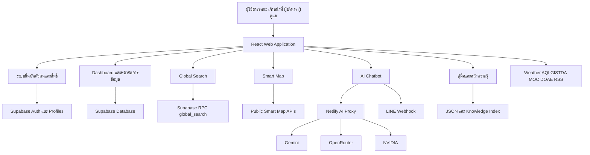

# NPT Smart Agri Dashboard

## รายงานโครงสร้างระบบ ฟังก์ชัน การไหลของข้อมูล และสถานะปัจจุบัน

**วันเวลาที่ตรวจ:** 26 กรกฎาคม 2569 เวลา 17:26 น. เขตเวลาเอเชีย/กรุงเทพฯ  
**Repository:** `dragonfly13110/npt_dashboard`  
**Branch ที่ตรวจ:** `main`  
**Commit ล่าสุดที่ใช้อ้างอิง:** `658dfd65bd1553f5949719969c0c381c8cb76b5e`  
**Commit message:** `Add illustrated page headers`  
**รูปแบบการตรวจ:** อ่านโค้ดและเอกสารจาก GitHub โดยตรง ครอบคลุมเส้นทางหน้าเว็บ โมดูลข้อมูล ระบบสิทธิ์ การค้นหา AI, LINE, Smart Map, Netlify Functions, การทดสอบ และการตั้งค่า Deploy

> **ข้อจำกัดของรายงาน**
>
> รายงานนี้เป็นการตรวจแบบ Static Code Review จากโค้ดใน GitHub ณ วันเวลาข้างต้น ไม่ได้เชื่อมต่อฐานข้อมูล Production โดยตรง ไม่ได้เข้าสู่ระบบด้วยบัญชีจริงครบทุกบทบาท และไม่ได้รัน `lint`, `test`, `build` หรือ E2E ซ้ำในรอบนี้ ดังนั้นคำว่า “มีในระบบ” หมายถึงพบโครงสร้างหรือการทำงานในโค้ด ส่วนคำว่า “ใช้งานได้จริงบน Production” ต้องยืนยันจากระบบจริงอีกครั้ง
>
> ตัวเลขจำนวนข้อมูลบางส่วนในรายงานมาจากเอกสาร Snapshot ที่เก็บอยู่ใน Repository จึงใช้เพื่อเข้าใจขนาดข้อมูลเท่านั้น ไม่ควรถือเป็นยอดสด ณ วันที่ 26 กรกฎาคม 2569

---

# สารบัญ

1. บทสรุปสำหรับผู้บริหาร
2. ที่มาและเป้าหมายของระบบ
3. ผู้ใช้งานและประโยชน์
4. ภาพรวมขอบเขตระบบ
5. สถาปัตยกรรมและเทคโนโลยี
6. โครงสร้างโฟลเดอร์
7. ระบบเส้นทางหน้าเว็บ
8. ส่วนสาธารณะ
9. Interactive Dashboard
10. Smart Map และ GIS
11. คลังความรู้และคู่มือ
12. ระบบภายในสำหรับเจ้าหน้าที่
13. Dashboard รวม
14. Situation Room
15. โมดูลฝ่ายบริหารทั่วไป
16. โมดูลกลุ่มยุทธศาสตร์และสารสนเทศ
17. โมดูลกลุ่มส่งเสริมและพัฒนาการผลิต
18. โมดูลกลุ่มส่งเสริมและพัฒนาเกษตรกร
19. โมดูลกลุ่มอารักขาพืช
20. ระบบคำขอข้อมูลจากอำเภอ
21. ระบบจัดการข้อมูลแบบ CRUD
22. ระบบค้นหากลาง
23. AI Chatbot ภายในเว็บไซต์
24. LINE AI Chatbot
25. โครงสร้างข้อมูลและฐานข้อมูล
26. ระบบสิทธิ์
27. การคุ้มครองข้อมูลส่วนบุคคล
28. Data Quality และ Data Dictionary
29. Netlify Functions และงานเบื้องหลัง
30. แหล่งข้อมูลภายนอก
31. Cache และประสิทธิภาพ
32. ความปลอดภัย
33. Monitoring และ Health Check
34. การทดสอบและ CI/CD
35. การ Deploy
36. สถานะข้อมูลในแต่ละโมดูล
37. การเปลี่ยนแปลงสำคัญหลังรายงานเดิม
38. จุดแข็งของระบบ
39. จุดเสี่ยงและสิ่งที่ควรตรวจต่อ
40. ข้อเสนอแนะสำหรับการพัฒนารอบถัดไป
41. แผนตรวจระบบแบบเป็นขั้นตอน
42. สรุปสถานะ
43. ไฟล์สำคัญที่ใช้ตรวจสอบ

---

# 1. บทสรุปสำหรับผู้บริหาร

NPT Smart Agri Dashboard พัฒนาจากเว็บแสดงผลข้อมูลไปเป็นแพลตฟอร์มข้อมูลการเกษตรระดับจังหวัดที่รวมหลายงานไว้ในโครงการเดียว ได้แก่ พอร์ทัลข้อมูลสาธารณะ แดชบอร์ดเจ้าหน้าที่ ห้องสถานการณ์ผู้บริหาร ระบบจัดการข้อมูล ระบบค้นหาข้ามตาราง แผนที่เชิงพื้นที่ AI Chatbot, LINE Chatbot คลังความรู้ คู่มือออนไลน์ ระบบตรวจคุณภาพข้อมูล และงานเชื่อมต่อข้อมูลจากหน่วยงานภายนอก

แกนหลักของระบบคือการรวบรวมข้อมูลที่กระจัดกระจายอยู่ใน Excel, Google Sheet, PDF และระบบส่วนกลาง มาแสดงและจัดการผ่านฐานข้อมูลกลาง ทำให้เจ้าหน้าที่ค้นหา แก้ไข และสรุปข้อมูลได้ง่ายขึ้น ผู้บริหารเห็นภาพรวมและความคืบหน้า ส่วนประชาชนเข้าถึงข้อมูลที่เปิดเผยได้โดยไม่เห็นข้อมูลส่วนบุคคล

โค้ดปัจจุบันมีความสามารถค่อนข้างกว้างและมีโครงสร้างรองรับงานจริงหลายส่วน แต่ควรมองสถานะโดยรวมเป็น **Beta ที่มีฟังก์ชันใช้งานจริงจำนวนมาก** เพราะบางตารางยังไม่มีข้อมูล บางหน้ามีข้อมูลสำรอง และบางประเด็นยังต้องยืนยันบน Production เช่น RLS ทุกบทบาท ความครบของข้อมูล การทดสอบ Staging การรองรับผู้ใช้พร้อมกัน และ Backup/Restore

ประเด็นที่ควรให้ความสำคัญต่อจากนี้มี 5 เรื่อง

1. กำหนดเจ้าของข้อมูลและรอบอัปเดตของทุกชุดข้อมูล
2. ทำ Role, Dataset Catalog, Route และ Supabase RLS ให้ใช้แหล่งกำหนดเดียวกัน
3. แยกสถานะฟังก์ชันว่าเปิดใช้จริง ทดลองใช้ รอข้อมูล หรือเลิกใช้
4. เพิ่มหลักฐานการทดสอบ Production, Staging, Load Test และ Restore
5. ทำเอกสารระบบให้สร้างหรืออัปเดตจากโค้ดโดยอัตโนมัติ

---

# 2. ที่มาและเป้าหมายของระบบ

ข้อมูลการเกษตรระดับจังหวัดมักอยู่หลายแหล่งและหลายรูปแบบ เมื่อข้อมูลอยู่คนละที่ การค้นหา การตรวจสอบ และการรายงานต้องใช้เวลามาก มีโอกาสเกิดข้อมูลซ้ำ ใช้ปีข้อมูลคนละปี หรือส่งไฟล์ผิดเวอร์ชัน

ระบบนี้จึงมีเป้าหมายสร้างศูนย์กลางที่เชื่อมโยงข้อมูลของสำนักงานเกษตรจังหวัดนครปฐม โดยแบ่งการใช้งานเป็น 2 ส่วนใหญ่

- **ส่วนสาธารณะ** สำหรับเกษตรกร ประชาชน ผู้ประกอบการ นักศึกษา นักวิจัย และหน่วยงานเครือข่าย
- **ส่วนภายใน** สำหรับเจ้าหน้าที่ ผู้บริหาร และผู้ดูแลระบบ

เป้าหมายเชิงงาน

- ทำให้ข้อมูลภาครัฐค้นหาและเข้าถึงได้ง่าย
- ลดการเปิดไฟล์และขอข้อมูลซ้ำ
- ทำให้ข้อมูลมีโครงสร้างและใช้รูปแบบเดียวกัน
- ช่วยเจ้าหน้าที่บันทึก ค้นหา แก้ไข และสรุปข้อมูล
- ช่วยผู้บริหารติดตามตัวชี้วัด งบประมาณ และความเสี่ยง
- เปิดข้อมูลสาธารณะโดยคุ้มครองข้อมูลส่วนบุคคล
- ใช้แผนที่และ AI ช่วยค้นหาและอธิบายข้อมูล
- รองรับ API และข้อมูลสดจากภายนอก
- สร้างฐานข้อมูลสำหรับงานวิเคราะห์ในอนาคต

---

# 3. ผู้ใช้งานและประโยชน์

## 3.1 เจ้าหน้าที่ระดับจังหวัด

ใช้ดูภาพรวมทุกอำเภอ จัดการข้อมูลของกลุ่มงาน สร้างคำขอข้อมูล ตรวจคุณภาพ และทำรายงาน

ประโยชน์

- ลดเวลารวมข้อมูลจากหลายอำเภอ
- ลดการส่งไฟล์หลายรอบ
- ค้นหาข้อมูลจากจุดเดียว
- ดูประวัติการแก้ไข
- ส่งออก CSV และพิมพ์รายงาน
- เห็นข้อมูลที่ขาด ซ้ำ หรือล่าช้า

## 3.2 เจ้าหน้าที่ระดับอำเภอ

โค้ดรองรับบทบาท `district_editor` ซึ่งจำกัดสิทธิ์ตามอำเภอและตารางที่อนุญาต

ประโยชน์

- กรอกข้อมูลตามคำขอจังหวัด
- ลดแบบฟอร์มหลายไฟล์
- ตรวจความครบก่อนส่ง
- นำเข้า CSV หรือวางข้อมูลแบบตาราง
- ดูสถานะการส่งข้อมูล

## 3.3 ผู้บริหาร

มี Dashboard และ Situation Room สำหรับดูงบประมาณ ทะเบียนเกษตรกร ข้อมูลรายอำเภอ จุดความร้อน สภาพอากาศ PM2.5 และคำขอข้อมูล

ประโยชน์

- เห็นภาพรวมในหน้าเดียว
- เปรียบเทียบอำเภอ
- ติดตามความก้าวหน้า
- เห็นรายการเสี่ยงหรือล่าช้า
- ใช้ AI ช่วยสรุปสถานการณ์
- พิมพ์รายงานเป็น PDF

## 3.4 เกษตรกรและประชาชน

เข้าถึง Landing Page, Interactive Dashboard, Smart Map, คู่มือทะเบียนเกษตรกร คลังความรู้สารป้องกันกำจัดศัตรูพืช และข้อมูลสาธารณะต่าง ๆ

## 3.5 ผู้ประกอบการ สถานศึกษา และนักวิจัย

สามารถใช้ข้อมูลเปิดเพื่อศึกษาแนวโน้ม วางแผนธุรกิจ ทำงานวิจัย หรือใช้ประกอบการเรียน โดยอยู่ภายใต้เงื่อนไขการใช้ข้อมูลของหน่วยงาน

---

# 4. ภาพรวมขอบเขตระบบ

ระบบแบ่งเป็น 10 กลุ่มความสามารถ

1. Public Data Portal
2. Interactive Dashboard
3. Smart Map และ GIS
4. Internal Dashboard
5. Data Management
6. Global Search
7. AI Chatbot และ LINE Bot
8. Knowledge Portal และ Manual
9. Admin, Data Quality และ Audit
10. Integration, Sync, Monitoring และ Deployment



---

# 5. สถาปัตยกรรมและเทคโนโลยี

## 5.1 รูปแบบสถาปัตยกรรม

ระบบเป็น Single Page Application โดย React แสดงผลและจัดการ Route ส่วน Supabase ทำหน้าที่ฐานข้อมูล ระบบผู้ใช้ และ RPC ขณะที่ Netlify Functions เป็น API ฝั่ง Server สำหรับซ่อน Secret เชื่อมข้อมูลภายนอก และทำงาน Sync

## 5.2 ชั้นการทำงาน

### Presentation Layer

- `src/App.jsx`
- `src/pages/`
- `src/components/`
- `src/features/`
- `src/styles/`

หน้าที่คือแสดงหน้าเว็บ ตาราง กราฟ แผนที่ ฟอร์ม และสถานะ Error/Loading

### State และ Hook Layer

- `AuthContext`
- React Query
- `useDashboardData`
- `useInteractiveOverviewData`
- `useSupabaseCrud`
- Smart Map Hooks
- Session Timeout

### Service Layer

- Global Search Service
- Chatbot Data Service
- AI Service
- Guest Session Service
- Prompt Guard Service
- Smart Map API Service

### Data Layer

- Supabase PostgreSQL
- Supabase Auth
- SQL Migrations และ RLS
- Static JSON และ GeoJSON
- Knowledge Index
- External APIs

## 5.3 เทคโนโลยีหลัก

### Frontend

- React 19
- Vite 7
- React Router 7
- Ant Design 6
- TanStack React Query
- Day.js

### Data Visualization

- ECharts
- Leaflet
- React-Leaflet
- Browser Print, jsPDF และ html2canvas สำหรับบางงานรายงาน

### Backend

- Supabase
- PostgreSQL
- Supabase Auth และ RPC
- Netlify Functions
- Netlify Hosting

### AI

- Google Gemini
- Gemma
- OpenRouter
- NVIDIA NIM
- KKU Chatbot API
- LINE Messaging API

### Quality และ Testing

- ESLint
- Prettier
- Husky
- lint-staged
- Vitest
- React Testing Library
- Playwright

### Monitoring และ PWA

- Sentry
- Service Worker
- Web Push
- Health Endpoint
- System Health Monitor

---

# 6. โครงสร้างโฟลเดอร์

```text
npt_dashboard/
├── src/
│   ├── App.jsx
│   ├── main.jsx
│   ├── supabaseClient.js
│   ├── components/
│   │   ├── Chatbot/
│   │   ├── DataTable/
│   │   ├── ErrorBoundary/
│   │   ├── LandingChatbot/
│   │   ├── Layout/
│   │   ├── Map/
│   │   ├── Search/
│   │   ├── charts/
│   │   └── widgets/
│   ├── contexts/
│   ├── data/
│   ├── domain/
│   ├── features/
│   │   └── smart-map/
│   ├── hooks/
│   │   └── dashboard/
│   ├── pages/
│   │   ├── admin/
│   │   ├── community/
│   │   ├── dataRequests/
│   │   ├── development/
│   │   ├── farmer69/
│   │   ├── interactiveDashboard/
│   │   ├── pesticides/
│   │   ├── production/
│   │   ├── protection/
│   │   └── strategy/
│   ├── services/
│   ├── styles/
│   └── utils/
├── netlify/functions/
│   └── lib/
├── supabase/
├── public/
├── pesticide_knowledge_md/
├── scripts/
├── tests/e2e/
├── docs/
│   ├── manual/
│   ├── reference/
│   ├── superpowers/plans/
│   └── superpowers/specs/
├── .github/workflows/
├── package.json
├── pnpm-lock.yaml
├── netlify.toml
└── README.md
```

ข้อสังเกต

- Smart Map ถูกแยกเป็น Feature Module ชัดเจน
- Dashboard Data เริ่มแยกเป็น `config`, `dataFetchers`, `selectors`
- `App.jsx` ยังรวม Route จำนวนมาก
- เอกสารมีจำนวนมาก แต่ต้องระวังเอกสารเก่าไม่ตรงกับโค้ดล่าสุด

---

# 7. ระบบเส้นทางหน้าเว็บ

## 7.1 เส้นทางสาธารณะหลัก

| เส้นทาง                       | หน้าที่                            |
| ----------------------------- | ---------------------------------- |
| `/`                           | หน้าแรก Public Portal              |
| `/manual`                     | หน้ารวมคู่มือออนไลน์               |
| `/manual/:slug`               | อ่านคู่มือรายบท                    |
| `/bmc`                        | Business Model Canvas              |
| `/interactive-dashboard`      | Dashboard สาธารณะแบบหน้าเดียว      |
| `/smart-map`                  | แผนที่ข้อมูลการเกษตร               |
| `/public/pesticides`          | คลังความรู้สารป้องกันกำจัดศัตรูพืช |
| `/public/pesticides/:slug`    | บทความความรู้รายเรื่อง             |
| `/public/farmer-manual`       | คู่มือทะเบียนเกษตรกร ปี 2569       |
| `/public/farmer-manual/:slug` | คู่มือรายหัวข้อ                    |
| `/login`                      | เข้าสู่ระบบ                        |

## 7.2 เส้นทางข้อมูลสาธารณะ

- `/public/large-plots`
- `/public/smart-farmers`
- `/public/smart-farmer-sf`
- `/public/young-smart-farmer-ysf`
- `/public/agricultural-career-groups`
- `/public/young-farmer-groups`
- `/public/housewife-farmer-groups`
- `/public/community-enterprises`
- `/public/agri-tourism`
- `/public/agricultural-areas`
- `/public/certifications`
- `/public/agricultural-prices`
- `/public/disease-forecast`
- `/public/fire-hotspots`
- `/public/disasters`
- `/public/data-dictionary`

## 7.3 เส้นทางภายในหลัก

- `/dashboard`
- `/dashboard/profile`
- `/dashboard/situation-room`
- `/dashboard/chatbot`
- `/dashboard/data-dictionary`
- `/dashboard/search`
- `/dashboard/data-requests`
- `/dashboard/community/forum`

## 7.4 ฝ่ายบริหารทั่วไป

- `/dashboard/admin/overview`
- `/dashboard/admin/personnel`
- `/dashboard/admin/assets`
- `/dashboard/admin/budgets`
- `/dashboard/admin/users`
- `/dashboard/admin/data-quality`
- `/dashboard/admin/audit-log`
- `/dashboard/admin/recent-activities`
- `/dashboard/admin/visitors`
- `/dashboard/admin/website-evaluations`

## 7.5 กลุ่มยุทธศาสตร์และสารสนเทศ

- `/dashboard/strategy/overview`
- `/dashboard/strategy/farmer-registry`
- `/dashboard/strategy/tbk-cultivation-area`
- `/dashboard/strategy/parcel-drawing-progress`
- `/dashboard/strategy/agricultural-areas`
- `/dashboard/strategy/agricultural-prices`
- `/dashboard/strategy/learning-centers`
- `/dashboard/strategy/daily-weather`

เส้นทางภัยพิบัติเดิมในกลุ่มยุทธศาสตร์ถูกส่งไป `/dashboard/development/disasters`

## 7.6 กลุ่มส่งเสริมและพัฒนาการผลิต

- `/dashboard/production/overview`
- `/dashboard/production/large-plots`
- `/dashboard/production/certifications`
- `/dashboard/production/crop-production`
- `/dashboard/production/rice-harvest-situation`
- `/dashboard/production/production-costs`

## 7.7 กลุ่มส่งเสริมและพัฒนาเกษตรกร

- `/dashboard/development/overview`
- `/dashboard/development/community-enterprises`
- `/dashboard/development/smart-farmers`
- `/dashboard/development/smart-farmer-sf`
- `/dashboard/development/young-smart-farmer-ysf`
- `/dashboard/development/agricultural-career-groups`
- `/dashboard/development/housewife-farmer-groups`
- `/dashboard/development/young-farmer-groups`
- `/dashboard/development/agri-tourism`
- `/dashboard/development/disasters`

## 7.8 กลุ่มอารักขาพืช

- `/dashboard/protection/overview`
- `/dashboard/protection/pest-outbreaks`
- `/dashboard/protection/disease-forecast`
- `/dashboard/protection/pest-centers`
- `/dashboard/protection/plant-doctors`
- `/dashboard/protection/soil-fertilizer`
- `/dashboard/protection/soil-series`
- `/dashboard/protection/fire-hotspots`

---

# 8. ส่วนสาธารณะ

ส่วนสาธารณะเผยแพร่ข้อมูลที่ผ่านการคัดกรองแล้วโดยไม่ต้องล็อกอิน บางหน้าใช้โค้ดร่วมกับหน้าภายในผ่าน `publicMode` หรือสิทธิ์ Guest

ฟังก์ชันที่พบ

- แสดงข้อมูลภาพรวมและตัวเลขสำคัญ
- แสดงกราฟและข้อมูลรายอำเภอ
- ค้นหา กรอง และเรียงข้อมูล
- แสดงข้อมูลบนแผนที่
- แสดงข่าว อากาศ AQI และราคา
- เปิดคู่มือและคลังความรู้
- ใช้ Chatbot หน้า Landing
- เปิด Data Dictionary
- แสดงข้อมูล GAP, Disease Forecast, Hotspots และ Disasters

ข้อควรระวัง

- ต้องตรวจว่าคอลัมน์ส่วนตัวถูกซ่อนครบทุก Public Route
- Guest Session ต้องพึ่ง RLS และ API Authorization เป็นชั้นสุดท้าย
- ทุกหน้าควรบอกแหล่งข้อมูล ปีข้อมูล และวันที่อัปเดต

---

# 9. Interactive Dashboard

หน้า `InteractiveDashboard` เป็น Dashboard สาธารณะแบบหน้าเดียว แบ่งเป็น 7 โมดูล

1. ภาพรวม
2. พื้นที่
3. ผลผลิต
4. กลุ่มเกษตรกร
5. ศูนย์และเครือข่าย
6. ความเสี่ยง
7. ข้อมูลเพิ่มเติม

ความสามารถ

- เลือกอำเภอ
- เลือกปีข้อมูล
- ใช้ตัวกรองร่วมระหว่างโมดูล
- KPI Card กดแล้วเลื่อนไปส่วนที่เกี่ยวข้อง
- แสดงครัวเรือนเกษตรกร พื้นที่เพาะปลูก วิสาหกิจชุมชน แปลงใหญ่ ศูนย์เรียนรู้ และความเสี่ยง
- แสดง AI Disease Forecast ล่าสุด
- แสดงแผนที่ตามอำเภอ
- ฝัง Dashboard ของ 4 กลุ่มงาน
- ใช้ Intersection Observer ระบุส่วนที่กำลังดู
- รองรับ Print และ Reload
- มี Loading, Error และ Retry

จุดที่ควรตรวจ

- ปีข้อมูลของแต่ละตารางใช้ชื่อคอลัมน์ไม่เหมือนกัน
- ตารางที่ไม่มีปีอาจไม่ตอบสนองต่อ Filter ปี
- Metric บางตัวใช้ยอดรวม แต่บางตัวใช้ปีล่าสุด
- ควรมีคำอธิบายสูตรและวันที่ข้อมูลของทุก KPI

---

# 10. Smart Map และ GIS

Smart Map ถูกแยกเป็น Feature Module ประกอบด้วย

- `SmartMapPage`
- `SmartMapScreen`
- `SmartMapCanvas`
- `SmartMapHeader`
- `SmartMapKpiBar`
- `SmartMapLayerPanel`
- `SmartMapPointLayerDropdown`
- `SmartMapDetailPanel`
- `SmartMapComparisonDialog`
- Hooks สำหรับ Summary, Points, Soil, Weather และ Layer Status

## 10.1 ตัวชี้วัดแผนที่

- พื้นที่เกษตร
- ครัวเรือนเกษตรกร
- วิสาหกิจชุมชน
- แปลงใหญ่
- จำนวนจุดความร้อน

## 10.2 ชั้นข้อมูลจุด

- ศพก.
- ศจช.
- ศดปช.
- กลุ่มยุวเกษตรกร
- กลุ่มอาชีพการเกษตร
- กลุ่มแม่บ้านเกษตรกร
- แปลงพยากรณ์
- จุดความร้อน

ชั้นที่ถูกปิดไว้ในโค้ด

- ท่องเที่ยวเกษตร เพราะพิกัดยังไม่พร้อม
- GIS Areas เพราะยังไม่มีข้อมูล

## 10.3 ความสามารถ

- เลือกอำเภอและตำบล
- ใช้ GeoJSON ขอบเขตตำบล
- ทำ Choropleth ตามตัวชี้วัด
- เปิดปิด Layer
- แสดง Marker และรายละเอียด
- เปรียบเทียบพื้นที่
- แสดงสภาพอากาศและ PM2.5
- แสดงข้อมูลชุดดิน
- แสดงสถานะความพร้อมของ Layer
- ใช้ Public API แยกจากการ Query ตารางโดยตรง

## 10.4 สิ่งที่ต้องตรวจ

- ความครบของ Latitude/Longitude
- จุดอยู่นอกจังหวัด
- พิกัดซ้ำ
- การสลับ Latitude กับ Longitude
- การ Normalize ชื่ออำเภอและตำบล
- Public API ต้องไม่ส่งข้อมูลเจ้าของแปลง
- Layer ที่ไม่มีข้อมูลต้องบอกเหตุผล ไม่ควรแสดง 0 อย่างเดียว

---

# 11. คลังความรู้และคู่มือ

## 11.1 คู่มือระบบ

เส้นทาง `/manual` และ `/manual/:slug` ใช้เนื้อหาจาก `docs/manual/`

## 11.2 คลังความรู้สารป้องกันกำจัดศัตรูพืช

เส้นทาง

- `/public/pesticides`
- `/public/pesticides/:slug`

โฟลเดอร์ `pesticide_knowledge_md/` แบ่งความรู้เป็นหมวด เช่น

- ความปลอดภัยและ PPE
- การอ่านฉลาก
- FRAC, IRAC, HRAC
- โรคพืช
- แมลง ไร และสัตว์ศัตรูพืช
- ความต้านทานสาร
- สารกำจัดวัชพืช
- การใช้สารร่วมชีวภัณฑ์
- เทคนิคการพ่น
- วัตถุอันตรายห้ามใช้
- ชุดข้อมูล RAG

คำสั่ง Build

```bash
pnpm run build:pesticides
```

## 11.3 คู่มือทะเบียนเกษตรกร ปี 2569

เส้นทาง

- `/public/farmer-manual`
- `/public/farmer-manual/:slug`

มีข้อมูลใน `public/data/farmer69/` และมีคำสั่ง

```bash
pnpm run build:farmer-knowledge
```

## 11.4 ประโยชน์

- เปลี่ยนเอกสารยาวให้ค้นหาได้
- เปิดอ่านบนมือถือ
- ใช้ Chatbot อ้างอิงความรู้
- ลดคำถามซ้ำของเจ้าหน้าที่
- รองรับ RAG ในอนาคต

## 11.5 จุดควบคุม

- ระบุแหล่งที่มาและวันที่มีผล
- แยกคำแนะนำทั่วไปกับข้อกำหนดทางกฎหมาย
- มีขั้นตอนอนุมัติก่อนเผยแพร่
- ไม่เปิดบทความที่ยังว่าง
- เนื้อหาเรื่องสารเคมีควรมีคำเตือนและอ้างอิงทะเบียนล่าสุด

---

# 12. ระบบภายในสำหรับเจ้าหน้าที่

พื้นที่ `/dashboard/*` ใช้ `ProtectedRoute` และ `AppLayout` เป็นโครงหลัก

ระบบภายในประกอบด้วย

- Dashboard รวม
- Profile
- Situation Room
- AI Chatbot
- Data Dictionary
- Global Search
- Data Requests
- Farmer Forum
- หน้ากลุ่มงาน
- หน้าผู้ดูแลระบบ

ตัวควบคุม Route ที่พบ

- `ProtectedRoute` ตรวจว่ามี User ID
- `AdminRoute` จำกัด Admin
- `PublicAdminReadRoute` เปิดหน้าบริหารแบบอ่านตาม Role
- `DataRequestRoute` อนุญาต Admin, Editor และ District Editor
- `NonGuestRoute` ปิด Situation Room และ Chatbot สำหรับ Guest

หลักสำคัญคือ Route Guard ฝั่ง React ช่วยจัดประสบการณ์ผู้ใช้ แต่ความปลอดภัยจริงต้องอยู่ที่ Supabase RLS และ Authorization ของ Netlify Functions

---

# 13. Dashboard รวม

Dashboard ภายในใช้ `useDashboardData` รวบรวมข้อมูลหลายตาราง

ข้อมูลที่แสดง

- สภาพอากาศ
- คุณภาพอากาศ
- ราคาสินค้าเกษตร
- จำนวนข้อมูลตามกลุ่มงาน
- จำนวนรายการในตาราง
- กราฟพื้นที่เกษตร
- กราฟแปลงใหญ่
- สถาบันเกษตรกร
- ท่องเที่ยวเกษตร
- จำนวนผู้เข้าชมเว็บไซต์
- ข้อมูลรายอำเภอ

ความสามารถ

- Cache ด้วย React Query
- แสดงคำเตือนเมื่อตารางบางส่วนโหลดไม่สำเร็จ
- Reload ข้อมูล
- คลิกการ์ดไปหน้าจัดการข้อมูล
- พิมพ์รายงานเป็น PDF ผ่าน Browser Print
- ใช้ Selector กลางรวมข้อมูลรายอำเภอ

ข้อสังเกต

- ค่า 0 อาจหมายถึงไม่มีข้อมูล หรือ Query ล้มเหลว ระบบเริ่มแยกด้วย `failedTables`
- Dashboard ยิง Query หลายตาราง จึงเป็นจุดที่ควรวัดเวลาโหลดและจำนวน Request
- เมื่อ Schema ตารางเปลี่ยน Dashboard มีโอกาสได้รับผลกระทบหลายส่วน

---

# 14. Situation Room

`SituationRoom` เป็นหน้าสำหรับผู้บริหาร โดยรวมข้อมูลหลายด้านและจัดลำดับสัญญาณสำคัญ

ข้อมูลที่ใช้

- งบประมาณ
- คำขอข้อมูล
- Assignment ของอำเภอ
- จุดความร้อน
- ทะเบียนเกษตรกร
- สภาพอากาศ 7 อำเภอ
- PM2.5
- ปริมาณฝนและโอกาสฝน
- ข้อมูล Dashboard รายอำเภอ

การคำนวณ

- ปีงบประมาณล่าสุด
- รอบงบประมาณล่าสุด
- งบรวมและเบิกจ่าย
- เปอร์เซ็นต์ความก้าวหน้า
- จำนวนโครงการตามสถานะ
- เป้าหมายทะเบียนเกษตรกร
- จำนวนปรับปรุงแล้ว
- พื้นที่ปรับปรุง
- จำนวนคงเหลือ
- Risk Score รายอำเภอ

ความสามารถ

- จัดอันดับอำเภอ
- ใช้ Gemini ช่วยสรุปสถานการณ์
- Copy Summary
- Print หรือ Export PDF
- Reload ข้อมูล

จุดที่ต้องระวัง

- Risk Score เป็นสูตรภายใน ต้องมีเอกสารอธิบาย
- เมื่อ API อากาศล้มเหลว โค้ดใช้ค่าศูนย์บางตำแหน่ง ต้องไม่แปลว่า “สถานการณ์ปกติ”
- งบประมาณมี Seed fallback จึงควรบอกว่าข้อมูลมาจากฐานข้อมูลหรือข้อมูลสำรอง
- AI Summary ควรแนบวันที่และชุดข้อมูลที่ใช้
- ทุกการ์ดควรมี Data Freshness

---

# 15. โมดูลฝ่ายบริหารทั่วไป

## 15.1 ภาพรวมบริหาร

แสดงสถิติด้านบุคลากร งบประมาณ ทรัพย์สิน ผู้ใช้ และกิจกรรมระบบ

## 15.2 บุคลากร

ตาราง `personnel`

ความสามารถ

- ค้นหาและกรอง
- เพิ่มและแก้ไขข้อมูล
- จัดการตำแหน่ง สังกัด และสถานะ
- จำกัด District Editor ให้แก้เฉพาะอำเภอของตน
- ซ่อนข้อมูลส่วนบุคคลจาก Guest

## 15.3 พัสดุและครุภัณฑ์

ตาราง `assets`

มีโครงสร้าง CRUD แต่เอกสาร Snapshot เดิมระบุว่ายังไม่มีข้อมูลในเวลาที่บันทึก

## 15.4 งบประมาณ

ตาราง `budgets`

ความสามารถ

- บันทึกงบประมาณ
- แยกปีและรอบ
- ติดตามเบิกจ่าย
- สรุปสถานะ
- ใช้ใน Situation Room
- ค้นหากลางรองรับข้อมูลบางส่วนที่เก็บใน `notes` แบบ JSON

## 15.5 จัดการผู้ใช้

ใช้ Profile, Role และ Department เพื่อควบคุมสิทธิ์

## 15.6 Audit Log

ตรวจประวัติ CREATE, UPDATE และ DELETE

## 15.7 Recent Activities

แสดงกิจกรรมล่าสุดของผู้ใช้และข้อมูล

## 15.8 Visitor Analytics

ดูสถิติผู้เข้าใช้งานเว็บไซต์

## 15.9 Website Evaluations

รองรับข้อมูลประเมินเว็บไซต์

## 15.10 Data Quality

ตรวจความครบ ข้อมูลซ้ำ วันที่อัปเดต และคุณภาพพิกัด

---

# 16. โมดูลกลุ่มยุทธศาสตร์และสารสนเทศ

## 16.1 Dashboard กลุ่มยุทธศาสตร์

สรุปทะเบียนเกษตรกร พื้นที่การเกษตร ศูนย์เรียนรู้ สภาพอากาศ และข้อมูลเชิงพื้นที่

## 16.2 ทะเบียนเกษตรกร

ตาราง `farmer_registry`

ข้อมูลสำคัญ

- อำเภอ
- ปีข้อมูล
- เป้าหมาย
- จำนวนครัวเรือนที่ปรับปรุง
- พื้นที่ที่ปรับปรุง
- วันที่ตัดยอด

ข้อมูลชุดนี้ถูกนำไปใช้ใน Dashboard และ Situation Room

## 16.3 พื้นที่เพาะปลูกตาม ทบก.

เส้นทาง `/dashboard/strategy/tbk-cultivation-area`

ตารางหลักใน Catalog

- `tbk_cultivation_snapshots`

มี Netlify Function `sync-tbk-cultivation.js` สำหรับซิงค์ข้อมูล และมีเอกสารแผนพัฒนาเฉพาะใน Repository

## 16.4 ความก้าวหน้าการวาดแปลง

เส้นทาง `/dashboard/strategy/parcel-drawing-progress`

ตาราง

- `geoplots_parcel_progress`
- `geoplots_parcel_subdistrict_progress`

มี Function `sync-geoplots-progress.js`

## 16.5 พื้นที่การเกษตร

ตาราง `agricultural_areas`

ข้อมูลที่ใช้แสดง

- ครัวเรือนเกษตรกร
- พื้นที่รวม
- พื้นที่ปลูกพืช
- ข้าวนาปี
- ข้าวนาปรัง
- พืชไร่
- ไม้ผล
- ผัก
- ดอกไม้
- สมุนไพร

## 16.6 ราคาสินค้าเกษตร

ใช้ Proxy เชื่อมข้อมูลจากกระทรวงพาณิชย์ และมีหน้าวิเคราะห์ราคาสินค้า

## 16.7 ศูนย์เรียนรู้

ตาราง `learning_centers`

เก็บข้อมูล ศพก. รายอำเภอ สินค้าเด่น และหลักสูตรความรู้

## 16.8 สภาพอากาศรายวัน

ตาราง `daily_weather`

มีงาน Sync จาก Meteostat และใช้ใน Widget สรุปฝน อุณหภูมิ ลม และความกดอากาศ

---

# 17. โมดูลกลุ่มส่งเสริมและพัฒนาการผลิต

## 17.1 Dashboard กลุ่มผลิต

สรุปแปลงใหญ่ มาตรฐาน ผลผลิต ต้นทุน และสถานการณ์การผลิต

## 17.2 แปลงใหญ่

ตาราง `large_plots`

ข้อมูล

- ชื่อกลุ่ม
- สินค้า
- สมาชิก
- พื้นที่
- ปีข้อมูล
- ผู้ประสานงาน

## 17.3 มาตรฐาน GAP

ตาราง `certifications`

ข้อมูล

- ใบรับรอง
- ประเภทมาตรฐาน
- วันหมดอายุ
- พืชหรือสินค้า
- พื้นที่
- ผู้ถือใบรับรอง

หน้าสาธารณะต้องกรองชื่อ เบอร์โทร ที่อยู่ และข้อมูลระบุตัวบุคคล

## 17.4 ผลผลิตพืช

ตาราง `crop_production`

มีหน้าและโครงสร้างรองรับ แต่ Snapshot เดิมระบุว่ายังไม่มีข้อมูล ต้องยืนยันฐานข้อมูลปัจจุบัน

## 17.5 สถานการณ์เก็บเกี่ยวข้าว

เส้นทาง `/dashboard/production/rice-harvest-situation`

มี Function `sync-rice-harvest.js` ซึ่งเพิ่มหลังรายงานเดิมวันที่ 17 กรกฎาคม 2569

## 17.6 ต้นทุนการผลิต

ตาราง `production_costs`

รองรับข้อมูลต้นทุน รายได้ ผลตอบแทน สินค้า และปีข้อมูล

---

# 18. โมดูลกลุ่มส่งเสริมและพัฒนาเกษตรกร

## 18.1 วิสาหกิจชุมชน

ตาราง `community_enterprises`

เก็บชื่อกลุ่ม ประเภท ผลิตภัณฑ์ สมาชิก อำเภอ และตำบล

## 18.2 Smart Farmer

ตาราง

- `smart_farmers`
- `smart_farmer_sf`

ตาราง `smart_farmers` ทำหน้าที่คล้าย Hub ขณะที่ข้อมูลจริงใน Snapshot ส่วนใหญ่อยู่ที่ `smart_farmer_sf`

## 18.3 Young Smart Farmer

ตาราง `young_smart_farmer_ysf`

มีข้อมูลรายบุคคลหลายช่อง จึงต้องปิดสำหรับ Guest อย่างเคร่งครัด

## 18.4 กลุ่มส่งเสริมอาชีพ

ตาราง `agricultural_career_groups`

## 18.5 กลุ่มแม่บ้านเกษตรกร

ตาราง `housewife_farmer_groups`

## 18.6 กลุ่มยุวเกษตรกร

ตาราง

- `young_farmer_groups`
- `young_farmer_groups_detailed`

Snapshot เดิมระบุว่าข้อมูลจริงใช้ตารางรายละเอียดเป็นหลัก

## 18.7 สถาบันเกษตรกร

ตาราง `farmer_institutes`

ใช้ทั้ง Dashboard และ Widget สาธารณะ

## 18.8 ท่องเที่ยวเชิงเกษตร

ตาราง `agri_tourism`

มีหน้า Seed และโครงสร้างฟอร์ม แต่ Snapshot เดิมระบุว่าตารางจริงยังว่าง และ Smart Map ปิด Layer นี้เพราะพิกัดไม่พร้อม

## 18.9 ภัยพิบัติ

ตาราง `disasters`

Route อยู่ในกลุ่มพัฒนาเกษตรกร แม้ไฟล์หน้าจอบางส่วนอยู่ในโฟลเดอร์ Strategy

---

# 19. โมดูลกลุ่มอารักขาพืช

## 19.1 Dashboard อารักขาพืช

สรุปแปลงพยากรณ์ ศูนย์เครือข่าย จุดความร้อน AI Forecast และหมอพืช

## 19.2 แปลงพยากรณ์และการระบาด

ตาราง

- `forecast_plots`
- `pest_outbreaks`

## 19.3 AI Disease Forecast

ตาราง `ai_disease_forecasts`

Functions ที่เกี่ยวข้อง

- `forecast-disease-insect.js`
- `forecast-disease-insect-daily.js`
- `forecast-disease-insect-background.js`

## 19.4 ศูนย์จัดการศัตรูพืชชุมชน

ตาราง `pest_centers`

## 19.5 หมอพืช

ตาราง `plant_doctors`

## 19.6 ศูนย์จัดการดินปุ๋ยชุมชน

ตาราง `soil_fertilizer_centers`

## 19.7 ชุดดิน

ตาราง `soil_series`

ใช้ใน Smart Map ผ่าน Public Soil API

## 19.8 จุดความร้อน

ตาราง `fire_hotspots`

เชื่อม GISTDA และมีงาน Sync

## 19.9 สต็อกชีวภัณฑ์

ตาราง `biocontrol_stock`

มีใน Catalog แต่ยังไม่มี Route แยก และ Snapshot เดิมระบุว่าไม่มีข้อมูล

---

# 20. ระบบคำขอข้อมูลจากอำเภอ

เส้นทาง `/dashboard/data-requests`

ตารางหลัก

- `data_requests`
- `data_request_assignments`
- `data_request_responses`

## 20.1 ฝั่งจังหวัด

สามารถ

- สร้างคำขอ
- กำหนดชื่อ คำอธิบาย และเส้นตาย
- เลือกอำเภอเป้าหมาย
- กำหนด Draft, Published หรือ Closed
- ออกแบบช่องข้อมูลเอง
- แก้ไขและลบคำขอ
- ดูจำนวนอำเภอที่ส่งแล้ว
- Export ผลลัพธ์

## 20.2 ตัวสร้างแบบฟอร์ม

รองรับ

- Text
- Textarea
- Number
- Date
- Select

## 20.3 AI ช่วยสร้างแบบฟอร์ม

พบโครงสร้างสำหรับ

- อ่าน CSV
- อ่าน Google Sheet ผ่าน CSV URL
- ตรวจ Candidate Tables
- ให้ AI เสนอ Schema
- แสดง Confidence
- Normalize Schema
- ตรวจชนิดข้อมูล

## 20.4 ฝั่งอำเภอ

รองรับ

- กรอกแบบ Grid
- วางข้อมูลหลายช่อง
- ตรวจ Required Fields
- เลือกอำเภอ
- ส่งข้อมูล
- Export CSV

## 20.5 สิ่งที่ต้องทดสอบจริง

- จังหวัดเห็นทุกอำเภอ
- อำเภอเห็นเฉพาะ Assignment ของตน
- RLS ทั้ง 3 ตาราง
- การแก้คำตอบหลังส่ง
- Cascade Delete
- Google Sheet URL
- AI Schema ไม่สร้างชนิดช่องผิด
- การกรอกข้อมูลจำนวนมาก

---

# 21. ระบบจัดการข้อมูลแบบ CRUD

`CrudTable` เป็น Component กลางที่หลายหน้าใช้ร่วมกัน

ความสามารถ

- Server-side Pagination
- Search และ Search หลายคอลัมน์
- Filter และ Sort
- เพิ่ม แก้ไข ลบ
- Detail Drawer
- Audit History สำหรับ Admin
- CSV Import และ Export
- เลือกคอลัมน์ที่แสดง
- Required และ Default Columns
- Custom Fields
- Read-only Mode
- Public Mode
- Override Fetch
- Transform ก่อนบันทึก
- Callback หลังแก้ข้อมูล

## 21.1 ตัวกรองพื้นที่

ระบบตรวจคอลัมน์อำเภอและตำบล แล้วเพิ่ม Filter อัตโนมัติสำหรับ 7 อำเภอ

- เมืองนครปฐม
- นครชัยศรี
- สามพราน
- ดอนตูม
- บางเลน
- กำแพงแสน
- พุทธมณฑล

เมื่อเลือกอำเภอ รายการตำบลจะเปลี่ยนตามอำเภอ

## 21.2 Custom Fields

Admin สามารถสร้างช่องเพิ่มในตารางที่รองรับ โดยเก็บค่าใน `custom_fields`

จุดควบคุม

- ห้าม Key ซ้ำ
- ต้องกำหนดชนิดข้อมูล
- Public ไม่ควรเห็น Custom Fields โดยอัตโนมัติ
- Export ต้องแปลง Custom Fields ให้เข้าใจง่าย

## 21.3 Import และ Export

ระบบปัจจุบันเน้น CSV ตาม Roadmap ที่ลบการพึ่ง Library Excel ที่มีประเด็น Security

สิ่งที่ควรมีครบ

- Template CSV
- ตรวจ Header
- ตรวจชนิดข้อมูล
- Preview ก่อน Import
- รายงานแถวที่ผิด
- ป้องกัน Import ซ้ำ
- Log ผู้ Import และไฟล์ต้นทาง

---

# 22. ระบบค้นหากลาง

`globalSearchService` ค้นหาข้ามหลายตาราง

## 22.1 ขั้นตอน

1. รับคำค้นอย่างน้อย 2 ตัวอักษร
2. Parse คำค้นเพื่อหา Table Hint
3. ตรวจ Cache
4. ผู้ใช้ภายในใช้ RPC `global_search`
5. เมื่อ RPC ล้มเหลว ใช้ Parallel Query
6. Guest ใช้ Parallel Query เพื่อควบคุมคอลัมน์ส่วนตัว
7. จัดอันดับผลลัพธ์
8. แยกกลุ่มตามตารางและกลุ่มงาน
9. บันทึก Recent Search

## 22.2 Cache

- Memory Cache
- Session Storage
- TTL 10 นาที
- สูงสุด 80 รายการ
- ป้องกัน Query เดียวกันยิงซ้ำพร้อมกัน
- Recent Searches สูงสุด 8 คำ

## 22.3 การจัดอันดับ

- ใช้ Score จาก RPC
- เพิ่มคะแนนตาม Table Hint
- เรียงจากผลตรงที่สุด
- แสดง Subtitle เช่น อำเภอ กิจกรรม และจำนวนเงิน

## 22.4 การคุ้มครองข้อมูล

Guest ผ่าน `sanitizeRowForRole` และเลือกเฉพาะ Public Columns

## 22.5 จุดที่ต้องตรวจ

- RPC กับ Fallback ให้ผลใกล้กัน
- จำนวนตารางใน Catalog กับ RPC ตรงกัน
- Route ของผลค้นหามีจริง
- ค้นชื่อไทยและชื่ออำเภอได้ดี
- Public Search มี Rate Limit
- Raw Row ไม่มีข้อมูลส่วนตัว

---

# 23. AI Chatbot ภายในเว็บไซต์

ระบบ AI รองรับหลาย Provider

- Gemini
- Gemma
- OpenRouter
- NVIDIA
- KKU

ความสามารถ

- Streaming Answer
- Retry เมื่อ Rate Limit
- Abort Request
- Web Search
- Deep Thinking
- แนบไฟล์ในข้อความล่าสุด
- เลือก Model
- Prompt Guardrail
- เตรียม Context จากฐานข้อมูล
- สรุป Count, Total, Average และ Ranking

## 23.1 หลักการตอบจากฐานข้อมูล

1. ตีความ Intent
2. เลือกตาราง
3. เลือกอำเภอ คำค้น และชนิดการวิเคราะห์
4. Query ฐานข้อมูล
5. คำนวณสถิติ
6. สร้าง Context ขนาดเล็ก
7. ให้ AI เขียนคำตอบจาก Context

ข้อดี

- ลด Token
- ลดการเดาคำตอบ
- ควบคุมข้อมูลที่ส่งออก
- ตอบคำถามเชิงสถิติได้ดีขึ้น

## 23.2 จุดควบคุม

- AI ต้องแจ้งเมื่อไม่มีข้อมูล
- Error ต้องไม่กลายเป็นคำตอบว่า “ไม่มีข้อมูล”
- ห้ามส่ง PII ไป Provider ภายนอก
- ควร Log Model และ Dataset ที่ใช้
- แสดงวันที่ข้อมูล
- แยกคำตอบฐานข้อมูลกับ Web Search

---

# 24. LINE AI Chatbot

Endpoint ที่พบ

- `netlify/functions/line-webhook.js`
- `netlify/functions/line-link-code.js`
- `supabase/functions/line-webhook/index.ts`

## 24.1 ความปลอดภัย

- รับเฉพาะ POST
- ตรวจ `X-Line-Signature`
- ใช้ HMAC SHA-256
- ใช้ `LINE_CHANNEL_SECRET`
- ใช้ Service Role ฝั่ง Server
- ไม่ Log Raw Request ที่มีข้อมูลอ่อนไหว

## 24.2 Knowledge First

LINE Bot ค้นข้อมูลในระบบก่อน โดยใช้ Dataset, System Pages และ Manuals ที่ลงทะเบียนใน `datasetCatalog.json`

ผู้ใช้ทั่วไป

- เห็นข้อมูลที่ตัด PII
- ใช้ Dataset ที่กำหนด `minRole = guest`

เจ้าหน้าที่

- เชื่อมบัญชีด้วยรหัสครั้งเดียว
- เข้าถึงข้อมูลตาม Role

เมื่อค้นในระบบไม่พบและเปิด Grounding

- ค้นอินเทอร์เน็ต
- แจ้งว่าเป็นคำตอบจากอินเทอร์เน็ต
- ส่งแหล่งอ้างอิง

## 24.3 แหล่งความรู้

- Dataset Catalog
- System Pages
- Manuals
- Farmer Manual
- Pesticide Knowledge
- Global Search

## 24.4 สิ่งที่ต้องทดสอบ

- Signature ผิด
- Replay Attack
- รหัสเชื่อมบัญชีหมดอายุ
- ยกเลิกการเชื่อมบัญชี
- Role เปลี่ยนแล้วสิทธิ์อัปเดต
- Rate Limit
- Provider AI ล้มเหลว
- Public User ไม่เห็น PII

---

# 25. โครงสร้างข้อมูลและฐานข้อมูล

## 25.1 กลุ่มตารางบริหาร

- `profiles`
- `personnel`
- `assets`
- `budgets`
- `audit_logs`
- `site_statistics`
- `website_evaluations`
- `visitor_events`

## 25.2 กลุ่มยุทธศาสตร์

- `farmer_registry`
- `tbk_cultivation_snapshots`
- `agricultural_areas`
- `gis_areas`
- `learning_centers`
- `daily_weather`
- `geoplots_parcel_progress`
- `geoplots_parcel_subdistrict_progress`

## 25.3 กลุ่มผลิต

- `large_plots`
- `certifications`
- `crop_production`
- `production_costs`
- ตารางหรือ Snapshot ที่เกี่ยวข้องกับ Rice Harvest

## 25.4 กลุ่มพัฒนาเกษตรกร

- `community_enterprises`
- `smart_farmers`
- `smart_farmer_sf`
- `young_smart_farmer_ysf`
- `agricultural_career_groups`
- `farmer_groups`
- `housewife_farmer_groups`
- `young_farmer_groups`
- `young_farmer_groups_detailed`
- `farmer_institutes`
- `agri_tourism`
- `disasters`

## 25.5 กลุ่มอารักขาพืช

- `forecast_plots`
- `ai_disease_forecasts`
- `pest_outbreaks`
- `pest_centers`
- `plant_doctors`
- `soil_fertilizer_centers`
- `soil_series`
- `biocontrol_stock`
- `fire_hotspots`

## 25.6 คำขอข้อมูลและชุมชน

- `data_requests`
- `data_request_assignments`
- `data_request_responses`
- `forum_posts`
- `forum_comments`

## 25.7 ตารางระบบประกอบ

- Guest Session
- Rate Limit
- Push Subscription
- LINE Account Link
- Custom Field Definitions
- Health และ Monitoring

## 25.8 หลักการ Dataset Catalog

`src/domain/datasetCatalog.js` และ `datasetCatalog.json` ทำหน้าที่เชื่อมข้อมูลสำคัญ

- Table Name
- Label
- Group
- Route
- Search Columns
- District Column
- Numeric Columns
- Category Columns
- Public/Private Policy
- LINE Knowledge Policy
- Minimum Role
- PII Fields
- Freshness Field

แนวคิดนี้เหมาะสำหรับเป็นศูนย์กลาง Metadata แต่ปัจจุบันยังมีรายการบางส่วนซ้ำใน `AuthContext` และ SQL

---

# 26. ระบบสิทธิ์

Role ที่พบ

| Role              | ความหมายโดยทั่วไป                 |
| ----------------- | --------------------------------- |
| `guest`           | ผู้ใช้สาธารณะหรือ Guest Session   |
| `viewer`          | ผู้ใช้ภายในแบบอ่านข้อมูล          |
| `editor`          | เจ้าหน้าที่แก้ไขข้อมูลตามกลุ่มงาน |
| `district_editor` | เจ้าหน้าที่อำเภอ                  |
| `admin`           | ผู้ดูแลระบบ                       |

## 26.1 Department Mapping

| Department                   | Group Key     |
| ---------------------------- | ------------- |
| ฝ่ายบริหารทั่วไป             | `admin`       |
| กลุ่มยุทธศาสตร์และสารสนเทศ   | `strategy`    |
| กลุ่มส่งเสริมและพัฒนาการผลิต | `production`  |
| กลุ่มส่งเสริมและพัฒนาเกษตรกร | `development` |
| กลุ่มอารักขาพืช              | `protection`  |
| ชุมชนเกษตรกร                 | `community`   |

## 26.2 สิทธิ์การทำงาน

- Admin อ่าน เขียน และลบได้ทั้งหมด
- Editor เขียนตารางในกลุ่มงานที่ตนรับผิดชอบ
- District Editor เขียนเฉพาะตารางที่กำหนดและควรจำกัดตามอำเภอ
- Viewer อ่านข้อมูลตามกลุ่มงาน
- Guest อ่านเฉพาะข้อมูลสาธารณะ

## 26.3 สิทธิ์ลบ

ใน `AuthContext` การลบถูกจำกัดเฉพาะ Admin

## 26.4 จุดเสี่ยงจากรายการซ้ำ

รายการ Department และ Table มีทั้งใน `AuthContext.jsx` และ `datasetCatalog.js` แม้บางส่วนเรียก Helper จาก Catalog แล้ว ความซ้ำทำให้มีโอกาสเพิ่มตารางในไฟล์หนึ่งแต่ลืมอีกไฟล์

ข้อเสนอ

- ให้ Dataset Catalog เป็น Source of Truth
- สร้าง Role Matrix จาก Catalog
- เพิ่ม Test ตรวจ Catalog กับ RLS
- ห้ามเชื่อ Route Guard ฝั่ง Browser เพียงอย่างเดียว

---

# 27. การคุ้มครองข้อมูลส่วนบุคคล

`dataPrivacy.js` ใช้ Pattern และรายการเฉพาะตารางเพื่อซ่อนคอลัมน์จาก Guest

Pattern ที่ถือว่าอ่อนไหว

- เลขบัตรประชาชน
- เบอร์โทร
- ที่อยู่
- ชื่อบุคคล
- ผู้ติดต่อ
- ประธาน ผู้จัดการ หรือผู้นำ
- Email
- LINE ID
- Facebook
- Custom Fields

ตารางที่มี Policy เฉพาะ เช่น

- Smart Farmer
- Young Smart Farmer
- Certifications
- Forecast Plots
- Plant Doctors
- Large Plots
- Agri Tourism
- Personnel
- Forum

## 27.1 จุดแข็ง

- มี Pattern กลางและรายการเฉพาะตาราง
- Guest Query เลือก Public Columns
- Global Search ของ Guest Sanitize Row
- LINE Catalog ระบุ PII Fields

## 27.2 ความเสี่ยง

- Policy เป็น Deny-list ถ้ามีคอลัมน์ใหม่ชื่อไม่ตรง Pattern อาจหลุด
- Public Function ที่ใช้ Service Role ต้องเลือกคอลัมน์อย่างชัดเจน
- พิกัดรายแปลงอาจระบุตัวบุคคลได้แม้ไม่มีชื่อ
- Custom Fields อาจเก็บข้อมูลอ่อนไหวที่ระบบกลางไม่รู้

## 27.3 ข้อเสนอ

- ใช้ Allow-list สำหรับ Public API
- ทำ Data Classification ระดับคอลัมน์
- แบ่งระดับ Public, Internal, Restricted, Sensitive
- เพิ่ม Regression Test สำหรับ Public API
- ทำ Privacy Review ก่อนเปิด Dataset ใหม่

---

# 28. Data Quality และ Data Dictionary

## 28.1 Data Quality

หน้า Admin ตรวจ

- จำนวนตาราง
- จำนวนแถว
- Completeness
- Duplicate Count
- Last Updated
- ตารางที่มีปัญหา
- กราฟความครบถ้วน
- คุณภาพพิกัด
- จุดนอกจังหวัด
- พิกัดซ้ำ
- ตัวอย่างพิกัดผิด
- สถานะ Layer
- Export CSV

API ที่ใช้

- `/api/admin/data-quality-stats`
- `/api/health`

## 28.2 Data Dictionary

มีทั้งหน้าสาธารณะ หน้าภายใน เอกสาร และ Netlify Function

Data Dictionary ที่ดีควรระบุ

- ชื่อตารางและความหมาย
- เจ้าของข้อมูล
- แหล่งข้อมูล
- ปีข้อมูล
- รอบอัปเดต
- Primary Key
- รายละเอียดคอลัมน์
- หน่วย
- ข้อมูลส่วนบุคคล
- Public Status
- Data Quality Rule

## 28.3 สิ่งที่ควรเพิ่ม

Data Quality ปัจจุบันเน้นความครบและข้อมูลซ้ำ ควรเพิ่ม

- Validity
- Accuracy
- Timeliness
- Consistency
- Uniqueness
- Referential Integrity
- Geographic Validity
- Business Rule

---

# 29. Netlify Functions และงานเบื้องหลัง

เอกสาร System Overview เดิมระบุ 19 Functions แต่โค้ดปัจจุบันมี Function เพิ่มขึ้น จึงควรใช้รายการจากโครงสร้างโค้ดจริงเป็นหลัก

## 29.1 AI และ Chat

- `ai-proxy.js`
- `kku-proxy.js`
- `line-webhook.js`
- `line-link-code.js`
- `guest-session.js`
- Library สำหรับ Landing Chat
- Library สำหรับ Pesticide Chat และ Search
- Library สำหรับ LINE AI

## 29.2 External Data Proxy

- `rss-proxy.js`
- `wp-proxy.js`
- `moc-price-proxy.js`
- `bangchak-oil-price-proxy.js`
- `gistda-proxy.js`
- `doae-hq-proxy.js`
- `doae-npt-proxy.js`
- `doae-esc-proxy.js`
- `ictc-proxy.js`
- `agritec-proxy.js`

## 29.3 Public Data API

- `public-certifications.js`
- `public-farmer-institutes-v2.js`
- `public-smart-map-summary.js`
- `public-smart-map-points.js`
- `public-smart-map-soil.js`
- `public-smart-map-layer-status.js`
- `data-dictionary.js`
- `data-quality-stats.js`
- Visitor Tracking Functions

## 29.4 Sync Jobs

- `sync-weather.js`
- `sync-hotspots.js`
- `sync-farmer-registry.js`
- `sync-geoplots-progress.js`
- `sync-tbk-cultivation.js`
- `sync-rice-harvest.js`

## 29.5 Forecast Jobs

- `forecast-disease-insect.js`
- `forecast-disease-insect-daily.js`
- `forecast-disease-insect-background.js`

## 29.6 Monitoring และ Alert

- `health.js`
- `system-health-monitor.js`
- `push-alerts.js`

## 29.7 หน้าที่ของ Functions

- ซ่อน API Key
- ตรวจ Origin และ Token
- ใช้ Service Role ฝั่ง Server
- แปลงข้อมูลจาก API ภายนอก
- Sync ข้อมูลลงฐานข้อมูล
- ประมวลผล Background
- ส่ง Alert
- ให้ Public API ที่คัดกรองข้อมูลแล้ว

---

# 30. แหล่งข้อมูลภายนอก

พบการเชื่อมต่อหรืออนุญาตใน CSP กับ

- Supabase
- KKU Generative AI
- NABC Agri API
- GISTDA
- สำนักงานเกษตรจังหวัดนครปฐม
- กรมส่งเสริมการเกษตร
- ESC
- ICTC
- Bangchak Oil Price
- OpenStreetMap
- CARTO
- ArcGIS
- Open-Meteo
- Open-Meteo Air Quality
- BigDataCloud
- กรมชลประทาน
- กระทรวงพาณิชย์
- RSS Proxy Services
- Cloudinary

ข้อมูลที่ดึง

- สภาพอากาศ
- PM2.5 และ AQI
- ราคาสินค้าเกษตร
- ราคาน้ำมัน
- จุดความร้อน
- ข่าว
- ข้อมูลน้ำและอ่างเก็บน้ำ
- ความชื้นดิน
- ข้อมูลหน่วยงาน

จุดที่ต้องควบคุม

- Timeout
- Retry
- Cache
- Rate Limit
- Schema Change
- API Key
- Data Attribution
- วันที่ข้อมูล
- Fallback ที่ไม่ทำให้ผู้ใช้เข้าใจผิด

---

# 31. Cache และประสิทธิภาพ

## 31.1 React Query

ค่าหลักใน `App.jsx`

- Stale Time 15 นาที
- Garbage Collection 60 นาที
- ไม่ Refetch เมื่อกลับมาที่หน้าต่าง
- Retry 1 ครั้ง

## 31.2 Global Search

- TTL 10 นาที
- Memory และ Session Storage
- ป้องกัน Query ซ้ำพร้อมกัน
- จำกัดจำนวน Cache

## 31.3 การลดภาระข้อมูล

- Dashboard ใช้ `Promise.all` หลายส่วน
- Interactive Dashboard ใช้ Shared Rows
- CrudTable ใช้ Pagination
- หน้าใหญ่ใช้ Lazy Loading
- Build แยก Knowledge Index

## 31.4 ความเสี่ยงด้านประสิทธิภาพ

- Dashboard เรียกหลายตาราง
- ECharts, Knowledge Data และ Seed Data อาจทำให้ Bundle ใหญ่
- External API หลายตัวเรียกจาก Browser
- Interactive Dashboard ฝังหลาย Dashboard
- Smart Map มี Layer และ GeoJSON มาก
- AI Streaming เปิด Connection นาน
- PDF Print สร้าง HTML และ iframe ใน Browser

## 31.5 งานที่ควรทำ

- Bundle Analyzer
- Route-based Chunk
- Lazy load ECharts
- Virtualize ตารางใหญ่
- Cache External API ฝั่ง Server
- Load Test 100, 500 และ 1,000 Users
- กำหนด Query Budget ต่อหน้า
- วัด Core Web Vitals
- วัดเวลาโหลดราย Route

---

# 32. ความปลอดภัย

## 32.1 สิ่งที่มีแล้ว

- Environment Variables
- Server-side Secrets
- Supabase RLS
- Role และ Department
- Route Guards
- CORS และ Origin Allow-list
- CSP
- X-Frame-Options
- X-Content-Type-Options
- Referrer Policy
- HSTS
- LINE Signature Validation
- Privacy Filter
- Error Boundary
- Sentry
- Audit Logs
- AI Rate Limiting
- Safe Error Message
- CI Test และ Build

## 32.2 CSP

`netlify.toml` ยังอนุญาต

- `'unsafe-inline'`
- `'unsafe-eval'`

อาจจำเป็นจาก Library บางตัว แต่ควรลดในระยะยาว

## 32.3 RLS ตาม Roadmap

Roadmap ระบุว่าได้ดำเนินการ

- ปรับ RLS สำหรับ Admin, Editor, District Editor และ Guest
- ปิด Broad Write Policies
- จำกัด Function Execution
- ป้องกัน Forum Impersonation
- แยก PDPA ออกจาก Public Search

สถานะนี้ต้องยืนยันด้วย Migration History และ Production จริง

## 32.4 รายการตรวจต่อ

- Production ใช้ Migration ล่าสุดหรือไม่
- Function ใดใช้ Service Role
- Public Endpoint ใช้ Allow-list หรือไม่
- Guest Session ปลอมแปลงได้หรือไม่
- Rate Limit Persist จริงหรือไม่
- Secret ไม่มี Prefix `VITE_`
- Sentry ไม่ส่ง PII
- Log ไม่เก็บ Token
- Backup และ Restore
- Dependency Audit
- Branch Protection

---

# 33. Monitoring และ Health Check

Endpoint หลัก

```text
/api/health
```

ตรวจ

- Supabase Configuration
- Database Health
- Dataset Freshness
- สถานะระบบโดยรวม

ลักษณะ

- รับ GET และ OPTIONS
- ตรวจ Origin
- ไม่ Cache
- ใช้ Service Role
- คืน 503 เมื่อระบบ Down หรือไม่ได้ตั้งค่า

มีส่วนประกอบ

- `FRESHNESS_RULES`
- `system-health-monitor.js`
- Data Quality อ่าน Health Report
- Roadmap ระบุ LINE Alert รายวัน

สิ่งที่ควรเพิ่ม

- Uptime Monitoring จากภายนอก Netlify
- Alert เมื่อ Health Endpoint ไม่ตอบ
- Alert เมื่อ Dataset เกิน SLA
- Dashboard ประวัติ Uptime
- Latency และ Error Rate
- AI Provider Availability
- External API Availability
- Sync Job Last Success

---

# 34. การทดสอบและ CI/CD

## 34.1 Unit และ Integration

- Vitest
- React Testing Library
- jsdom

## 34.2 E2E

- Playwright
- Role Access
- Guest
- Admin
- Editor
- District Editor
- Dashboard Isolation
- LINE Webhook Test
- Public Data Privacy Regression

## 34.3 GitHub Actions

Workflow ทำงานเมื่อ Push หรือ Pull Request เข้า

- `main`
- `master`
- `dev`

ขั้นตอน

1. Checkout
2. ติดตั้ง pnpm 11.9.0
3. ใช้ Node.js 22
4. `pnpm install --frozen-lockfile`
5. `pnpm run lint`
6. `pnpm run test`
7. `pnpm run build:netlify`

## 34.4 Pre-commit

- Husky
- lint-staged
- Prettier

## 34.5 สถานะตาม Roadmap

- Local E2E ผ่าน 4 Role
- Production E2E ผ่าน 4 Role
- Staging ยังต้องรันให้ครบ

รายงานนี้ไม่ได้รัน Test ซ้ำ จึงควรตรวจ Workflow Run ล่าสุดก่อนใช้เป็นหลักฐานทางการ

---

# 35. การ Deploy

## 35.1 Netlify

- Publish Directory: `dist`
- Build Command: `pnpm run build:netlify`
- Node.js 22
- Netlify Functions ใช้ esbuild
- SPA Redirect ทุก Route ไป `index.html`

## 35.2 Build Pipeline

```bash
pnpm run build:line-knowledge
pnpm run build:pesticides
pnpm run build:farmer-knowledge
vite build
```

## 35.3 Environment Variables

Frontend

- `VITE_SUPABASE_URL`
- `VITE_SUPABASE_ANON_KEY`
- Landing Chatbot URL และ Key
- Soil Layer URL

Server

- `SUPABASE_SERVICE_ROLE_KEY`
- Supabase Project Ref
- Supabase Access Token
- Gemini Key
- OpenRouter Key
- NVIDIA Key
- LINE Secret
- LINE Access Token
- External API Credentials

## 35.4 ข้อห้ามสำคัญ

Secret ห้ามขึ้นต้นด้วย `VITE_` เพราะตัวแปรกลุ่มนี้อาจถูก Bundle ไป Browser

---

# 36. สถานะข้อมูลในแต่ละโมดูล

เอกสาร `DATABASE_AND_WIDGET_TABLES.md` เก็บ Snapshot จำนวนข้อมูล แต่ไม่ใช่ยอดสดของวันที่รายงานนี้

## 36.1 ตารางที่ Snapshot เดิมระบุว่ามีข้อมูล

| ตาราง                          | จำนวนใน Snapshot | หมายเหตุ             |
| ------------------------------ | ---------------: | -------------------- |
| `profiles`                     |                5 | โปรไฟล์ผู้ใช้        |
| `budgets`                      |              363 | งบประมาณ             |
| `audit_logs`                   |               65 | ประวัติแก้ไข         |
| `personnel`                    |              107 | บุคลากร              |
| `site_statistics`              |                1 | สถิติเข้าชม          |
| `learning_centers`             |                7 | ศพก. รายอำเภอ        |
| `agricultural_areas`           |                7 | พื้นที่เกษตรรายอำเภอ |
| `daily_weather`                |              147 | สภาพอากาศรายวัน      |
| `farmer_registry`              |                8 | ทะเบียนเกษตรกร       |
| `large_plots`                  |               71 | แปลงใหญ่             |
| `certifications`               |            1,963 | มาตรฐาน GAP          |
| `community_enterprises`        |              344 | วิสาหกิจชุมชน        |
| `farmer_institutes`            |                7 | สถาบันเกษตรกร        |
| `smart_farmer_sf`              |              506 | Smart Farmer         |
| `young_smart_farmer_ysf`       |              120 | Young Smart Farmer   |
| `agricultural_career_groups`   |              445 | กลุ่มอาชีพ           |
| `housewife_farmer_groups`      |              254 | กลุ่มแม่บ้าน         |
| `young_farmer_groups_detailed` |              341 | กลุ่มยุวเกษตรกร      |
| `forecast_plots`               |               62 | แปลงพยากรณ์          |
| `pest_centers`                 |               46 | ศจช.                 |
| `fire_hotspots`                |              204 | จุดความร้อน          |
| `soil_fertilizer_centers`      |               20 | ศดปช.                |
| `ai_disease_forecasts`         |                9 | AI Forecast          |
| `plant_doctors`                |               34 | หมอพืช               |

## 36.2 ตารางที่ Snapshot เดิมระบุว่ายังว่าง

- `assets`
- `gis_areas`
- `disasters`
- `crop_production`
- `smart_farmers`
- `farmer_groups`
- `young_farmer_groups`
- `agri_tourism`
- `pest_outbreaks`
- `biocontrol_stock`
- `data_requests`
- `data_request_assignments`
- `data_request_responses`
- `forum_posts`
- `forum_comments`

## 36.3 วิธีตีความสถานะ

ควรแบ่งสถานะโมดูลเป็น

- ฟังก์ชันพร้อมและมีข้อมูล
- ฟังก์ชันพร้อมแต่ข้อมูลไม่ครบ
- มีหน้าและตารางแต่ยังไม่เปิดใช้
- ใช้ Seed หรือ Fallback
- มีแผนแต่ยังไม่มี Production Data
- เลิกใช้แล้วแต่ยังมีตารางเดิม

ควรสร้างหน้า Module Status ให้ Admin เห็นสถานะจริงของทุกโมดูล

---

# 37. การเปลี่ยนแปลงสำคัญหลังรายงานเดิม

รายงานฉบับวันที่ 17 กรกฎาคม 2569 ใช้ Commit `c1d3e93c3643690e7b1450323fe0f43c54b3a3b3` ส่วนรายงานนี้ใช้ Commit `658dfd65bd1553f5949719969c0c381c8cb76b5e`

ระหว่างสอง Commit มีการเปลี่ยนแปลง 147 Commits

## 37.1 Security และ Data Governance

- ปรับ RLS
- ปรับ Guest Session
- ปรับ AI Proxy
- เพิ่ม Health Endpoint
- เพิ่ม System Health Monitor
- แยก Public Search กับ PII
- ปรับ Public APIs
- ลบ `package-lock.json` เพื่อใช้ pnpm เป็นหลัก
- ปรับ CI

## 37.2 Dashboard

- พัฒนา Interactive Dashboard แบบหน้าเดียว
- เพิ่ม Filter ที่ใช้ร่วมกัน
- ใช้ Shared Rows
- แยก Section และ Module
- เพิ่ม Accessibility
- เพิ่ม Illustrated Page Headers

## 37.3 ข้อมูลและหน้าจอใหม่

- พื้นที่เพาะปลูกตาม ทบก.
- ความก้าวหน้าการวาดแปลง
- สถานการณ์เก็บเกี่ยวข้าว

## 37.4 Knowledge Portal

- คลังความรู้สารป้องกันกำจัดศัตรูพืช
- Build Knowledge Index
- คู่มือทะเบียนเกษตรกร 2569
- โครงสร้าง RAG Export

## 37.5 Monitoring

- Health Endpoint
- Data Freshness
- System Health Monitor
- Push Alerts
- LINE Alert ตาม Roadmap

ดังนั้นรายงานวันที่ 17 กรกฎาคมยังใช้เป็น Baseline ได้ แต่ไม่ควรใช้แทนสถานะปัจจุบัน

---

# 38. จุดแข็งของระบบ

1. เป้าหมายตรงกับปัญหางานจริง
2. รองรับ Public และ Internal ใน Codebase เดียว
3. แบ่งโมดูลตามโครงสร้างกลุ่มงาน
4. มีสิทธิ์หลายระดับ
5. มี RLS และ Privacy Filter
6. มี Dashboard และ Situation Room
7. Smart Map แยกเป็น Feature Module
8. Global Search มี RPC และ Fallback
9. AI เตรียมข้อมูลก่อนตอบ
10. LINE Bot ใช้แนวคิด Knowledge First
11. Data Requests รองรับงานจังหวัดและอำเภอ
12. มี CRUD Component กลาง
13. มี CSV Import/Export
14. มี Audit Log
15. มี Data Quality
16. มี Health Endpoint
17. มี Unit, E2E และ CI
18. มี Knowledge Portal และ Manual
19. มี Roadmap และเอกสารจำนวนมาก
20. มีการพัฒนาต่อเนื่อง

---

# 39. จุดเสี่ยงและสิ่งที่ควรตรวจต่อ

## 39.1 ระดับเร่งด่วนมาก

### A. ยืนยัน RLS Production

ทดสอบด้วยบัญชีจริงครบ

- Guest
- Viewer
- Editor
- District Editor
- Admin

### B. Public Data Privacy

ทดสอบทุก Public Route และ Function ว่าไม่คืน

- ชื่อบุคคล
- เบอร์โทร
- ที่อยู่
- Email
- LINE ID
- เลขบัตร
- พิกัดรายบุคคล
- Custom Fields

### C. Backup และ Restore

ต้องมีหลักฐานว่า

- Backup ใช้งานได้
- Restore ลง Staging ได้
- Migration ย้อนกลับได้
- มีผู้รับผิดชอบ

### D. Data Freshness

ทุก Dataset ต้องมี

- เจ้าของ
- รอบอัปเดต
- วันที่ล่าสุด
- SLA
- สถานะ Sync

## 39.2 ระดับสูง

### A. Permission Duplication

ลดรายการ Table และ Department ที่ซ้ำใน Context, Catalog และ SQL

### B. Module Status

หน้าและ Route มีจำนวนมาก แต่ข้อมูลบางตารางว่าง ต้องแสดงสถานะให้ชัด

### C. External API Failure

ห้ามแสดงค่า 0 แทน Error

### D. Bundle และ Performance

ทำ Load Test และ Bundle Analysis

### E. AI Governance

เก็บ Log Dataset, Model, Answer Source และผู้ใช้ โดยไม่เก็บข้อมูลอ่อนไหวเกินจำเป็น

## 39.3 ระดับกลาง

- ย้าย Route ไป Config
- เพิ่ม TypeScript หรือ JSDoc
- เพิ่ม Static Analysis
- เพิ่ม Test Coverage
- ลด Inline Style
- สร้าง Design System
- ทำเอกสารจาก Code
- สร้าง Schema Type จาก Supabase
- แยก Service ขนาดใหญ่
- แยก Business Logic ออกจาก Page

---

# 40. ข้อเสนอแนะสำหรับการพัฒนารอบถัดไป

## 40.1 สร้างทะเบียนชุดข้อมูลกลาง

ใช้แหล่งเดียวเก็บ

- Dataset ID
- ชื่อ
- เจ้าของ
- Department
- Source
- Table
- Public Status
- PII
- Freshness
- Route
- Search
- LINE
- AI
- Map
- Last Sync
- Status

จากนั้นให้ Route, Search, LINE, Dashboard และ Data Quality อ่านจากทะเบียนเดียวกัน

## 40.2 สร้าง Module Status Dashboard

แสดง

- Route
- Table
- จำนวนข้อมูล
- Last Updated
- Owner
- Public/Internal
- Health
- Test Status
- Production Status

## 40.3 สร้าง Data Contract

ทุกชุดข้อมูลควรมี

- Schema
- Required Fields
- Unique Key
- Valid Values
- Units
- Geographic Rule
- Update Rule
- Duplicate Rule

## 40.4 เพิ่ม Open Data Metadata

หน้าสาธารณะควรบอก

- ชื่อชุดข้อมูล
- รายละเอียด
- หน่วยงานเจ้าของ
- วันที่ข้อมูล
- ความถี่
- License
- วิธีติดต่อ
- Download
- Data Dictionary

## 40.5 แยกสถานะข้อมูลบนหน้าจอ

ใช้สถานะ

- พร้อมใช้งาน
- อัปเดตล่าสุด
- กำลังซิงค์
- ข้อมูลล่าช้า
- ยังไม่มีข้อมูล
- ระบบต้นทางขัดข้อง
- ใช้ข้อมูลสำรอง

## 40.6 สร้าง Automated Documentation

Script ควรอ่าน

- App Routes
- Dataset Catalog
- Netlify Functions
- SQL Tables
- Environment Variables
- Test Files

แล้วสร้าง Markdown ใหม่ทุก Release

---

# 41. แผนตรวจระบบแบบเป็นขั้นตอน

## รอบที่ 1: Inventory

- Export Route ทั้งหมด
- Export Table ทั้งหมด
- Export Functions ทั้งหมด
- Export Environment Variables
- Export External APIs
- Export Role Matrix

## รอบที่ 2: Data

- ตรวจจำนวนข้อมูล
- ตรวจความครบ
- ตรวจซ้ำ
- ตรวจปีข้อมูล
- ตรวจพิกัด
- ตรวจ Owner
- ตรวจ SLA

## รอบที่ 3: Security

- Test RLS
- Test Public API
- Test Guest
- Test District Editor
- Test Service Role
- Test LINE Signature
- Scan Secret
- Dependency Audit

## รอบที่ 4: Function

- Public Portal
- Dashboard
- Search
- Smart Map
- AI
- LINE
- Data Requests
- Import/Export
- PDF
- Monitoring

## รอบที่ 5: Performance

- Bundle Size
- Page Load
- Query Count
- API Latency
- Concurrent Users
- Mobile Performance

## รอบที่ 6: Production Readiness

- Backup
- Restore
- Rollback
- Alert
- Runbook
- Owner
- Incident Flow
- Release Checklist

---

# 42. สรุปสถานะ

NPT Smart Agri Dashboard มีโครงสร้างและฟังก์ชันในระดับแพลตฟอร์มข้อมูลจังหวัด ครอบคลุมข้อมูล เจ้าหน้าที่ ผู้บริหาร ประชาชน แผนที่ AI และ LINE ภายในโครงการเดียว

สิ่งที่ยืนยันจากโค้ดได้คือมี Route, Page, Component, Service, Dataset Catalog, RLS/Migration, Netlify Functions, Tests และ Build Pipeline รองรับงานจำนวนมาก ส่วนสิ่งที่ยังต้องยืนยันคือข้อมูล Production ล่าสุด ความครบของทุกตาราง ผลทดสอบทุก Role บน Staging และ Production รวมถึงประสิทธิภาพเมื่อมีผู้ใช้จำนวนมาก

แนวทางที่เหมาะสมคือจัด Source of Truth ของ Dataset, Role, Route และ Module Status ให้เป็นระบบเดียว ก่อนเพิ่มฟังก์ชันใหม่จำนวนมาก เมื่อฐานนี้แข็งแรง การเพิ่มข้อมูลจังหวัดอื่น การเชื่อมระบบส่วนกลาง หรือการเพิ่ม AI จะทำได้ง่ายและปลอดภัยขึ้น

---

# 43. ไฟล์สำคัญที่ใช้ตรวจสอบ

## ภาพรวม

- `README.md`
- `package.json`
- `netlify.toml`
- `src/App.jsx`

## สถาปัตยกรรมและสถานะ

- `docs/reference/ARCHITECTURE.md`
- `docs/reference/SYSTEM_OVERVIEW.md`
- `docs/reference/DATABASE_AND_WIDGET_TABLES.md`
- `ROADMAP_2026-07-19.md`
- `NPT_Dashboard_Full_Code_and_Product_Review_2026-07-17.md`

## Route และสิทธิ์

- `src/contexts/AuthContext.jsx`
- `src/domain/datasetCatalog.js`
- `src/domain/datasetCatalog.json`
- `src/utils/dataPrivacy.js`

## Dashboard

- `src/pages/Dashboard.jsx`
- `src/pages/InteractiveDashboard.jsx`
- `src/pages/SituationRoom.jsx`
- `src/hooks/useDashboardData.js`
- `src/hooks/dashboard/config.js`
- `src/hooks/dashboard/dataFetchers.js`
- `src/hooks/dashboard/selectors.js`

## Data Management

- `src/components/DataTable/CrudTable.jsx`
- `src/components/DataTable/CsvImportModal.jsx`
- `src/hooks/useSupabase.js`
- `src/utils/customFields.js`
- `src/utils/csv.js`

## Search และ AI

- `src/services/globalSearchService.js`
- `src/services/searchQueryParser.js`
- `src/services/chatbotDataService.js`
- `src/services/aiService.js`
- `src/services/promptGuardService.js`
- `src/utils/chatbotConstants.js`

## Smart Map

- `src/features/smart-map/SmartMapPage.jsx`
- `src/features/smart-map/components/SmartMapScreen.jsx`
- `src/features/smart-map/components/SmartMapCanvas.jsx`
- `src/features/smart-map/hooks/useSmartMapApi.js`

## Data Requests

- `src/pages/dataRequests/DataRequests.jsx`
- `src/utils/dataRequestGrid.js`

## Admin และ Data Quality

- `src/pages/admin/DataQuality.jsx`
- `src/pages/admin/AuditLog.jsx`
- `src/pages/admin/UserManagement.jsx`

## LINE

- `netlify/functions/line-webhook.js`
- `netlify/functions/line-link-code.js`
- `netlify/functions/lib/line-ai/`
- `supabase/functions/line-webhook/index.ts`

## Health และ Monitoring

- `netlify/functions/health.js`
- `netlify/functions/system-health-monitor.js`
- `netlify/functions/lib/system-health.js`
- `netlify/functions/push-alerts.js`

## CI

- `.github/workflows/ci.yml`
- `playwright.config.js`
- `tests/e2e/`
- `src/__tests__/`

---

**สิ้นสุดรายงาน**  
**อ้างอิงสถานะ GitHub branch `main` ณ วันที่ 26 กรกฎาคม 2569 เวลา 17:26 น.**
