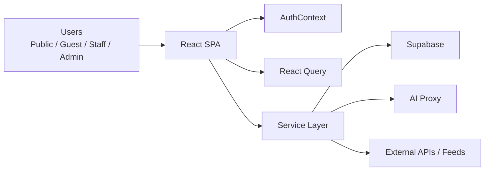

# NPT Dashboard

ระบบศูนย์ข้อมูลการเกษตรจังหวัดนครปฐม พัฒนาด้วย `React + Vite` สำหรับใช้เป็นทั้ง public data portal และ internal dashboard ของหน่วยงาน

## What This Project Does

โปรเจคนี้รวมความสามารถหลักไว้ในระบบเดียว:

- Public portal สำหรับเผยแพร่ข้อมูลเกษตรของจังหวัด
- Internal dashboard สำหรับเจ้าหน้าที่และผู้ใช้งานภายใน
- Data management สำหรับดู ค้นหา และจัดการข้อมูลจากหลายตาราง
- AI chatbot สำหรับถามตอบจากฐานข้อมูลและความรู้ทั่วไป

ตัวอย่างข้อมูลที่ระบบรองรับ:

- พื้นที่การเกษตร
- ทะเบียนเกษตรกร
- แปลงใหญ่
- Smart Farmer
- วิสาหกิจชุมชน
- ท่องเที่ยวเกษตร
- ศูนย์เรียนรู้และหน่วยงานภาคสนาม
- ข่าวเกษตร สภาพอากาศ AQI ราคาสินค้า และ hotspot

## Tech Stack

- Frontend: `React 19`, `Vite`, `React Router`, `Ant Design`
- Data fetching/cache: `TanStack React Query`
- Database/Auth: `Supabase`
- Visualization: `Recharts`, `Leaflet`, `React-Leaflet`
- AI integration: custom AI proxy, `Gemini`, `OpenRouter`
- Testing: `Vitest`, `Playwright`
- Deployment: `Netlify`

## High-Level Architecture



## Main Modules

### Public Experience

- `src/pages/LandingPage.jsx`
- `src/pages/InteractiveDashboard.jsx`
- `src/components/widgets/**`

หน้าสาธารณะสำหรับแสดงข้อมูลภาพรวม ข่าว สภาพอากาศ แผนที่ และ dashboard เชิงโต้ตอบ

### Internal Dashboard

- `src/components/Layout/**`
- `src/pages/Dashboard.jsx`
- `src/pages/admin/**`
- `src/pages/strategy/**`
- `src/pages/production/**`
- `src/pages/development/**`
- `src/pages/protection/**`

เป็นส่วนใช้งานหลังบ้าน แยกตามกลุ่มงานของหน่วยงาน

### Search

- `src/components/Search/**`
- `src/services/globalSearchService.js`

รองรับการค้นหาข้ามหลายตาราง โดยใช้ Supabase RPC ก่อน และ fallback เป็น parallel query ถ้าจำเป็น

### AI Chatbot

- `src/pages/Chatbot.jsx`
- `src/services/chatbotDataService.js`
- `src/services/aiService.js`

ใช้ AI ช่วยตีความคำถาม ดึงข้อมูลจากฐานข้อมูลที่เกี่ยวข้อง และสร้างคำตอบโดยอ้างอิงข้อมูลจริงในระบบ

## Route Overview

เส้นทางหลักของระบบ:

- `/` หน้า public landing page
- `/interactive-dashboard` หน้า dashboard สาธารณะแบบ interactive
- `/public/*` หน้า public detail บางชุด
- `/login` หน้าเข้าสู่ระบบ
- `/dashboard/*` ส่วน internal dashboard

ภายใต้ `/dashboard/*` มีโมดูลหลัก:

- `/dashboard/admin/*`
- `/dashboard/strategy/*`
- `/dashboard/production/*`
- `/dashboard/development/*`
- `/dashboard/protection/*`
- `/dashboard/chatbot`
- `/dashboard/search`

## Project Structure

```text
src/
  components/
  contexts/
  hooks/
  pages/
    admin/
    community/
    development/
    production/
    protection/
    strategy/
  services/
  styles/
  utils/
supabase/
tests/
public/
netlify/
```

## Getting Started

### Install

```bash
npm install
```

### Run Dev Server

```bash
npm run dev
```

### Build

```bash
npm run build
```

### Preview

```bash
npm run preview
```

## Testing

Run unit tests:

```bash
npm run test
```

Run e2e tests:

```bash
npm run test:e2e
```

## Environment

โปรเจคนี้ใช้ Supabase ผ่าน environment variables:

- `VITE_SUPABASE_URL`
- `VITE_SUPABASE_ANON_KEY`

ดูตัวอย่างเบื้องต้นได้ใน `.env.example`

หมายเหตุ: ในโค้ดปัจจุบันมี fallback สำหรับ Supabase URL/anon key อยู่ใน `src/supabaseClient.js` แต่ในงานจริงควรใช้ env เป็นหลัก

## Deployment

โปรเจคนี้ถูกตั้งค่าให้ deploy บน Netlify ผ่าน `netlify.toml`

- build command: `npm run build`
- publish directory: `dist`
- SPA redirect: `/* -> /index.html`

## Documentation

- รายละเอียดสถาปัตยกรรมแบบเต็ม: [ARCHITECTURE.md](./ARCHITECTURE.md)

## Current Notes

- `README.md` นี้เน้น onboarding และภาพรวมระบบ
- เอกสารเชิงลึกเรื่องโมดูล, data flow, access control และ integration อยู่ใน `ARCHITECTURE.md`
- บางไฟล์ในโปรเจคมีสัญญาณเรื่อง encoding ภาษาไทยที่ควรตรวจเพิ่มถ้าจะปรับเอกสารหรือข้อความใน UI ต่อ
