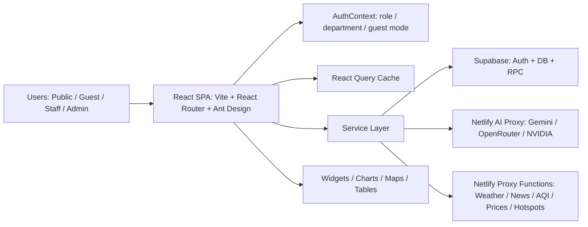

# NPT Smart Agri Dashboard

ระบบศูนย์ข้อมูลการเกษตรจังหวัดนครปฐม สำหรับรวมข้อมูลเกษตรที่กระจายอยู่หลายไฟล์ หลายกลุ่มงาน และหลายแหล่งข้อมูล ให้กลายเป็นเว็บแอปเดียวที่ใช้งานได้ทั้งแบบสาธารณะและภายในหน่วยงาน

โปรเจกต์นี้สร้างด้วย `React + Vite` เชื่อมต่อ `Supabase` สำหรับฐานข้อมูลและระบบสมาชิก ใช้ `Ant Design` เป็น UI หลัก มี dashboard, ตารางข้อมูล, แผนที่, กราฟ, global search, data request workflow, public portal และ AI chatbot สำหรับถามตอบข้อมูลในระบบ

## สารบัญ

- [ภาพรวม](#ภาพรวม)
- [ที่มาที่ไป](#ที่มาที่ไป)
- [ปัญหาที่ระบบนี้แก้](#ปัญหาที่ระบบนี้แก้)
- [ผู้ใช้หลัก](#ผู้ใช้หลัก)
- [ความสามารถหลัก](#ความสามารถหลัก)
- [สถาปัตยกรรมระบบ](#สถาปัตยกรรมระบบ)
- [โครงสร้างข้อมูลและกลุ่มงาน](#โครงสร้างข้อมูลและกลุ่มงาน)
- [เส้นทางหน้าเว็บ](#เส้นทางหน้าเว็บ)
- [ระบบสิทธิ์](#ระบบสิทธิ์)
- [AI Chatbot](#ai-chatbot)
- [Global Search](#global-search)
- [Data Requests](#data-requests)
- [External Feeds และ Netlify Functions](#external-feeds-และ-netlify-functions)
- [Tech Stack](#tech-stack)
- [โครงสร้างโปรเจกต์](#โครงสร้างโปรเจกต์)
- [เริ่มต้นพัฒนา](#เริ่มต้นพัฒนา)
- [Environment Variables](#environment-variables)
- [คำสั่งที่ใช้บ่อย](#คำสั่งที่ใช้บ่อย)
- [ทดสอบและตรวจคุณภาพ](#ทดสอบและตรวจคุณภาพ)
- [Deploy](#deploy)
- [เอกสารเพิ่มเติม](#เอกสารเพิ่มเติม)
- [แนวทางดูแลระบบ](#แนวทางดูแลระบบ)
- [สถานะและข้อควรระวัง](#สถานะและข้อควรระวัง)

## ภาพรวม

`npt_dashboard` คือเว็บแอปศูนย์กลางข้อมูลเกษตรของจังหวัดนครปฐม มีเป้าหมายให้ผู้บริหาร เจ้าหน้าที่ และประชาชนเข้าถึงข้อมูลเกษตรได้ง่ายขึ้นจากระบบเดียว แทนการกระจายข้อมูลไว้ใน Excel, Google Sheet, ไฟล์รายงาน, ระบบส่วนกลาง และเอกสารภายในหลายชุด

ระบบแบ่งประสบการณ์ใช้งานเป็น 2 ฝั่งหลัก:

| ฝั่งระบบ | ใช้สำหรับ | ผู้ใช้ |
|---|---|---|
| Public Portal | เผยแพร่ข้อมูลภาพรวม ข่าว สภาพอากาศ แผนที่ และ dashboard บางส่วน | ประชาชน ผู้สนใจ หน่วยงานภายนอก |
| Internal Dashboard | ดูข้อมูลเชิงลึก จัดการข้อมูล ค้นหา ใช้ AI และติดตามงานตามกลุ่มภารกิจ | เจ้าหน้าที่ ผู้บริหาร ผู้ดูแลระบบ |

แกนสำคัญของระบบคือการรวมข้อมูลเกษตรระดับจังหวัดให้เป็นฐานข้อมูลกลาง แล้วแสดงผลผ่าน dashboard, CRUD table, map, chart, search และ AI assistant โดยยังคุมสิทธิ์ตามบทบาทและกลุ่มงาน

## ที่มาที่ไป

งานข้อมูลเกษตรระดับจังหวัดมักมีข้อมูลจำนวนมากและเปลี่ยนแปลงต่อเนื่อง เช่น ทะเบียนเกษตรกร พื้นที่การเกษตร แปลงใหญ่ วิสาหกิจชุมชน Smart Farmer ศูนย์เรียนรู้ ภัยพิบัติ จุดความร้อน และข้อมูลข่าวสารด้านการเกษตร ข้อมูลเหล่านี้มักเกิดจากหลายกลุ่มงานและหลายช่องทาง ทำให้การสรุปภาพรวมจังหวัดใช้เวลามาก

โจทย์หลักของระบบนี้คือ:

- ทำให้ข้อมูลที่เคยกระจายอยู่หลายที่ ถูกจัดเก็บและเปิดดูได้จากศูนย์กลางเดียว
- ทำให้ข้อมูลเชิงพื้นที่ ตาราง กราฟ และแผนที่อยู่ใน workflow เดียวกัน
- ทำให้เจ้าหน้าที่ค้นหาข้อมูลข้ามหลายหมวดได้เร็ว
- ทำให้ผู้บริหารเห็นภาพรวมโดยไม่ต้องรอรวบรวมรายงานใหม่ทุกครั้ง
- ทำให้ข้อมูลบางส่วนเผยแพร่สาธารณะได้ โดยไม่เปิดข้อมูลภายในเกินจำเป็น
- ทำให้ AI ช่วยตอบคำถาม สรุปข้อมูล และช่วยทำงานข้อมูลซ้ำ ๆ ได้

ระบบจึงถูกออกแบบให้เป็นมากกว่า dashboard แสดงกราฟ แต่เป็น data portal + internal operation dashboard + search engine + AI assistant สำหรับข้อมูลเกษตรจังหวัด

## ปัญหาที่ระบบนี้แก้

### 1. ข้อมูลกระจัดกระจาย

ก่อนมีระบบกลาง ข้อมูลมักอยู่ใน Excel, Google Sheet, รายงาน PDF, ระบบของแต่ละกลุ่มงาน หรือฐานข้อมูลเฉพาะกิจ ทำให้ตอบคำถามง่าย ๆ เช่น "อำเภอใดมีแปลงใหญ่มากที่สุด" หรือ "มี Smart Farmer อยู่ในตำบลใดบ้าง" ต้องเปิดหลายไฟล์และรวมเอง

ระบบนี้ช่วยรวมข้อมูลลงฐานกลาง แล้วให้หน้าเว็บดึงข้อมูลชุดเดียวกันไปใช้ในหลายหน้าจอ

### 2. รายงานใช้เวลามาก

เมื่อผู้บริหารต้องการภาพรวม เจ้าหน้าที่มักต้องคัดลอกข้อมูล ทำ pivot table ทำกราฟ และจัดรูปแบบรายงานใหม่ ระบบนี้ลดภาระด้วย dashboard, chart, table, export และ AI ช่วยสรุป

### 3. ค้นหาข้อมูลยาก

ข้อมูลเกษตรมีหลายตาราง หลายชื่อฟิลด์ และหลายหมวด ระบบนี้มี global search สำหรับค้นหาข้ามตาราง ลดการไล่เปิดเมนูทีละหน้า

### 4. ใช้ข้อมูลเผยแพร่และข้อมูลภายในปนกัน

ระบบแยก public routes ออกจาก internal dashboard และมี role/department logic เพื่อควบคุมการเข้าถึงตามประเภทผู้ใช้

### 5. ความรู้ระบบอยู่กับคน ไม่อยู่ในเอกสาร

โปรเจกต์นี้มีคู่มือและเอกสาร reference แยกเป็นหมวด เพื่อให้ทีมใหม่ จังหวัดอื่น หรือผู้ดูแลรุ่นถัดไปเข้าใจวิธีสร้าง ใช้งาน และดูแลระบบต่อได้

## ผู้ใช้หลัก

| กลุ่มผู้ใช้ | ความต้องการหลัก |
|---|---|
| ประชาชนและผู้สนใจ | ดูข้อมูลเกษตรจังหวัด ข่าว แผนที่ สภาพอากาศ และข้อมูล public |
| เจ้าหน้าที่กลุ่มงาน | ดูและจัดการข้อมูลของกลุ่มงานตนเอง |
| ผู้บริหาร | เห็นภาพรวม สถานการณ์ ปัญหา และตัวชี้วัดสำคัญ |
| ผู้ดูแลระบบ | จัดการผู้ใช้ สิทธิ์ ข้อมูล master และ audit trail |
| ทีมพัฒนา | ต่อยอดหน้า dashboard, data model, AI, search และ integration |
| จังหวัดอื่น | ใช้เป็นต้นแบบสร้างศูนย์ข้อมูลเกษตรของตนเอง |

## ความสามารถหลัก

### Public Portal

- หน้า landing page สำหรับศูนย์ข้อมูลเกษตรจังหวัด
- interactive dashboard สำหรับข้อมูลภาพรวม
- public detail pages สำหรับข้อมูลที่เผยแพร่ได้
- widget ข่าวเกษตร สภาพอากาศ AQI ราคาสินค้าเกษตร ราคาน้ำมัน และจุดเฝ้าระวัง
- แผนที่และข้อมูลเชิงพื้นที่
- รองรับผู้ใช้ที่ไม่ต้อง login

### Internal Dashboard

- dashboard รวมหลังเข้าสู่ระบบ
- เมนูแยกตามกลุ่มงาน
- ตารางข้อมูล CRUD หลายหมวด
- dashboard เฉพาะกลุ่มงาน
- global search ข้ามหลายตาราง
- AI chatbot สำหรับถามข้อมูลและสรุปบริบท
- data request workflow สำหรับรับข้อมูลจาก Google Sheet/CSV
- role-based navigation และ access control

### Data Management

- ตารางข้อมูลเชิงโครงสร้างจาก Supabase
- หน้า CRUD สำหรับเพิ่ม แก้ไข ลบ ดู และ export
- รองรับข้อมูลเกษตรหลายมิติ เช่น บุคคล พื้นที่ กลุ่ม เกษตรกร ศูนย์เรียนรู้ มาตรฐาน GAP ภัยพิบัติ และ hotspot
- ใช้ React Query ช่วย cache ข้อมูลและลด request ซ้ำ

### AI และการค้นหา

- AI chatbot ชื่อ "น้องข้าวหอม" สำหรับถามตอบข้อมูลเกษตร
- ดึง context จากฐานข้อมูลก่อนส่งให้ AI
- รองรับ Gemini, OpenRouter และ NVIDIA-compatible endpoint ผ่าน proxy
- มี global search สำหรับค้นหาข้อมูลข้ามตาราง
- มี fallback query เมื่อ RPC ไม่พร้อม

## สถาปัตยกรรมระบบ



### Layer หลัก

| Layer | ไฟล์/โฟลเดอร์ | หน้าที่ |
|---|---|---|
| App Shell | `src/App.jsx` | route, provider, lazy loading, protected routes |
| Presentation | `src/pages/**`, `src/components/**` | หน้าเว็บ dashboard, table, map, chatbot, widgets |
| State/Auth | `src/contexts/AuthContext.jsx`, `src/hooks/**` | session, role, department, cache, dashboard hooks |
| Service | `src/services/**`, `src/supabaseClient.js` | Supabase, search, chatbot context, AI call |
| Data | `supabase/**` | schema, migration, table definitions |
| Edge/Proxy | `netlify/functions/**` | proxy external APIs และ AI providers |
| Docs | `docs/manual/**`, `docs/reference/**` | คู่มือและเอกสารอ้างอิง |

## โครงสร้างข้อมูลและกลุ่มงาน

ระบบออกแบบตามภารกิจของสำนักงานเกษตรจังหวัด โดยแยกข้อมูลเป็นกลุ่มงานเพื่อให้เมนู สิทธิ์ และการดูแลข้อมูลชัดเจน

### ฝ่ายบริหารทั่วไป

- บุคลากร
- พัสดุ/ครุภัณฑ์
- งบประมาณ
- ผู้ใช้ระบบ
- audit log
- recent activities

ตาราง/โมดูลตัวอย่าง:

- `personnel`
- `assets`
- `budgets`
- `profiles`
- `audit_logs`

### กลุ่มยุทธศาสตร์และสารสนเทศ

- ทะเบียนเกษตรกร
- GIS และพิกัดพื้นที่
- พื้นที่การเกษตร
- ศูนย์เรียนรู้
- สภาพอากาศรายวัน
- ข้อมูลภัยพิบัติ

ตาราง/โมดูลตัวอย่าง:

- `farmer_registry`
- `gis_areas`
- `agricultural_areas`
- `learning_centers`
- `disasters`
- `daily_weather`

### กลุ่มส่งเสริมและพัฒนาการผลิต

- แปลงใหญ่
- มาตรฐาน GAP / ใบรับรอง
- ผลผลิตพืช
- แบบเก็บข้อมูลมะพร้าวน้ำหอม

ตาราง/โมดูลตัวอย่าง:

- `large_plots`
- `certifications`
- `crop_production`
- `coconut_aromatic_surveys`

### กลุ่มส่งเสริมและพัฒนาเกษตรกร

- วิสาหกิจชุมชน
- Smart Farmer
- Young Smart Farmer
- กลุ่มส่งเสริมอาชีพการเกษตร
- กลุ่มแม่บ้านเกษตรกร
- กลุ่มยุวเกษตรกร
- สถาบันเกษตรกร
- ท่องเที่ยวเชิงเกษตร
- ภัยพิบัติในมุมงานพัฒนา

ตาราง/โมดูลตัวอย่าง:

- `community_enterprises`
- `smart_farmer_sf`
- `young_smart_farmer_ysf`
- `agricultural_career_groups`
- `housewife_farmer_groups`
- `young_farmer_groups`
- `young_farmer_groups_detailed`
- `farmer_institutes`
- `agri_tourism`

### กลุ่มอารักขาพืช

- แปลงพยากรณ์
- ศูนย์จัดการศัตรูพืชชุมชน
- ศูนย์จัดการดินปุ๋ยชุมชน
- จุดความร้อน/Hotspot จาก GISTDA

ตาราง/โมดูลตัวอย่าง:

- `forecast_plots`
- `pest_centers`
- `soil_fertilizer_centers`
- `fire_hotspots`
- `biocontrol_stock`

### ชุมชนเกษตรกร

- กระดานข่าวถามตอบ
- พื้นที่แลกเปลี่ยนข้อมูลและประเด็นจากพื้นที่

โมดูลตัวอย่าง:

- `FarmerForum`

## เส้นทางหน้าเว็บ

### Public Routes

| Route | หน้า | รายละเอียด |
|---|---|---|
| `/` | `LandingPage` | หน้าแรก public portal |
| `/interactive-dashboard` | `InteractiveDashboard` | dashboard สาธารณะแบบ interactive |
| `/public/large-plots` | `LargePlots` | ข้อมูลแปลงใหญ่แบบ public |
| `/public/smart-farmer-sf` | `SmartFarmerSf` | Smart Farmer |
| `/public/young-smart-farmer-ysf` | `YoungSmartFarmerYsf` | Young Smart Farmer |
| `/public/agricultural-career-groups` | `AgriculturalCareerGroups` | กลุ่มส่งเสริมอาชีพ |
| `/public/young-farmer-groups` | `YoungFarmerGroups` | กลุ่มยุวเกษตรกร |
| `/public/community-enterprises` | `CommunityEnterprises` | วิสาหกิจชุมชน |
| `/public/agri-tourism` | `AgriTourism` | ท่องเที่ยวเชิงเกษตร |
| `/public/farmer-institutes` | `FarmerInstitutes` | สถาบันเกษตรกร |
| `/public/agricultural-areas` | `AgriculturalAreas` | พื้นที่การเกษตร |

### Auth Routes

| Route | หน้า | รายละเอียด |
|---|---|---|
| `/login` | `Login` | เข้าสู่ระบบหรือ guest mode |
| `/dashboard` | `Dashboard` | dashboard รวม |
| `/dashboard/search` | `SearchResults` | ผลการค้นหาข้ามระบบ |
| `/dashboard/chatbot` | `Chatbot` | AI assistant |
| `/dashboard/data-requests` | `DataRequests` | workflow คำขอข้อมูล |

### Admin Routes

| Route | หน้า |
|---|---|
| `/dashboard/admin/overview` | Dashboard ฝ่ายบริหาร |
| `/dashboard/admin/personnel` | บุคลากร |
| `/dashboard/admin/assets` | พัสดุ/ครุภัณฑ์ |
| `/dashboard/admin/budgets` | งบประมาณ |
| `/dashboard/admin/users` | จัดการสิทธิ์ผู้ใช้ |
| `/dashboard/admin/audit-log` | ประวัติการแก้ไข |
| `/dashboard/admin/recent-activities` | กิจกรรมล่าสุด |

### Strategy Routes

| Route | หน้า |
|---|---|
| `/dashboard/strategy/overview` | Dashboard กลุ่มยุทธศาสตร์ |
| `/dashboard/strategy/farmer-registry` | ทะเบียนเกษตรกร |
| `/dashboard/strategy/gis` | GIS |
| `/dashboard/strategy/agricultural-areas` | พื้นที่การเกษตร |
| `/dashboard/strategy/learning-centers` | ศูนย์เรียนรู้ |
| `/dashboard/strategy/daily-weather` | สภาพอากาศ/น้ำฝน |

### Production Routes

| Route | หน้า |
|---|---|
| `/dashboard/production/overview` | Dashboard กลุ่มส่งเสริมการผลิต |
| `/dashboard/production/large-plots` | แปลงใหญ่ |
| `/dashboard/production/certifications` | มาตรฐาน GAP |
| `/dashboard/production/crop-production` | ผลผลิตพืช |
| `/dashboard/production/coconut-aromatic-survey` | แบบเก็บมะพร้าวน้ำหอม |

### Development Routes

| Route | หน้า |
|---|---|
| `/dashboard/development/overview` | Dashboard กลุ่มส่งเสริมเกษตรกร |
| `/dashboard/development/community-enterprises` | วิสาหกิจชุมชน |
| `/dashboard/development/smart-farmer-sf` | Smart Farmer |
| `/dashboard/development/young-smart-farmer-ysf` | Young Smart Farmer |
| `/dashboard/development/agricultural-career-groups` | กลุ่มส่งเสริมอาชีพ |
| `/dashboard/development/housewife-farmer-groups` | กลุ่มแม่บ้านเกษตรกร |
| `/dashboard/development/young-farmer-groups` | กลุ่มยุวเกษตรกร |
| `/dashboard/development/farmer-institutes` | สถาบันเกษตรกร |
| `/dashboard/development/agri-tourism` | ท่องเที่ยวเชิงเกษตร |
| `/dashboard/development/disasters` | ภัยพิบัติ |

### Protection Routes

| Route | หน้า |
|---|---|
| `/dashboard/protection/overview` | Dashboard กลุ่มอารักขาพืช |
| `/dashboard/protection/pest-outbreaks` | แปลงพยากรณ์ |
| `/dashboard/protection/pest-centers` | ศูนย์จัดการศัตรูพืชชุมชน |
| `/dashboard/protection/soil-fertilizer` | ศูนย์จัดการดินปุ๋ยชุมชน |
| `/dashboard/protection/fire-hotspots` | จุด Hotspot |

## ระบบสิทธิ์

ระบบใช้ `AuthContext` อ่านข้อมูล session จาก Supabase Auth และ profile จากตาราง `profiles` เพื่อกำหนด `role`, `department` และ `groupKey`

### Role หลัก

| Role | ความสามารถ |
|---|---|
| `guest` | เข้า dashboard บางส่วน ดูเมนู public/internal ที่จำกัด ไม่ใช้ chatbot และ data requests |
| `viewer` | ดูข้อมูลตามกลุ่มงานตนเอง |
| `editor` | ดูและแก้ไขข้อมูลตามกลุ่มงานตนเอง ใช้ data requests ได้ |
| `admin` | เห็นทุกเมนู จัดการผู้ใช้ ดู audit log ลบข้อมูลได้ |

### Department Mapping

| Department | Group Key |
|---|---|
| ฝ่ายบริหารทั่วไป | `admin` |
| กลุ่มยุทธศาสตร์และสารสนเทศ | `strategy` |
| กลุ่มส่งเสริมและพัฒนาการผลิต | `production` |
| กลุ่มส่งเสริมและพัฒนาเกษตรกร | `development` |
| กลุ่มอารักขาพืช | `protection` |

### Access Pattern

- `ProtectedRoute` ป้องกันหน้า `/dashboard/*`
- `AdminRoute` จำกัดหน้าจัดการระบบให้ admin เท่านั้น
- `DataRequestRoute` จำกัด workflow คำขอข้อมูลให้ `admin` และ `editor`
- `NonGuestRoute` ป้องกัน guest เข้า chatbot
- sidebar filter เมนูตาม role และ department
- helper `canAccessGroup` และ `canAccessTable` ใช้คุมสิทธิ์ระดับกลุ่มงาน/ตาราง

## AI Chatbot

AI chatbot เป็นผู้ช่วยข้อมูลเกษตรในระบบ ใช้ไฟล์หลัก:

- `src/pages/Chatbot.jsx`
- `src/services/chatbotDataService.js`
- `src/services/aiService.js`
- `src/utils/chatbotConstants.js`
- `netlify/functions/ai-proxy.js`

### แนวทางทำงาน

1. ผู้ใช้ถามคำถามภาษาธรรมชาติ
2. ระบบวิเคราะห์ intent และบริบทจากข้อความ
3. `chatbotDataService` ดึงข้อมูลที่เกี่ยวข้องจาก Supabase
4. ระบบสร้าง context แบบย่อเพื่อไม่ส่ง row ดิบมากเกินไป
5. `aiService` เรียก AI ผ่าน `/.netlify/functions/ai-proxy`
6. AI สร้างคำตอบจากข้อมูลจริงในระบบและบริบทคำถาม

### Provider ที่รองรับ

- Gemini ผ่าน Google Generative Language API
- OpenRouter-compatible models
- NVIDIA/OpenAI-compatible endpoint สำหรับบาง model

### สิ่งที่ AI ช่วยได้

- ถามข้อมูลเกษตรตามอำเภอ/ตำบล/กลุ่มงาน
- สรุปภาพรวมจากหลายตาราง
- ช่วยเปรียบเทียบข้อมูล
- ช่วยสร้างคำอธิบายสำหรับผู้บริหาร
- ช่วยอ่านไฟล์แนบในบาง workflow
- ช่วยแนะนำ schema จาก Google Sheet/CSV ใน data request workflow

## Global Search

Global Search ใช้ค้นหาข้ามตารางจาก sidebar และหน้า search results

ไฟล์หลัก:

- `src/components/Search/**`
- `src/services/globalSearchService.js`

แนวทางทำงาน:

- พยายามค้นหาผ่าน Supabase RPC `global_search`
- ถ้า RPC ไม่พร้อม ใช้ fallback query หลายตารางแบบขนาน
- เก็บ recent searches ใน `localStorage`
- ใช้กับข้อมูลหลายหมวด เช่น แปลงใหญ่ Smart Farmer วิสาหกิจชุมชน พื้นที่ และศูนย์ต่าง ๆ

## Data Requests

Data Requests เป็น workflow สำหรับรับหรือจัดการคำขอข้อมูล โดยรองรับการนำข้อมูลจาก Google Sheet หรือ CSV export URL เข้าสู่กระบวนการตรวจ schema

ไฟล์หลัก:

- `src/pages/dataRequests/DataRequests.jsx`
- `src/utils/dataRequestGrid.js`
- `supabase/data_requests.sql`

ความสามารถหลัก:

- บันทึกคำขอข้อมูล
- วาง Google Sheet URL หรือ CSV export URL
- แปลง Google Sheet URL เป็น CSV export URL
- ใช้ AI แนะนำ schema จากหัวตาราง
- fallback เป็น schema จาก header เมื่อ AI ใช้ไม่ได้
- จำกัดการเข้าถึงเฉพาะ `admin` และ `editor`

## External Feeds และ Netlify Functions

ระบบมี Netlify Functions เพื่อ proxy ข้อมูลภายนอก ลดปัญหา CORS และซ่อน logic บางส่วนไว้ฝั่ง serverless

ตัวอย่าง function:

| Function | ใช้สำหรับ |
|---|---|
| `ai-proxy.js` | เรียก AI providers |
| `rss-proxy.js` | ดึง RSS/news feeds |
| `wp-proxy.js` | proxy WordPress APIs |
| `moc-price-proxy.js` | ดึงราคาสินค้าเกษตรจาก MOC |
| `bangchak-oil-price-proxy.js` | ดึงราคาน้ำมัน |
| `gistda-proxy.js` | proxy ข้อมูลจาก GISTDA |
| `sync-hotspots.js` | sync จุดความร้อนเข้า Supabase |
| `sync-weather.js` | sync สภาพอากาศเข้า Supabase |
| `public-certifications.js` | endpoint public สำหรับข้อมูล certification |

Widget ฝั่ง frontend อยู่ใน `src/components/widgets/**` เช่น ข่าว สภาพอากาศ ราคาเกษตร แผนที่ และข้อมูลเฝ้าระวัง

## Tech Stack

| หมวด | เทคโนโลยี |
|---|---|
| Frontend | React 19, Vite |
| Routing | React Router DOM 7 |
| UI | Ant Design 6, Ant Design Icons |
| State/Data Fetching | TanStack React Query |
| Backend-as-a-Service | Supabase Auth, Supabase Database, RPC |
| Chart | Recharts |
| Map | Leaflet, React Leaflet |
| Export/Canvas/PDF | XLSX, html2canvas, jsPDF |
| AI | Gemini, OpenRouter, NVIDIA-compatible API ผ่าน Netlify Function |
| Serverless | Netlify Functions |
| Testing | Vitest, Testing Library, Playwright |
| Lint | ESLint |
| Deploy | Netlify |

## โครงสร้างโปรเจกต์

```text
npt_dashboard/
  .github/
  docs/
    manual/
    reference/
  netlify/
    functions/
  public/
  scripts/
  src/
    components/
      Chatbot/
      DataTable/
      Layout/
      Search/
      widgets/
    contexts/
    hooks/
    pages/
      admin/
      community/
      dataRequests/
      development/
      production/
      protection/
      strategy/
    services/
    styles/
    utils/
  supabase/
  tests/
  .env.example
  netlify.toml
  package.json
  vite.config.js
```

### โฟลเดอร์สำคัญ

| Path | รายละเอียด |
|---|---|
| `src/App.jsx` | route ทั้งระบบและ protected route |
| `src/pages/**` | หน้าหลักทั้งหมด |
| `src/components/Layout/**` | layout, sidebar, app shell |
| `src/components/DataTable/**` | ตาราง CRUD กลาง |
| `src/components/widgets/**` | widget public/dashboard |
| `src/services/**` | service สำหรับ search, AI, chatbot context |
| `src/contexts/AuthContext.jsx` | auth, role, department, access helper |
| `supabase/**` | schema และ SQL migration |
| `netlify/functions/**` | serverless proxy และ sync jobs |
| `docs/manual/**` | คู่มือการสร้างระบบแบบเป็นขั้นตอน |
| `docs/reference/**` | เอกสารอ้างอิงเชิงลึก |

## เริ่มต้นพัฒนา

### Prerequisites

- Node.js รุ่นใหม่ที่รองรับ Vite 7
- npm
- Supabase project
- Netlify account ถ้าต้อง deploy หรือทดสอบ functions ใกล้เคียง production

### ติดตั้ง dependency

```bash
npm install
```

### ตั้งค่า environment

คัดลอก `.env.example` เป็น `.env`

```bash
cp .env.example .env
```

ใส่ค่า Supabase:

```env
VITE_SUPABASE_URL=https://your-project.supabase.co
VITE_SUPABASE_ANON_KEY=your-anon-key-here
```

### รัน dev server

```bash
npm run dev
```

Vite จะเปิด local dev server ตาม port ที่ว่าง เช่น `http://localhost:5173`

### Build production

```bash
npm run build
```

### Preview build

```bash
npm run preview
```

## Environment Variables

### Frontend required

| Variable | ใช้สำหรับ |
|---|---|
| `VITE_SUPABASE_URL` | URL ของ Supabase project |
| `VITE_SUPABASE_ANON_KEY` | Supabase anon key สำหรับ client |

### Netlify Functions optional/production

| Variable | ใช้สำหรับ |
|---|---|
| `SUPABASE_SERVICE_ROLE_KEY` | ใช้ใน function ที่ต้อง sync/write ข้อมูล server-side |
| `GEMINI_API_KEY` | เรียก Gemini ผ่าน `ai-proxy` |
| `OPENROUTER_API_KEY` | เรียก OpenRouter models |
| `NVIDIA_API_KEY` | เรียก NVIDIA/OpenAI-compatible model |
| `VITE_GISTDA_API_KEY` | ใช้กับ hotspot/GISTDA workflow บางส่วน |

หมายเหตุ: โค้ดปัจจุบันมี fallback key บางจุดเพื่อให้ demo/dev ทำงานได้ แต่ production ควรตั้งค่าผ่าน environment variables เสมอ และไม่ควรพึ่งพา key ที่ hardcode ใน client หรือ function

## คำสั่งที่ใช้บ่อย

| คำสั่ง | ความหมาย |
|---|---|
| `npm run dev` | เปิด Vite dev server |
| `npm run build` | build production |
| `npm run build:netlify` | build สำหรับ Netlify |
| `npm run preview` | preview ไฟล์ build |
| `npm run lint` | ตรวจ ESLint |
| `npm run test` | รัน Vitest |
| `npm run test:watch` | รัน Vitest watch mode |
| `npm run test:e2e` | รัน Playwright e2e |
| `npm run test:e2e:ui` | เปิด Playwright UI |
| `npm run prerender` | รัน script prerender |

## ทดสอบและตรวจคุณภาพ

### Unit Test

```bash
npm run test
```

ใช้สำหรับ logic ที่แยกทดสอบได้ เช่น utility, service และ data transform

### E2E Test

```bash
npm run test:e2e
```

ใช้ตรวจ flow หน้าเว็บจริง เช่น login, dashboard, public pages หรือ workflow ที่ต้องผ่าน browser

### Lint

```bash
npm run lint
```

ใช้ตรวจ style และปัญหา JavaScript/React ตาม ESLint config

### Build Check

```bash
npm run build
```

ควรรันก่อน deploy หรือก่อน merge งานใหญ่ เพื่อจับปัญหา import, route, syntax และ bundle

## Deploy

โปรเจกต์ตั้งค่า deploy บน Netlify ผ่าน `netlify.toml`

```toml
[build]
  publish = "dist"
  command = "npm run build:netlify"
```

SPA redirect:

```toml
[[redirects]]
  from = "/*"
  to = "/index.html"
  status = 200
```

### ขั้นตอน deploy โดยย่อ

1. ตั้งค่า environment variables ใน Netlify
2. เชื่อม repo กับ Netlify
3. ใช้ build command `npm run build:netlify`
4. ตั้ง publish directory เป็น `dist`
5. ตรวจ Netlify Functions ว่า deploy แล้ว
6. ทดสอบ public routes และ `/dashboard`
7. ทดสอบ AI proxy เฉพาะเมื่อใส่ API key แล้ว
8. ตรวจ security headers และ SPA redirect

## เอกสารเพิ่มเติม

เอกสารใน repo แบ่งเป็น 2 หมวด

### คู่มือสร้างระบบ

อยู่ที่ `docs/manual/`

| ไฟล์ | เนื้อหา |
|---|---|
| `docs/manual/README.md` | ภาพรวมคู่มือ |
| `docs/manual/01-ภาพรวมและเป้าหมายระบบ.md` | เป้าหมาย ผู้ใช้ และขอบเขต |
| `docs/manual/02-การรวบรวมข้อมูลจากจังหวัด.md` | วิธีสำรวจและขอข้อมูล |
| `docs/manual/03-การทำความสะอาดและเตรียมข้อมูล.md` | เตรียม Excel/CSV ให้พร้อมใช้ |
| `docs/manual/04-การออกแบบฐานข้อมูลและตั้งค่า-supabase.md` | schema, Auth, RLS, RPC |
| `docs/manual/05-การติดตั้งและตั้งค่าโปรเจกต์.md` | clone, install, env, run dev |
| `docs/manual/06-การสร้าง-dashboard-search-ai.md` | Dashboard, Search, AI |
| `docs/manual/07-ความปลอดภัยและการ-deploy.md` | security และ Netlify deploy |
| `docs/manual/08-การดูแลระบบและอบรมผู้ใช้งาน.md` | maintenance และ training |

### เอกสารอ้างอิง

อยู่ที่ `docs/reference/`

| ไฟล์ | เนื้อหา |
|---|---|
| `docs/reference/SYSTEM_OVERVIEW.md` | สรุประบบทั้งภาพรวม |
| `docs/reference/ARCHITECTURE.md` | สถาปัตยกรรม โครงสร้างโมดูล และ data flow |
| `docs/reference/DATABASE_AND_WIDGET_TABLES.md` | ตารางฐานข้อมูลและ widget |
| `docs/reference/CONTEST_PLAN.md` | แผนประกวด/แผนเล่าเรื่องโครงการ |
| `docs/reference/CONTEST_APPLICATION_DRAFT.md` | draft เอกสารสมัคร/นำเสนอโครงการ |
| `docs/reference/INFOGRAPHIC_4_PART_CONTENT.md` | เนื้อหา infographic 4 ส่วน |

## แนวทางดูแลระบบ

### งานประจำของผู้ดูแลระบบ

- ตรวจผู้ใช้ใหม่และกำหนด role/department
- ตรวจ audit log เมื่อมีการแก้ไขข้อมูลสำคัญ
- ตรวจ data requests ที่รอดำเนินการ
- ตรวจความสมบูรณ์ของข้อมูลแต่ละกลุ่มงาน
- ตรวจ Netlify deploy logs และ function errors
- ตรวจ Supabase quota, auth logs และ database logs
- ตรวจ API key และ rotate key ตามรอบความปลอดภัย

### งานประจำของเจ้าหน้าที่กลุ่มงาน

- อัปเดตข้อมูลตามรอบของกลุ่มงาน
- ตรวจ field สำคัญ เช่น อำเภอ ตำบล ปีงบประมาณ ประเภทกิจกรรม และพิกัด
- ตรวจข้อมูล public ก่อนเผยแพร่
- ใช้ dashboard และ search เพื่อตรวจความผิดปกติ
- ส่ง feedback เมื่อ field หรือรายงานยังไม่พอใช้งาน

### งานประจำของทีมพัฒนา

- เพิ่ม/แก้หน้า dashboard ตามความต้องการผู้ใช้
- ปรับ schema และ migration เมื่อมีชุดข้อมูลใหม่
- เพิ่ม test ให้ utility และ flow สำคัญ
- ตรวจ bundle และ performance ของ dashboard/widgets
- ปรับ prompt/context ของ AI ให้ตอบตรงขึ้น
- ลด hardcoded fallback และย้าย config สำคัญไป env

## Roadmap ที่ควรต่อยอด

- เพิ่ม RLS policy ให้ครบตามตาราง production
- เพิ่ม dashboard summary รายอำเภอ/ตำบลแบบ standardized
- เพิ่มระบบ import/export ที่ตรวจ schema เข้มขึ้น
- เพิ่ม data quality score ต่อชุดข้อมูล
- เพิ่ม workflow approve ก่อนเผยแพร่ข้อมูล public
- เพิ่ม e2e tests สำหรับ route หลัก
- เพิ่ม monitoring ของ Netlify Functions
- เพิ่มเอกสาร API/data dictionary รายตาราง
- เพิ่ม role matrix แบบละเอียดในเอกสาร security
- ย้าย secret/fallback key ออกจาก source code ให้หมดใน production

## สถานะและข้อควรระวัง

- README นี้อธิบายจากโครงสร้างโค้ดปัจจุบันของ repo
- เอกสารคู่มือใน `docs/manual` เป็นชุดเอกสารใช้งานและขยายต่อได้
- ไฟล์ reference ใน `docs/reference` ใช้สำหรับอ่านเชิงลึก ไม่ใช่คู่มือทีละขั้น
- บางไฟล์ configuration มีข้อความไทยที่เคยผ่าน encoding ไม่ตรง ควรตรวจเมื่อแก้เอกสารหรือ UI copy
- Production ควรใช้ environment variables จริง ไม่ควรพึ่ง fallback key ใน source code
- ควรตรวจ Supabase RLS, service role usage และ public endpoint ก่อนเปิดใช้งานจริง

## License และการนำไปใช้

โปรเจกต์นี้เป็นระบบต้นแบบ/ระบบปฏิบัติการสำหรับศูนย์ข้อมูลเกษตรจังหวัดนครปฐม สามารถใช้เป็นแนวทางสำหรับหน่วยงานหรือจังหวัดอื่นที่ต้องการสร้างระบบข้อมูลลักษณะเดียวกัน โดยควรปรับ schema, ชุดข้อมูล, สิทธิ์ผู้ใช้, branding และขั้นตอนความปลอดภัยให้เหมาะกับบริบทของพื้นที่ตนเอง
