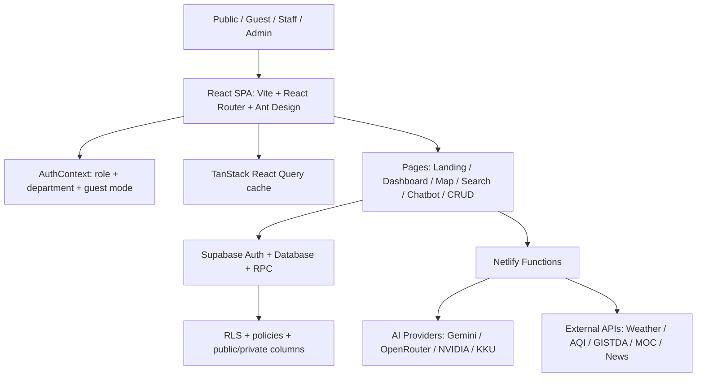

# NPT Smart Agri Dashboard

## เอกสารสรุปฟีเจอร์และสถานะระบบจริง

เอกสารนี้ปรับปรุงจากไฟล์ summary เดิม โดยตรวจเทียบกับโค้ดและเอกสารใน repository `npt_dashboard` แล้วแยกชัดว่าแต่ละฟังก์ชัน "ใช้งานได้จริง", "ใช้งานได้บางส่วน", หรือ "ยังเป็นแผน/ต้องพัฒนาต่อ"

แหล่งตรวจหลัก:

- `src/App.jsx` สำหรับ routes และพื้นที่ใช้งาน public/internal
- `src/domain/datasetCatalog.js` สำหรับ dataset และเส้นทางของแต่ละตาราง
- `src/hooks/useDashboardData.js` สำหรับข้อมูล dashboard
- `src/pages/*` และ `src/components/*` สำหรับฟังก์ชันหน้าจอจริง
- `src/services/*` สำหรับ AI, search, data service
- `netlify/functions/*` สำหรับ proxy, sync, forecast, LINE webhook
- `supabase/*.sql` สำหรับ schema, RLS, RPC และ migrations
- `docs/reference/DATABASE_AND_WIDGET_TABLES.md` สำหรับจำนวนข้อมูลและ widget
- `docs/reference/ARCHITECTURE.md`, `docs/reference/SYSTEM_OVERVIEW.md`, `docs/manual/*`

---

## 1. Executive Summary

NPT Smart Agri Dashboard เป็นเว็บแอป `React + Vite` สำหรับรวมข้อมูลเกษตรจังหวัดนครปฐม แสดงผลทั้งแบบ public portal และ internal dashboard โดยใช้ Supabase เป็นฐานข้อมูล/Auth/RPC และใช้ Netlify Functions เป็นชั้น proxy กับงาน serverless

ระบบที่มีจริงในโค้ดปัจจุบัน:

- Public Landing Page
- Interactive Dashboard
- Smart Map
- Public data pages หลายหน้า
- Internal dashboard หลัง login
- CRUD data management
- CSV import/export หลายโมดูล
- PDF/print report บางหน้า
- Global Search พร้อม Supabase RPC + fallback search
- Internal AI Chatbot พร้อม PDF upload และหลาย provider
- Landing Chatbot ผ่าน KKU API proxy
- AI Disease/Pest Forecast 7 วัน พร้อมบันทึกลง Supabase
- Role-based access control ฝั่ง UI + Supabase RLS/migration scripts
- Netlify Functions สำหรับ proxy ข่าว ราคา จุดความร้อน อากาศ AI และ LINE webhook

สิ่งที่ไฟล์เดิมอ้าง แต่ยังไม่พบ implementation ครบ:

- PWA เต็มรูปแบบ: ยังไม่มี manifest/service worker/workbox
- Offline support และ offline edit queue: ยังไม่มี
- Web push notification: ยังไม่มี
- Excel export โดยตรงทุกหน้า: ส่วนใหญ่เป็น CSV, PDF/print บางหน้า
- SLA 99.9%, search <100ms, bundle <500KB: ยังไม่มีหลักฐานวัดใน repo
- Auto-sync schedule ทุก 15/30/60 นาที: มี functions/scripts แต่ไม่พบ schedule config ชัดใน `netlify.toml`
- Netlify built-in analytics: ไม่พบ config หลักฐานใน repo

---

## 2. Feature Verification Matrix

| ฟังก์ชันในเอกสาร      | สถานะจริง             | หลักฐานในโปรเจกต์                                                                               | หมายเหตุ                                                      |
| --------------------- | --------------------- | ----------------------------------------------------------------------------------------------- | ------------------------------------------------------------- |
| Public Portal         | ใช้งานได้จริง         | `LandingPage.jsx`, route `/`                                                                    | มี landing page และ landing chatbot                           |
| Interactive Dashboard | ใช้งานได้จริง         | `InteractiveDashboard.jsx`, route `/interactive-dashboard`                                      | มี metric cards, filter อำเภอ, ECharts, print                 |
| Internal Dashboard    | ใช้งานได้จริง         | `Dashboard.jsx`, route `/dashboard`                                                             | ต้อง login ผ่าน `ProtectedRoute`                              |
| Smart GIS Map         | ใช้งานได้จริง         | `SmartMap.jsx`, route `/smart-map`                                                              | มี choropleth, soil layer, marker layers, weather/PM2.5       |
| Public detail pages   | ใช้งานได้จริง         | `/public/*` routes ใน `App.jsx`                                                                 | แปลงใหญ่, SF/YSF, วิสาหกิจ, ราคา, forecast, hotspot ฯลฯ       |
| CRUD Data Management  | ใช้งานได้จริง         | `CrudTable.jsx`, pages ใน admin/strategy/production/development/protection                      | เพิ่ม/แก้/ลบตาม role                                          |
| CSV Import            | ใช้งานได้จริงบางโมดูล | `CsvImportModal.jsx`, data request, SF/YSF/career/young farmer pages                            | ไม่ใช่ทุกตารางเท่ากัน                                         |
| CSV Export            | ใช้งานได้จริงหลายหน้า | `utils/csv.js`, pages admin/development/strategy                                                | ส่วนใหญ่ export เป็น CSV                                      |
| PDF/Print Export      | ใช้งานได้บางหน้า      | `Dashboard.jsx`, `dashboardPdfReport.js`, `InteractiveDashboard.jsx`, `SituationRoom.jsx`       | เป็น print/PDF workflow ไม่ใช่ Excel/PDF ทุกหน้า              |
| Global Search         | ใช้งานได้จริง         | `GlobalSearch.jsx`, `SearchResults.jsx`, `globalSearchService.js`, `supabase/global_search.sql` | มี RPC `global_search` และ fallback parallel search           |
| AI Chatbot ภายใน      | ใช้งานได้จริง         | `Chatbot.jsx`, `chatbotDataService.js`, `aiService.js`, `ai-proxy.js`                           | ใช้ DB context, model selector, PDF upload                    |
| Landing Chatbot       | ใช้งานได้จริง         | `LandingChatbot.jsx`, `kku-proxy.js`                                                            | ใช้ KKU chatbot API                                           |
| AI Disease Forecast   | ใช้งานได้จริง         | `AiDiseaseForecast.jsx`, `forecast-disease-insect*.js`, `ai_disease_forecasts`                  | ใช้ weather + outbreak + AI, สั่ง run manual ได้เมื่อมีสิทธิ์ |
| Situation Room        | ใช้งานได้จริง         | `SituationRoom.jsx`, route `/dashboard/situation-room`                                          | Non-guest only                                                |
| RBAC                  | ใช้งานได้จริงฝั่ง UI  | `AuthContext.jsx`, route guards                                                                 | role: admin/editor/viewer/guest + department                  |
| RLS/DB hardening      | มี migration/support  | `supabase/rls_role_hardening.sql`, `anon_column_privacy.sql`, `public_admin_read_access.sql`    | ต้องตรวจว่า deploy ครบใน Supabase จริง                        |
| Audit Log             | ใช้งานได้จริงบางส่วน  | `AuditLog.jsx`, `CrudTable.jsx`, `audit_logs`                                                   | แสดง history ใน detail drawer สำหรับ admin                    |
| Data Request Workflow | ใช้งานได้จริง         | `DataRequests.jsx`, `supabase/data_requests.sql`                                                | รองรับ CSV/grid/template/export                               |
| Farmer Forum          | มีหน้าใช้งาน          | `FarmerForum.jsx`, route `/dashboard/community/forum`                                           | ความสมบูรณ์ขึ้นกับตาราง forum ใน DB                           |
| LINE webhook          | มี backend            | `line-webhook.cjs`, `line-webhook-background.cjs`                                               | ใช้ต่อยอด LINE OA/AI routing                                  |
| PWA/Offline/Push      | ยังไม่รองรับจริง      | ไม่พบ manifest/service worker/workbox                                                           | อยู่ใน roadmap ไม่ควรอ้างเป็น feature พร้อมใช้                |

---

## 3. Public Portal

### ทำได้จริง

- หน้าแรก `/` แสดงข้อมูลภาพรวม โครงสร้าง landing และ widget
- Landing chatbot แสดงใน public route หลัก ได้แก่ `/`, `/interactive-dashboard`, `/smart-map`, `/public/*`
- มี public detail pages สำหรับ dataset สำคัญ เช่น:
  - `/public/large-plots`
  - `/public/smart-farmers`
  - `/public/smart-farmer-sf`
  - `/public/young-smart-farmer-ysf`
  - `/public/agricultural-career-groups`
  - `/public/young-farmer-groups`
  - `/public/community-enterprises`
  - `/public/agri-tourism`
  - `/public/farmer-institutes`
  - `/public/agricultural-areas`
  - `/public/agricultural-prices`
  - `/public/disease-forecast`
  - `/public/fire-hotspots`

### ข้อควรระวัง

- Public pages ใช้ component เดียวกับ internal บางส่วน แต่ห่อด้วย layout public
- ต้องพึ่ง `dataPrivacy.js` และ select columns ให้ซ่อนข้อมูลส่วนบุคคลจริง
- จำนวนข้อมูล public ที่เห็นขึ้นกับ Supabase RLS และข้อมูลในตารางจริง

---

## 4. Interactive Dashboard

### ทำได้จริง

หน้า `/interactive-dashboard` มี:

- Metric cards คลิกนำทางบางรายการ
- Filter รายอำเภอ
- ECharts หลายแบบ ได้แก่ bar, pie, radar, area, treemap
- กราฟเปรียบเทียบรายอำเภอ
- สัดส่วนพื้นที่เพาะปลูก
- แปลงใหญ่ตามประเภทสินค้า
- สถาบันเกษตรกรตามประเภทกลุ่ม
- วิสาหกิจชุมชนรายอำเภอ
- ข้อมูล AI disease forecast ล่าสุดเป็น card เตือน
- ปุ่มพิมพ์รายงานผ่าน `window.print()`

### ไม่ควรอ้างเกินจริง

- ไม่ใช่ real-time ทุกตาราง ข้อมูล DB อัปเดตตามรอบ import/sync
- Export ในหน้านี้เป็น print workflow ไม่ใช่ PDF/Excel file generator เต็มรูปแบบ
- ไม่มีหลักฐานวัด load time `<2s` ใน repo

---

## 5. Smart Map / GIS

### ทำได้จริง

หน้า `/smart-map` มี:

- แผนที่ Leaflet/React-Leaflet
- GeoJSON ขอบเขต 7 อำเภอ
- ชั้นตำบลจาก `nakhon_pathom_subdistricts.json`
- choropleth metric:
  - พื้นที่เกษตร
  - ครัวเรือน
  - วิสาหกิจชุมชน
  - แปลงใหญ่
- marker layers:
  - กลุ่มยุวเกษตรกร
  - กลุ่มอาชีพการเกษตร
  - แปลงพยากรณ์
  - จุดความร้อน
- soil series layer จาก `/gis/soil/nakhon-pathom-soil-series.geojson`
- weather/PM2.5 live fetch จาก Open-Meteo/Air Quality
- basemap selector, search, compare mode, simulation sliders, AI insights บางส่วน

### ปรับคำอธิบายจากไฟล์เดิม

ไฟล์เดิมอ้างว่าเปิด-ปิด layer เช่น แปลงใหญ่, ศพก., ท่องเที่ยวเชิงเกษตร เป็น marker layer ตรง ๆ แต่ในโค้ดจริง marker layers หลักคือ young farmer, career group, forecast, hotspot ส่วน metric/aggregate ใช้ใน choropleth และ dashboard data

---

## 6. AI Chatbot

### ทำได้จริง

ระบบมี AI 2 ส่วน:

1. **Internal AI Chatbot**
   - route `/dashboard/chatbot`
   - ใช้ `Chatbot.jsx`
   - ดึง DB context จาก `chatbotDataService.js`
   - ใช้ `aiService.js` เรียก AI provider ผ่าน `ai-proxy.js`
   - รองรับ PDF upload ในหน้า chatbot
   - มี model selector
   - มี web search/deep thinking setting บาง model

2. **Landing Chatbot**
   - component `LandingChatbot.jsx`
   - route public หลัก
   - ใช้ KKU chatbot API ผ่าน `kku-proxy.js`
   - มี link safety policy และ conversation storage

### Provider ที่มีในโค้ด

- Gemini/Gemma ผ่าน Google Gemini API proxy
- OpenRouter สำหรับ model key ที่ไม่เข้า provider เฉพาะ
- NVIDIA-compatible models เช่น Qwen, Kimi, Mistral, DeepSeek, Llama, Ministral
- KKU models ผ่าน KKU API

### ข้อควรระวัง

- คำว่า RAG ใช้ได้ในความหมาย "ดึงข้อมูล DB context ก่อนส่งให้ AI" แต่ยังไม่ใช่ vector database/RAG เต็มรูปแบบ
- ความถูกต้องของคำตอบขึ้นกับข้อมูลที่ query ได้, intent extraction, prompt และสิทธิ์ข้อมูล
- ไม่ควรอ้างว่า "ไม่มั่ว" แบบเด็ดขาด ควรอ้างว่า "ลด hallucination โดยส่ง context จาก DB จริง"

---

## 7. AI Disease/Pest Forecast

### ทำได้จริง

หน้า `/dashboard/protection/disease-forecast` และ `/public/disease-forecast` ใช้ `AiDiseaseForecast.jsx`

ฟังก์ชันจริง:

- แสดงประวัติผล forecast จากตาราง `ai_disease_forecasts`
- เลือกช่วงวันที่และเลือก forecast รายวัน
- filter ตาม crop, risk level, keyword
- แสดง summary, จำนวน risk สูง/กลาง/ต่ำ และคำแนะนำ
- user ที่ `canEdit()` สามารถสั่ง run forecast ได้
- backend `forecast-disease-insect.js` ใช้:
  - weather 14 วันจาก `daily_weather`
  - forecast 7 วันจาก Open-Meteo
  - pest outbreak ล่าสุดจาก `pest_outbreaks`
  - Gemini + Google Search Grounding พร้อม fallback
  - KKU fallback
  - upsert ลง `ai_disease_forecasts`
- มี background function สำหรับ manual/background run

### ข้อควรระวัง

- ตาราง `pest_outbreaks` ใน inventory ถูกระบุว่ายังว่างในบาง snapshot
- ผลพยากรณ์เป็น AI-assisted risk assessment ไม่ใช่โมเดลวิทยาศาสตร์ที่ validate เชิงสถิติแล้ว
- ยังไม่พบระบบ push notification หรือ alert automation ไปยังผู้ใช้ปลายทาง

---

## 8. Global Search

### ทำได้จริง

- `GlobalSearch.jsx` แสดง search dropdown, recent searches, suggested searches, highlight match
- `SearchResults.jsx` แสดงผลหน้าเต็ม
- `globalSearchService.js`:
  - ใช้ Supabase RPC `global_search`
  - fallback เป็น parallel search เมื่อ RPC fail
  - cache ใน memory/localStorage ตาม key
  - recent searches ใน localStorage
- `supabase/global_search.sql` สร้าง RPC และ grant ให้ anon/authenticated

### ข้อควรระวัง

- เอกสารเดิมอ้าง `<100ms` แต่ไม่มี benchmark ใน repo
- Guest path ใช้ parallel search เพื่อเลี่ยง private search columns
- ประสิทธิภาพจริงขึ้นกับ Supabase, index, network, RLS และจำนวนตาราง

---

## 9. Data Management / CRUD / Import / Export

### ทำได้จริง

`CrudTable.jsx` รองรับ:

- เพิ่ม/แก้/ลบข้อมูลตามสิทธิ์
- ค้นหาและ filter
- pagination/sort
- column picker
- detail drawer
- CSV export
- CSV import ผ่าน `CsvImportModal`
- custom fields บางตาราง
- audit history สำหรับ admin
- public/private columns ผ่าน `dataPrivacy.js`

ตัวอย่างหน้า/โมดูลที่มี import/export:

- Admin assets/budgets
- Data Requests
- Smart Farmer SF
- Young Smart Farmer YSF
- Agricultural Career Groups
- Housewife Farmer Groups
- Young Farmer Groups
- Agricultural Prices export CSV
- Farmer Registry export/print บางส่วน

### ไม่ควรอ้างเกินจริง

- ไม่ใช่ทุกตารางมี Excel export
- Excel import ไม่ใช่ workflow หลักใน UI ปัจจุบัน หลักคือ CSV
- มี dependency `xlsx` แต่เอกสาร security แนะนำระวัง/ลดการพึ่งพา

---

## 10. Internal Modules

### Admin

Routes:

- `/dashboard/admin/overview`
- `/dashboard/admin/personnel`
- `/dashboard/admin/assets`
- `/dashboard/admin/budgets`
- `/dashboard/admin/users`
- `/dashboard/admin/audit-log`
- `/dashboard/admin/recent-activities`
- `/dashboard/admin/website-evaluations`

สถานะ:

- personnel/budgets/audit/users/evaluations มีหน้าใช้งาน
- assets มีหน้า แต่ inventory บาง snapshot ระบุข้อมูล 0 แถว
- users/audit/recent/evaluations ใช้ `AdminRoute`

### Strategy

Routes:

- `/dashboard/strategy/overview`
- `/dashboard/strategy/farmer-registry`
- `/dashboard/strategy/parcel-drawing-progress`
- `/dashboard/strategy/agricultural-areas`
- `/dashboard/strategy/agricultural-prices`
- `/dashboard/strategy/learning-centers`
- `/dashboard/strategy/daily-weather`

สถานะ:

- มีหน้าใช้งานครบตาม route
- disaster route redirect ไป `/dashboard/development/disasters`
- agricultural prices ใช้ proxy/ข้อมูลราคาและ export CSV

### Production

Routes:

- `/dashboard/production/overview`
- `/dashboard/production/large-plots`
- `/dashboard/production/certifications`
- `/dashboard/production/crop-production`

สถานะ:

- large_plots และ certifications มีข้อมูลตาม inventory
- crop_production มี route/page แต่ inventory ระบุข้อมูล 0 ใน snapshot ล่าสุด

### Development

Routes:

- `/dashboard/development/overview`
- `/dashboard/development/community-enterprises`
- `/dashboard/development/smart-farmers`
- `/dashboard/development/smart-farmer-sf`
- `/dashboard/development/young-smart-farmer-ysf`
- `/dashboard/development/agricultural-career-groups`
- `/dashboard/development/housewife-farmer-groups`
- `/dashboard/development/young-farmer-groups`
- `/dashboard/development/farmer-institutes`
- `/dashboard/development/agri-tourism`
- `/dashboard/development/disasters`

สถานะ:

- SF/YSF/career/housewife/young farmer/community enterprises มีข้อมูลหรือ UI หลัก
- agri_tourism และ disasters มี route/page แต่ inventory บาง snapshot ระบุข้อมูล 0
- `smart_farmers`, `farmer_groups`, `young_farmer_groups` เป็น hub/route concept; ตารางข้อมูลจริงคือ `smart_farmer_sf`, `young_smart_farmer_ysf`, `housewife_farmer_groups`, `young_farmer_groups_detailed`

### Protection

Routes:

- `/dashboard/protection/overview`
- `/dashboard/protection/pest-outbreaks`
- `/dashboard/protection/disease-forecast`
- `/dashboard/protection/pest-centers`
- `/dashboard/protection/plant-doctors`
- `/dashboard/protection/soil-fertilizer`
- `/dashboard/protection/soil-series`
- `/dashboard/protection/fire-hotspots`

สถานะ:

- forecast plots, AI disease forecasts, pest centers, plant doctors, soil fertilizer centers, soil series, fire hotspots มีหน้าและข้อมูลรองรับ
- pest_outbreaks มี route/page แต่ inventory บาง snapshot ระบุข้อมูล 0

---

## 11. Database Snapshot

ข้อมูลจาก `docs/reference/DATABASE_AND_WIDGET_TABLES.md` ระบุ snapshot สำคัญ:

| กลุ่ม        | ตาราง                          | จำนวน | สถานะ            |
| ------------ | ------------------------------ | ----: | ---------------- |
| ผู้ใช้       | `profiles`                     |     5 | มีข้อมูล         |
| บริหาร       | `budgets`                      |   363 | มีข้อมูล         |
| บริหาร       | `audit_logs`                   |    65 | มีข้อมูล         |
| บริหาร       | `personnel`                    |   107 | มีข้อมูล         |
| เว็บ         | `site_statistics`              |     1 | มีข้อมูล         |
| ยุทธศาสตร์   | `learning_centers`             |     7 | มีข้อมูล         |
| ยุทธศาสตร์   | `agricultural_areas`           |     7 | มีข้อมูล         |
| ยุทธศาสตร์   | `daily_weather`                |   147 | มีข้อมูล         |
| ยุทธศาสตร์   | `farmer_registry`              |     8 | มีข้อมูลรายอำเภอ |
| ผลิต         | `large_plots`                  |    71 | มีข้อมูล         |
| ผลิต         | `certifications`               | 1,963 | มีข้อมูล         |
| พัฒนาเกษตรกร | `community_enterprises`        |   344 | มีข้อมูล         |
| พัฒนาเกษตรกร | `farmer_institutes`            |     7 | มีข้อมูล         |
| พัฒนาเกษตรกร | `smart_farmer_sf`              |   506 | มีข้อมูล         |
| พัฒนาเกษตรกร | `young_smart_farmer_ysf`       |   120 | มีข้อมูล         |
| พัฒนาเกษตรกร | `agricultural_career_groups`   |   445 | มีข้อมูล         |
| พัฒนาเกษตรกร | `housewife_farmer_groups`      |   254 | มีข้อมูล         |
| พัฒนาเกษตรกร | `young_farmer_groups_detailed` |   341 | มีข้อมูล         |
| อารักขาพืช   | `forecast_plots`               |    62 | มีข้อมูล         |
| อารักขาพืช   | `pest_centers`                 |    46 | มีข้อมูล         |
| อารักขาพืช   | `fire_hotspots`                |   204 | มีข้อมูล         |
| อารักขาพืช   | `soil_fertilizer_centers`      |    20 | มีข้อมูล         |
| อารักขาพืช   | `ai_disease_forecasts`         |     9 | มีข้อมูล         |
| อารักขาพืช   | `plant_doctors`                |    34 | มีข้อมูล         |

ตารางที่ inventory ระบุว่ายังว่างหรือเป็น hub/รอข้อมูล:

- `assets`
- `gis_areas`
- `disasters`
- `crop_production`
- `smart_farmers`
- `farmer_groups`
- `young_farmer_groups`
- `agri_tourism`
- `pest_outbreaks`
- `biocontrol_stock`
- `data_requests`
- `data_request_assignments`
- `data_request_responses`
- `forum_posts`
- `forum_comments`

---

## 12. External APIs และ Netlify Functions

### Functions ที่มีจริง

ใน `netlify/functions` มี functions หลัก เช่น:

- `ai-proxy.js`
- `kku-proxy.js`
- `forecast-disease-insect.js`
- `forecast-disease-insect-daily.js`
- `forecast-disease-insect-background.js`
- `gistda-proxy.js`
- `moc-price-proxy.js`
- `bangchak-oil-price-proxy.js`
- `doae-npt-proxy.js`
- `doae-hq-proxy.js`
- `doae-esc-proxy.js`
- `agritec-proxy.js`
- `ictc-proxy.js`
- `rss-proxy.js`
- `wp-proxy.js`
- `sync-weather.js`
- `sync-hotspots.js`
- `sync-farmer-registry.js`
- `sync-geoplots-progress.js`
- `track-visit.js`
- `update-user.js`
- `delete-user.js`
- `line-webhook.cjs`
- `line-webhook-background.cjs`

### แหล่งข้อมูล live/API ที่อ้างได้

- Open-Meteo weather
- Open-Meteo Air Quality
- BigDataCloud reverse geocode
- GISTDA hotspot proxy
- MOC price proxy
- DOAE/NPT/HQ/ESC/AgriTec/ICTC WordPress/RSS proxies
- KKU chatbot API
- Google Gemini/OpenRouter/NVIDIA-compatible AI providers ผ่าน proxy

### ข้อควรระวัง

- มี sync functions แต่ไม่พบ schedule/cron config ชัดใน `netlify.toml`
- บาง widget ดึงข้อมูล live แล้ว cache ใน browser ไม่ได้เขียนลง Supabase
- API ภายนอกอาจเปลี่ยน format หรือล่ม ต้องมี fallback/error state

---

## 13. Security / Access Control

### ทำได้จริง

- Supabase Auth ผ่าน `supabaseClient.js` และ `AuthContext.jsx`
- Guest mode ผ่าน `localStorage`
- role: `admin`, `editor`, `viewer`, `guest`
- department mapping เป็นกลุ่มงาน:
  - admin
  - strategy
  - production
  - development
  - protection
- route guards:
  - `ProtectedRoute`
  - `AdminRoute`
  - `PublicAdminReadRoute`
  - `DataRequestRoute`
  - `NonGuestRoute`
- public/private column handling ผ่าน `dataPrivacy.js`
- audit log display ในหลายจุด
- Netlify security headers ใน `netlify.toml`
- proxy functions ช่วยซ่อน API keys จาก browser

### ต้องตรวจก่อน production จริง

- RLS migration ถูก apply ครบหรือไม่ใน Supabase จริง
- public read policy สอดคล้องกับข้อมูลที่เผยแพร่หรือไม่
- service role key ไม่อยู่ฝั่ง client
- API key ทั้งหมดอยู่ใน Netlify/GitHub env หรือไม่
- CSP อนุญาตเฉพาะ domain ที่จำเป็นหรือไม่

### ไม่ควรอ้างเกินจริง

- TLS/AES at rest เป็นคุณสมบัติของ provider แต่ repo ไม่ได้พิสูจน์เอง
- "ป้องกัน injection ทุก input" ควรลดเป็น "มี validation/sanitization ในหลาย endpoint และควรตรวจต่อเนื่อง"

---

## 14. Cross-Platform / Responsive / PWA

### ทำได้จริง

- React SPA ใช้งานผ่าน browser
- มี responsive CSS หลายหน้า
- รองรับ desktop/tablet/mobile ในระดับ UI layout
- lazy-loaded routes ผ่าน `React.lazy` และ `Suspense`
- React Query cache ตั้งค่า stale time 15 นาที และ gc 60 นาที

### ยังไม่รองรับจริง

- ไม่มี `manifest.json` สำหรับ PWA
- ไม่มี service worker/workbox
- ไม่มี offline cache strategy แบบ PWA
- ไม่มี queue offline edit
- ไม่มี web push notification
- ไม่มี splash screen/app icon config แบบ PWA

สรุป: ควรอธิบายว่า "Responsive Web App" ไม่ใช่ "PWA พร้อม offline/push" จนกว่าจะ implement จริง

---

## 15. Architecture จริง

### Deployment

- Build command: `npm run build:netlify`
- Publish directory: `dist`
- SPA fallback: `/* -> /index.html`
- Functions bundler: esbuild
- Security headers: configured in `netlify.toml`

---

## 16. Key Metrics ที่อ้างได้อย่างระมัดระวัง

| หมวด                | ตัวเลข/สถานะ                              | หมายเหตุ                                             |
| ------------------- | ----------------------------------------- | ---------------------------------------------------- |
| Routes              | public + internal routes ครบตาม `App.jsx` | ตรวจจากโค้ด                                          |
| Netlify Functions   | 20+ files รวม proxy/sync/AI/LINE          | ตรวจจาก `netlify/functions`                          |
| Roles               | 4 roles                                   | admin/editor/viewer/guest                            |
| Portal              | 2 โหมดหลัก                                | public + internal                                    |
| Data groups         | 5 กลุ่มงานหลัก                            | admin, strategy, production, development, protection |
| Dataset ที่มีข้อมูล | 20+ ตารางตาม inventory                    | บางตารางยังว่าง                                      |
| Record count        | มากกว่า 5,000 รวมตาม inventory snapshot   | ตัวเลขขึ้นกับฐานข้อมูลล่าสุด                         |
| District coverage   | 7 อำเภอ                                   | ตาม SmartMap/DISTRICT_LIST                           |
| Test suite          | มี Vitest + Playwright                    | ไม่ได้การันตีว่าผ่านทุกครั้งจนกว่าจะรัน              |

ไม่ควรอ้างโดยไม่มี benchmark:

- search `<100ms`
- page load `<2s`
- uptime `99.9%`
- initial bundle `<500KB`
- ประหยัดงบ `60-70%`

---

## 17. Value Proposition สำหรับผู้บริหาร

1. **รวมข้อมูลเกษตรไว้ในระบบเดียว**
   - ลดการค้นหาไฟล์หลายชุด
   - ทำให้ dashboard, map, search และ AI ใช้ข้อมูลร่วมกันได้

2. **เห็นภาพรวมจังหวัดเร็วขึ้น**
   - Interactive Dashboard และ Situation Room ช่วยสรุปตัวเลขรายอำเภอ/รายกลุ่มงาน

3. **เปิดข้อมูล public ได้ปลอดภัยขึ้น**
   - มี route public แยกจาก internal
   - มี public column privacy และ RLS migration รองรับ

4. **ใช้ AI เป็นผู้ช่วย ไม่ใช่ผู้ตัดสินแทน**
   - Chatbot ช่วยค้น/สรุปจาก DB context
   - Disease forecast ช่วยประเมินความเสี่ยงเบื้องต้น

5. **ต่อยอดได้**
   - Stack ใช้ React/Supabase/Netlify/open-source
   - มี docs/manual/tests รองรับการส่งมอบและขยายผล

---

## 18. Gaps / งานที่ควรทำต่อ

### Must Fix / Verify ก่อนนำเสนอเป็น production

- แก้ encoding ภาษาไทยใน docs/code comments ที่ยัง mojibake
- ตรวจ `npm run build`, `npm run test`, `npm run test:e2e`
- ตรวจว่า RLS migrations apply แล้วจริงบน Supabase
- ตรวจ public pages ว่าไม่เปิด PII
- ตรวจข้อมูลตารางที่ยังว่าง และระบุว่าเป็น sample/รอข้อมูล
- วัด performance จริงแทนการใส่ตัวเลขคาดเดา

### Feature ที่ควรย้ายไป roadmap

- PWA manifest + service worker
- offline mode/offline edit queue
- push notification
- scheduled sync config ชัดเจน
- Excel export/import เต็มรูปแบบ
- automated alert ไป LINE/email/in-app
- benchmark dashboard/search

---

## 19. Infographic Brief ที่สอดคล้องกับระบบจริง

### หัวข้อหลัก

NPT Smart Agri Dashboard: ศูนย์ข้อมูลเกษตรจังหวัดนครปฐม

### 5 block ที่ควรใส่

1. **Data Hub**
   - Supabase
   - 5 กลุ่มงาน
   - 20+ ตารางที่มีข้อมูลจริง

2. **Public Portal**
   - Landing
   - Interactive Dashboard
   - Smart Map
   - Public data pages

3. **Internal Operations**
   - CRUD
   - CSV import/export
   - Data request
   - Audit log
   - User/role management

4. **Decision Support**
   - Situation Room
   - Charts
   - GIS
   - Global Search
   - AI Chatbot

5. **Live/AI Integrations**
   - Weather/AQI
   - GISTDA hotspot
   - MOC prices
   - News/RSS
   - AI disease forecast
   - LINE webhook foundation

### Claim ที่ไม่ควรใส่ใน infographic ตอนนี้

- "PWA offline พร้อมใช้"
- "Push notification พร้อมใช้"
- "99.9% SLA"
- "Search <100ms"
- "Excel export ทุกหน้า"
- "ข้อมูล real-time ทุกตาราง"

---

## 20. Contact / Project Info

- Project: NPT Smart Agri Dashboard
- หน่วยงาน: สำนักงานเกษตรจังหวัดนครปฐม
- Platform: React 19, Vite, Supabase, Netlify, ECharts, Leaflet, AI Proxy
- Runtime target: Netlify static hosting + serverless functions
- Status: ระบบมี implementation หลักหลายส่วนพร้อมใช้งาน แต่บาง claim เดิมต้องลดเป็น roadmap/ต้องตรวจ production config

---

_ปรับปรุงล่าสุด: 29 มิถุนายน 2569_
_หมายเหตุ: เอกสารนี้เป็น summary ที่ตรวจจาก repository ปัจจุบัน ไม่ใช่การรับรองสถานะ production บน server จริง_
