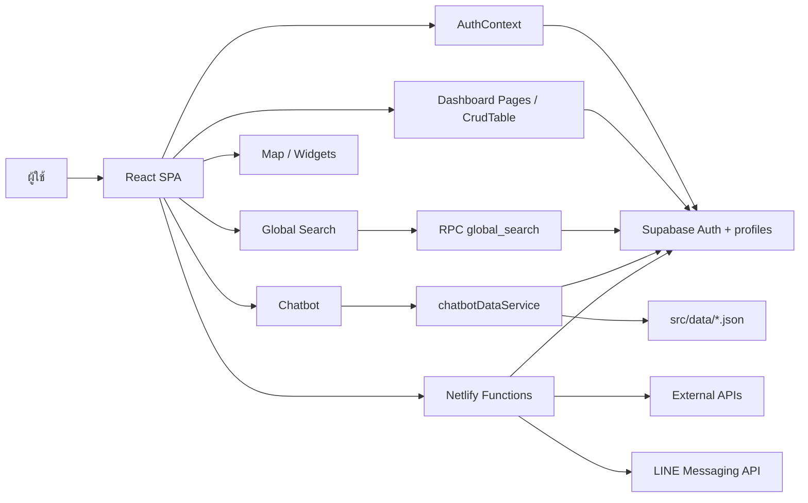

# รายละเอียดระบบ NPT Smart Agri Dashboard และข้อเสนอพัฒนาต่อ

อัปเดตจากโค้ดในโปรเจค ณ วันที่ 5 กรกฎาคม 2569

เอกสารนี้สรุปภาพรวมระบบ, การเชื่อมโยงข้อมูล, สิทธิ์ผู้ใช้, ตารางหลัก, แหล่งข้อมูล, AI, งานล่าสุด และสิ่งที่ควรพัฒนาต่อ โดยตรวจจากโค้ดใน `src/`, `supabase/`, `netlify/functions/`, `scripts/`, `docs/` และ `src/data/`

## ภาพรวม

`npt_dashboard` คือเว็บศูนย์ข้อมูลการเกษตรจังหวัดนครปฐม ใช้รวมข้อมูลหลายกลุ่มงานเป็น dashboard, ตารางจัดการข้อมูล, แผนที่, ระบบค้นหา, ระบบขอข้อมูล, AI chatbot และ LINE AI

เทคโนโลยีหลัก:

- Frontend: React 19, Vite, React Router, Ant Design
- Database/Auth: Supabase Auth และ Supabase Postgres
- Chart/Map: ECharts, Leaflet, React Leaflet
- Data table: `CrudTable` สำหรับค้นหา, กรอง, sort, pagination, import/export CSV, column picker, custom fields และ audit log
- Backend: Netlify Functions สำหรับ proxy, scheduled sync, LINE webhook, AI proxy และงานที่ต้องใช้ service role
- Seed/Fallback: JSON ใน `src/data/` สำหรับหน้าที่ต้องมีข้อมูลทันทีแม้ฐานข้อมูลยังว่าง

## โครงสร้างระบบ

| ส่วน            | ไฟล์หลัก                                                                             | หน้าที่                                                               |
| --------------- | ------------------------------------------------------------------------------------ | --------------------------------------------------------------------- |
| Routes          | `src/App.jsx`                                                                        | รวม route public, dashboard, admin และ redirect บางหน้า               |
| Layout/Sidebar  | `src/components/Layout/Sidebar.jsx`                                                  | เมนูด้านซ้ายและการมองเห็นเมนูตาม role                                 |
| Auth/RBAC       | `src/contexts/AuthContext.jsx`                                                       | อ่าน session/profile และตัดสินสิทธิ์ดู/แก้ตาม role, department, table |
| Supabase client | `src/supabaseClient.js`                                                              | เชื่อม frontend กับ Supabase ด้วย anon key                            |
| Dataset catalog | `src/domain/datasetCatalog.js`                                                       | รายการ table, label, route, search/numeric/category columns           |
| Generic CRUD    | `src/components/DataTable/CrudTable.jsx`                                             | ตารางกลางของหลายหน้า พร้อม import/export และ audit                    |
| CSV import      | `src/components/DataTable/CsvImportModal.jsx`                                        | import CSV เข้า Supabase ตาม policy                                   |
| Chatbot config  | `src/utils/chatbotConstants.js`                                                      | รายการตารางและ column ที่ AI รู้จัก                                   |
| AI data service | `src/services/chatbotDataService.js`                                                 | รวม context จาก Supabase และ seed data ให้ AI                         |
| LINE AI         | `netlify/functions/line-webhook.cjs`, `netlify/functions/lib/line-ai/*`              | รับข้อความ LINE, เลือก tool, query ข้อมูล, ตอบกลับ                    |
| Admin users API | `netlify/functions/update-user.js`, `delete-user.js`, `create-default-data-users.js` | จัดการผู้ใช้ด้วย service role                                         |
| Database schema | `supabase/schema.sql` และไฟล์ SQL แยก                                                | สร้างตาราง, RLS, function, policy                                     |
| Data scripts    | `scripts/*.mjs`, `scripts/*.js`, `scripts/*.py`                                      | import/sync/seed/ตรวจ encoding                                        |

## การไหลของข้อมูล



สรุป:

- หน้า dashboard ส่วนใหญ่อ่าน/เขียน Supabase ผ่าน `supabaseClient`
- หน้าตารางส่วนใหญ่ใช้ `CrudTable` จึงได้ search, filter, sort, import/export และสิทธิ์แก้ข้อมูลแบบเดียวกัน
- Search ใช้ `datasetCatalog` และ RPC `global_search`
- AI ภายในเว็บใช้ `chatbotDataService` เพื่อรวมข้อมูลจาก DB และ fallback JSON
- LINE AI ใช้ Netlify Functions เพื่อซ่อน key และใช้ service-side logic
- API ภายนอก เช่น GISTDA, Meteostat, ราคาน้ำมัน, RSS ถูกผ่าน proxy/sync function เพื่อลดปัญหา CORS และเก็บ secret ฝั่ง server

## สิทธิ์ผู้ใช้

สิทธิ์หลักมาจาก `profiles.role` และ `profiles.department`

| Role              | ดูข้อมูล                       | แก้ข้อมูล                       | ลบข้อมูล | หมายเหตุ                  |
| ----------------- | ------------------------------ | ------------------------------- | -------- | ------------------------- |
| `guest`           | เฉพาะ public/dashboard บางส่วน | ไม่ได้                          | ไม่ได้   | ไม่เห็นเมนูภายในสำคัญ     |
| `viewer`          | ตามกลุ่มงานเดิม                | ไม่ได้                          | ไม่ได้   | สำหรับดูอย่างเดียว        |
| `editor`          | เห็นทุกกลุ่มงาน                | แก้เฉพาะ table ในกลุ่มตัวเอง    | ไม่ได้   | เป็นผู้ดูแลข้อมูลของกลุ่ม |
| `district_editor` | เห็นทุกกลุ่มงาน                | แก้เฉพาะ `personnel`, `budgets` | ไม่ได้   | เป็นผู้ดูแลข้อมูลอำเภอ    |
| `admin`           | เห็นทั้งหมด                    | แก้ทั้งหมด                      | ลบได้    | จัดการผู้ใช้และระบบ       |

งานล่าสุดเพิ่ม:

- `DISTRICT_WRITE_TABLES = ['personnel', 'budgets']` ใน `AuthContext`
- `CrudTable` เรียก `canEdit(tableName)` เพื่อเช็กสิทธิ์ราย table
- Sidebar เปิดให้ `editor` และ `district_editor` เห็นทุกกลุ่มงาน
- หน้า User Management มี role `district_editor`
- endpoint `/api/admin/users/create-default-data-users` สร้างบัญชีตั้งต้น 5 กลุ่มงาน + 7 อำเภอ และดาวน์โหลด CSV รหัสผ่านชั่วคราว
- ไฟล์ `supabase/group_and_district_user_access.sql` เตรียม RLS policy ฝั่งฐานข้อมูลให้ตรงกับสิทธิ์ใหม่

ข้อสำคัญ: ต้องรัน `supabase/group_and_district_user_access.sql` ใน Supabase SQL Editor ก่อน สิทธิ์ระดับฐานข้อมูลจึงจะบังคับจริง

## กลุ่มงานและหน้าในระบบ

| กลุ่ม                    | Route หลัก                                                          | ข้อมูลสำคัญ                                                                         |
| ------------------------ | ------------------------------------------------------------------- | ----------------------------------------------------------------------------------- |
| Public                   | `/`, `/interactive-dashboard`, `/smart-map`, `/public/*`, `/manual` | หน้าแรก, dashboard สาธารณะ, แผนที่, คู่มือ, ข้อมูล public                           |
| Dashboard รวม            | `/dashboard`                                                        | KPI รวม, สรุปข้อมูลทุกกลุ่ม, link ไปตาราง                                           |
| Executive Situation Room | `/dashboard/situation-room`                                         | มุมผู้บริหาร, สถานการณ์น้ำ/เกษตร/ภัยพิบัติ/จุดความร้อน                              |
| Chatbot                  | `/dashboard/chatbot`                                                | ผู้ช่วย AI ภายใน                                                                    |
| คำขอข้อมูล               | `/dashboard/data-requests`                                          | workflow ขอข้อมูลและติดตามคำขอ                                                      |
| ฝ่ายบริหารทั่วไป         | `/dashboard/admin/*`                                                | บุคลากร, พัสดุ, งบประมาณ, ผู้ใช้, audit, visitor, website evaluations               |
| ยุทธศาสตร์และสารสนเทศ    | `/dashboard/strategy/*`                                             | ทะเบียนเกษตรกร, วาดแปลง, พื้นที่เกษตร, ศพก., ราคา, อากาศ                            |
| ส่งเสริมและพัฒนาการผลิต  | `/dashboard/production/*`                                           | แปลงใหญ่, GAP, ผลผลิตพืช, ต้นทุนการผลิต                                             |
| ส่งเสริมและพัฒนาเกษตรกร  | `/dashboard/development/*`                                          | วิสาหกิจชุมชน, SF, YSF, กลุ่มอาชีพ, แม่บ้าน, ยุวเกษตรกร, ท่องเที่ยวเกษตร, ภัยพิบัติ |
| อารักขาพืช               | `/dashboard/protection/*`                                           | แปลงพยากรณ์, AI forecast, ศจช., หมอพืช, ศดปช., ชุดดิน, hotspot                      |
| ชุมชน                    | `/dashboard/community/forum`                                        | กระดานข่าว/โพสต์/ความคิดเห็น                                                        |

## ตารางข้อมูลหลัก

### ระบบและบริหารทั่วไป

| Table                      | เก็บข้อมูล                                  | ใช้โดย                         |
| -------------------------- | ------------------------------------------- | ------------------------------ |
| `profiles`                 | ผู้ใช้, role, department, position          | Auth, Sidebar, User Management |
| `personnel`                | บุคลากร, ตำแหน่ง, หน่วยงาน, เบอร์, การศึกษา | Personnel, AI, Search          |
| `assets`                   | พัสดุ/ครุภัณฑ์, serial, สถานที่, มูลค่า     | Assets                         |
| `budgets`                  | โครงการ, ปีงบ, รอบงบ, แหล่งงบ, งบ/ใช้จ่าย   | Budgets, AI                    |
| `audit_logs`               | ประวัติ create/update/delete                | CrudTable, Audit Log           |
| `visitor_events`           | สถิติผู้เข้าเว็บแบบไม่เก็บข้อมูลส่วนตัวตรง  | Visitor Analytics              |
| `website_evaluations`      | แบบประเมินเว็บไซต์                          | Website Evaluations            |
| `custom_field_definitions` | metadata คอลัมน์เพิ่มเอง                    | CrudTable custom fields        |
| `data_requests`            | คำขอข้อมูลและสถานะ                          | Data Requests                  |

### ยุทธศาสตร์และสารสนเทศ

| Table                                                                          | เก็บข้อมูล                   |
| ------------------------------------------------------------------------------ | ---------------------------- |
| `farmer_registry`, `farmer_registry_subdistricts`, `farmer_registry_snapshots` | ทะเบียนเกษตรกรและ snapshot   |
| `geoplots_parcel_progress`, `geoplots_parcel_subdistrict_progress`             | ความคืบหน้าวาดแปลงรายพื้นที่ |
| `agricultural_areas`, `gis_areas`                                              | พื้นที่เกษตร/GIS             |
| `learning_centers`                                                             | ศูนย์เรียนรู้/ศพก.           |
| `daily_weather`                                                                | อากาศรายวัน                  |

### ส่งเสริมและพัฒนาการผลิต

| Table              | เก็บข้อมูล                                      |
| ------------------ | ----------------------------------------------- |
| `large_plots`      | แปลงใหญ่                                        |
| `certifications`   | GAP/มาตรฐาน                                     |
| `crop_production`  | ผลผลิตพืช                                       |
| `production_costs` | ต้นทุนการผลิต ปี/ชนิดพืช/ค่าใช้จ่าย/รายได้/กำไร |

### ส่งเสริมและพัฒนาเกษตรกร

| Table                                                                                             | เก็บข้อมูล                                                    |
| ------------------------------------------------------------------------------------------------- | ------------------------------------------------------------- |
| `community_enterprises`                                                                           | วิสาหกิจชุมชน                                                 |
| `smart_farmers`, `smart_farmer_sf`                                                                | Smart Farmer                                                  |
| `young_smart_farmer_ysf`                                                                          | Young Smart Farmer                                            |
| `agricultural_career_groups`                                                                      | กลุ่มส่งเสริมอาชีพ                                            |
| `farmer_groups`, `housewife_farmer_groups`, `young_farmer_groups`, `young_farmer_groups_detailed` | กลุ่มเกษตรกร/แม่บ้าน/ยุวเกษตรกร                               |
| `agri_tourism`                                                                                    | แหล่งท่องเที่ยวเชิงเกษตร รวมพิกัดและสินค้า/บริการ             |
| `disasters`                                                                                       | ภัยพิบัติระดับอำเภอ/ตำบล/หมู่ พื้นที่เสียหาย ผู้ได้รับผลกระทบ |

### อารักขาพืช

| Table                     | เก็บข้อมูล               |
| ------------------------- | ------------------------ |
| `forecast_plots`          | แปลงพยากรณ์              |
| `pest_outbreaks`          | การระบาดศัตรูพืช         |
| `pest_centers`            | ศูนย์จัดการศัตรูพืชชุมชน |
| `plant_doctors`           | หมอพืช                   |
| `soil_fertilizer_centers` | ศูนย์ดินปุ๋ย             |
| `soil_series`             | ชุดดิน                   |
| `biocontrol_stock`        | ชีวภัณฑ์/สต็อก           |
| `fire_hotspots`           | จุดความร้อน              |
| `ai_disease_forecasts`    | ผลพยากรณ์โรค/แมลงด้วย AI |

## แหล่งข้อมูลและการนำเข้า

ข้อมูลมาจาก 4 ทางหลัก:

- Supabase table จริง สำหรับข้อมูลใช้งานประจำ
- JSON fallback ใน `src/data/` เช่น `production_costs_2567.json`, `agri_tourism_seed.json`, `disasters_by_village_seed.json`, เขตอำเภอ/ตำบล
- Script import/sync ใน `scripts/` เช่น import Excel, seed fallback, sync วาดแปลง, hotspot, weather
- Netlify Functions ที่ดึง API ภายนอก เช่น GISTDA, Meteostat, DOAE, RSS, ราคาน้ำมัน

ไฟล์ seed/fallback ที่ควรรู้:

| ไฟล์                                       | ใช้กับ                 |
| ------------------------------------------ | ---------------------- |
| `src/data/production_costs_2567.json`      | หน้า `ProductionCosts` |
| `src/data/agri_tourism_seed.json`          | หน้า `AgriTourism`     |
| `src/data/disasters_by_village_seed.json`  | หน้า `Disasters`       |
| `src/data/budgetRound2_2569.json`          | งบประมาณ               |
| `src/data/nakhon_pathom_districts.json`    | แผนที่อำเภอ            |
| `src/data/nakhon_pathom_subdistricts.json` | แผนที่ตำบล             |

`scripts/seed_fallback_data.mjs` ถูกเตรียมไว้เพื่อย้าย fallback สำคัญเข้า DB แบบเป็นทางการ

## AI และการค้นหา

AI ในระบบมีหลายชั้น:

- Landing Chatbot สำหรับประชาชน ใช้ public-safe links และไม่แนะนำ route ภายใน
- Internal Chatbot ใน `/dashboard/chatbot` ใช้ข้อมูลจาก catalog/DB/seed
- LINE AI Bot ใน `line-webhook.cjs` และ `lib/line-ai/*`
- AI forecast โรคและแมลงในกลุ่มอารักขาพืช

ตารางที่ AI รู้จักถูกผูกไว้หลายจุด:

- `src/utils/chatbotConstants.js`
- `src/domain/datasetCatalog.js`
- `netlify/functions/lib/line-ai/orchestrator.cjs`
- `netlify/functions/lib/line-ai/tools.cjs`

จุดควรพัฒนา: ลดการซ้ำของ mapping เหล่านี้ให้มี source เดียวมากขึ้น

## Netlify Functions สำคัญ

| Function                              | หน้าที่                                |
| ------------------------------------- | -------------------------------------- |
| `ai-proxy.js`                         | proxy เรียก AI provider และ rate limit |
| `line-webhook.cjs`                    | รับ webhook จาก LINE                   |
| `forecast-disease-insect*.js`         | พยากรณ์โรค/แมลง                        |
| `sync-farmer-registry.js`             | sync ทะเบียนเกษตรกร                    |
| `sync-geoplots-progress.js`           | sync ความคืบหน้าวาดแปลง                |
| `sync-hotspots.js`, `gistda-proxy.js` | จุดความร้อน/GISTDA                     |
| `sync-weather.js`                     | อากาศ                                  |
| `track-visit.js`                      | เก็บสถิติ visitor                      |
| `update-user.js`, `delete-user.js`    | จัดการ user โดย admin                  |
| `create-default-data-users.js`        | สร้างบัญชีผู้ดูแลกลุ่ม/อำเภอตั้งต้น    |

## งานล่าสุดที่เพิ่ม/ปรับ

- เพิ่มหน้า `ProductionCosts` พร้อมกราฟและ fallback ต้นทุนการผลิต ปี 2567
- เพิ่มข้อมูลท่องเที่ยวเกษตร 23 รายการ พร้อมพิกัดและ default columns ที่กระชับขึ้น
- เพิ่มหน้า `Disasters` จากข้อมูลภัยพิบัติ 626 รายการ พร้อม KPI, chart, filter, search, sort, export และ column picker
- ปรับกราฟวาดแปลงรายตำบลเป็นแนวตั้ง
- เชื่อม `production_costs`, `agri_tourism`, `disasters` เข้ากับ route, sidebar, auth group, dataset catalog, chatbot และ LINE AI
- เพิ่ม role `district_editor` และสิทธิ์แบบเห็นทั้งหมดแต่แก้เฉพาะ `personnel`, `budgets`
- เพิ่ม endpoint สร้างบัญชีตั้งต้น 5 กลุ่มงาน + 7 อำเภอ
- เพิ่ม SQL `group_and_district_user_access.sql` สำหรับ RLS ตามสิทธิ์ใหม่
- เพิ่ม `scripts/find_mojibake.js` สำหรับสแกนข้อความไทยเพี้ยน
- เพิ่ม `scripts/seed_fallback_data.mjs` สำหรับ seed ข้อมูล fallback เข้า DB

## สิ่งที่ควรพัฒนาต่อ

เรียงตามความคุ้มค่าก่อน:

1. รัน `supabase/group_and_district_user_access.sql` ใน Supabase จริง เพื่อบังคับสิทธิ์ฐานข้อมูลให้ตรงกับ UI
2. ใช้ปุ่มสร้างบัญชีตั้งต้นจากหน้า User Management แล้วส่ง CSV รหัสผ่านให้ผู้เกี่ยวข้องอย่างปลอดภัย
3. ย้าย fallback สำคัญเข้า DB ด้วย `scripts/seed_fallback_data.mjs` แล้วลดการพึ่ง JSON ในระยะยาว
4. ตรวจและแก้ encoding ภาษาไทยเพี้ยนด้วย `scripts/find_mojibake.js`
5. ทำ schema `disasters` ให้ตรงข้อมูลระดับหมู่บ้านทุกคอลัมน์ เช่น `village_no`, `affected_area_rai`, `affected_households`
6. รวม mapping ตารางของ `datasetCatalog`, chatbot และ LINE AI ให้ซ้ำน้อยลง
7. เพิ่ม smoke test เล็ก ๆ ให้หน้า fallback สำคัญ: ProductionCosts, AgriTourism, Disasters
8. ลด bundle warning จาก Vite เมื่อเริ่มรู้สึกว่าโหลดช้า โดยแยก chunk `echarts`, `antd`, `xlsx`
9. ทำ Data Quality dashboard สำหรับนับ row, ช่องว่าง, duplicate และวันที่อัปเดตล่าสุดต่อ table

## คำสั่งตรวจระบบ

```bash
npm run lint:src
npm run build
npm run test
```

คำสั่ง dev:

```bash
npm run dev
```

ค่า env สำคัญ:

- `VITE_SUPABASE_URL`
- `VITE_SUPABASE_ANON_KEY`
- `SUPABASE_SERVICE_ROLE_KEY`
- `GISTDA_API_KEY`
- `GEMINI_API_KEY` หรือ key ชุด LINE AI
- `LINE_CHANNEL_SECRET`
- `LINE_CHANNEL_ACCESS_TOKEN`
- `VITE_LANDING_CHATBOT_API_URL`
- `VITE_LANDING_CHATBOT_API_KEY`

## สถานะตรวจล่าสุด

ตรวจหลังเพิ่มระบบสิทธิ์ผู้ดูแลกลุ่ม/อำเภอ:

- `npm run lint:src` ผ่าน
- `npm run build` ผ่าน
- build ยังมี warning เรื่อง chunk ใหญ่จาก dependency หนัก เช่น ECharts/Ant Design/xlsx ซึ่งไม่ทำให้ build ล้ม

## สรุป

ระบบนี้เป็น platform ข้อมูลเกษตรจังหวัดนครปฐม 5 ชั้นหลัก:

1. Public portal สำหรับประชาชน
2. Dashboard ภายในสำหรับเจ้าหน้าที่และผู้บริหาร
3. Data management สำหรับนำเข้า/แก้ไข/ส่งออกข้อมูล
4. Search/AI ที่อ่านจาก catalog, DB และ fallback data
5. Netlify Functions สำหรับ external API, sync, forecast, LINE Bot และงาน server-only

งานที่ควรทำก่อนใช้งานสิทธิ์ใหม่จริงคือรัน SQL policy ใน Supabase, สร้างบัญชีตั้งต้นจากหน้า admin, แล้วทดสอบ login ด้วยบัญชีตัวอย่างของกลุ่มงานและอำเภอ
