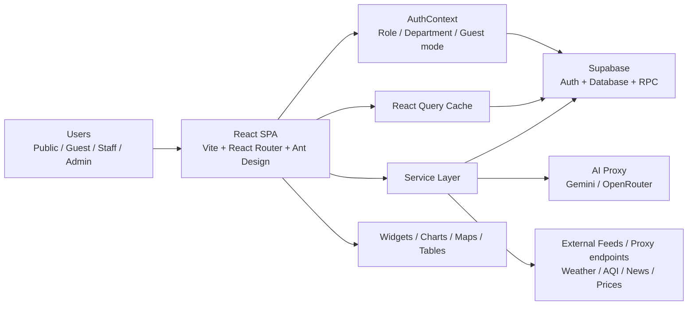
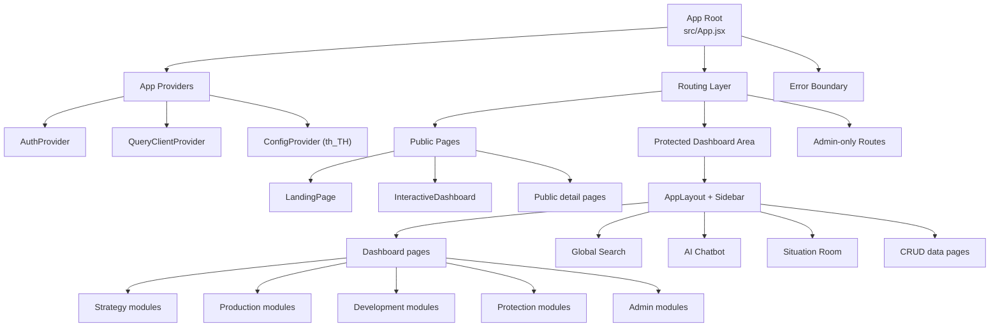
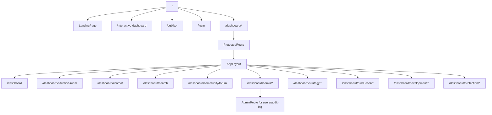
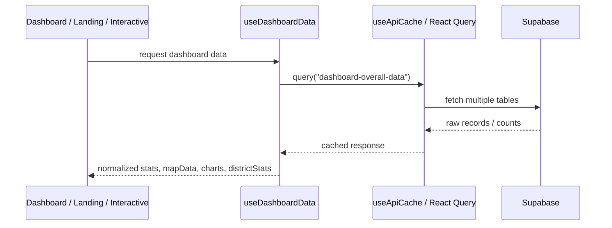
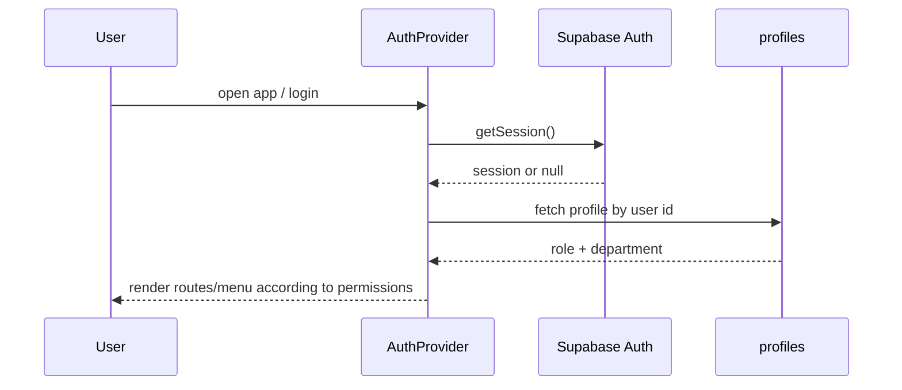
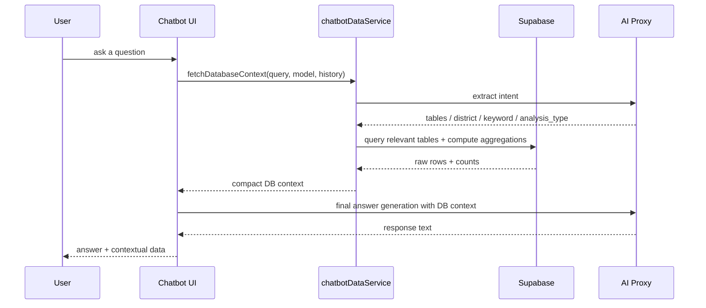
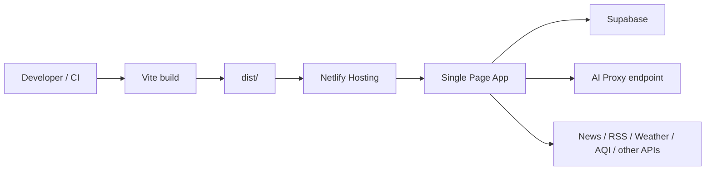
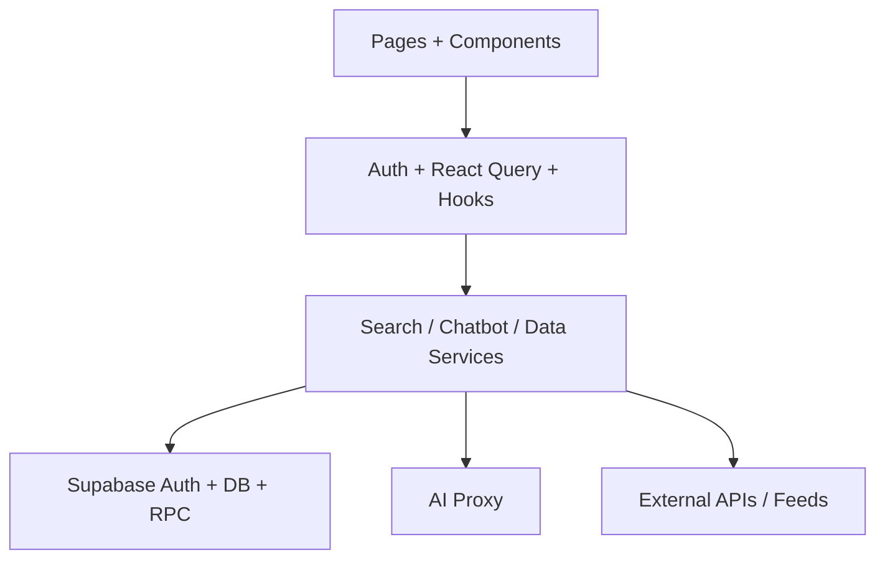

# NPT Dashboard Architecture

เอกสารนี้สรุปสถาปัตยกรรมของโปรเจค `npt_dashboard` จากโค้ดปัจจุบัน เพื่อให้เข้าใจภาพรวมระบบ, โมดูลหลัก, data flow และจุดเชื่อมต่อสำคัญได้เร็วขึ้น

## 1. ภาพรวมระบบ

โปรเจคนี้เป็นเว็บแอป `React + Vite` สำหรับศูนย์ข้อมูลการเกษตรจังหวัดนครปฐม โดยรวมความสามารถ 4 ส่วนไว้ในระบบเดียว:

1. Public portal สำหรับเผยแพร่ข้อมูลเกษตรและ widget สาธารณะ
2. Internal dashboard สำหรับเจ้าหน้าที่และผู้ใช้ภายใน
3. Data management สำหรับดู/ค้นหา/จัดการข้อมูลเชิงตาราง
4. AI assistant สำหรับถามตอบจากฐานข้อมูลและความรู้ทั่วไป

เทคโนโลยีหลัก:

- Frontend: `React 19`, `Vite`, `React Router`, `Ant Design`
- Data fetching/cache: `TanStack React Query`
- Database/Auth: `Supabase`
- Visualization: `ECharts`, `Leaflet`, `React-Leaflet`
- AI integration: custom proxy + `Gemini` / `OpenRouter`
- Testing: `Vitest`, `Playwright`
- Deployment target: `Netlify`

## 2. System Context



## 3. High-Level Module Map



## 4. Layered Architecture

### 4.1 Presentation Layer

ไฟล์หลัก:

- `src/App.jsx`
- `src/components/**`
- `src/pages/**`
- `src/styles/**`

หน้าที่:

- จัดการ route
- แสดง layout, sidebar, breadcrumb
- render dashboard, widgets, map, charts, search, chatbot, situation room
- แสดง public pages และ protected pages

องค์ประกอบสำคัญ:

- `LandingPage.jsx` เป็น public portal หน้าแรก
- `Dashboard.jsx` เป็น dashboard รวมในระบบ
- `SituationRoom.jsx` เป็น Executive Situation Room สำหรับผู้บริหาร
- `InteractiveDashboard.jsx` เป็น public analytic dashboard แบบ interactive
- `AppLayout.jsx` เป็น shell ของส่วน authenticated
- `Sidebar.jsx` เป็น navigation หลักตามสิทธิ์ผู้ใช้

### 4.2 State / App Provider Layer

ไฟล์หลัก:

- `src/contexts/AuthContext.jsx`
- `src/hooks/useApiCache.js`
- `src/hooks/useDashboardData.js`
- `src/hooks/useSessionTimeout.jsx`

หน้าที่:

- เก็บสถานะ auth, profile, role, department
- สร้าง policy สำหรับการมองเห็นเมนูและการเข้าถึงตาราง
- จัดการ cache ของ query ผ่าน React Query
- รวมและแปลงข้อมูลจากหลายตารางให้พร้อมใช้ใน dashboard

### 4.3 Service / Integration Layer

ไฟล์หลัก:

- `src/supabaseClient.js`
- `src/services/globalSearchService.js`
- `src/services/chatbotDataService.js`
- `src/services/aiService.js`

หน้าที่:

- เชื่อม Supabase
- ค้นหาข้ามหลายตารางผ่าน RPC `global_search` หรือ fallback แบบขนาน
- เตรียมบริบทข้อมูลจาก DB สำหรับ AI
- เรียก AI ผ่าน proxy เดียว แล้วเลือก provider ตาม model

### 4.4 Data Layer

แหล่งข้อมูลหลัก:

- Supabase database
- Supabase Auth
- RPC / SQL schema ในโฟลเดอร์ `supabase/`
- external feeds ที่ widget บางตัวดึงผ่าน proxy หรือ endpoint ภายนอก

ตัวอย่างตารางหลัก:

- `profiles`
- `personnel`, `assets`, `budgets`, `audit_logs`
- `farmer_registry`, `gis_areas`, `disasters`, `agricultural_areas`, `daily_weather`
- `large_plots`, `learning_centers`, `certifications`, `crop_production`, `coconut_aromatic_surveys`
- `community_enterprises`, `smart_farmer_sf`, `young_smart_farmer_ysf`, `agricultural_career_groups`, `housewife_farmer_groups`, `young_farmer_groups_detailed`, `farmer_institutes`, `agri_tourism`
- `forecast_plots`, `pest_centers`, `soil_fertilizer_centers`, `fire_hotspots`, `ai_disease_forecasts`, `plant_doctors`

## 5. Routing Architecture



แนวคิด routing:

- หน้า public เข้าถึงได้โดยไม่ต้อง login
- หน้า `/dashboard/*` ใช้ `ProtectedRoute`
- บางหน้าใน admin ใช้ `AdminRoute` ซ้อนเพิ่ม
- เมนู sidebar ถูกกรองตาม `role` และ `department`
- เส้นทาง `/dashboard/strategy/disasters` จะทำการ Redirect ไปยังกลุ่มพัฒนาเกษตรกรที่ `/dashboard/development/disasters` เพื่อแสดงหน้า `Disasters.jsx`

## 6. Functional Modules

### 6.1 Public Experience

โมดูล:

- `LandingPage`
- public views เช่น `/public/large-plots`
- `InteractiveDashboard`
- public widgets เช่น weather, AQI, prices, news, hotspots, map, KKU chatbot
- `SmartMap` สำหรับสืบค้นและแสดงพิกัดแผนที่

บทบาท:

- เป็นหน้าสาธารณะสำหรับเผยแพร่ข้อมูลจังหวัด
- แสดงตัวชี้วัด, ข่าว, ภาพรวมเชิงพื้นที่ และ call-to-action เข้าสู่ระบบ

### 6.2 Dashboard & Domain Modules

แบ่งตามกลุ่มงานในระบบ:

- Admin
  - บุคลากร
  - ทรัพย์สิน
  - งบประมาณ
  - ผู้ใช้ / audit log / recent activities
- Strategy
  - ทะเบียนเกษตรกร
  - GIS
  - พื้นที่เกษตร
  - ศูนย์เรียนรู้
  - สภาพอากาศและน้ำฝนรายวัน
- Production
  - แปลงใหญ่
  - GAP / certifications
  - ผลผลิตพืช
  - สำรวจมะพร้าวน้ำหอม
- Development
  - วิสาหกิจชุมชน
  - Smart Farmer (SF) / Young Smart Farmer (YSF)
  - กลุ่มแม่บ้านเกษตรกร / กลุ่มยุวเกษตรกร / กลุ่มส่งเสริมอาชีพ
  - สถาบันเกษตรกร
  - ท่องเที่ยวเกษตร
  - ภัยพิบัติ
- Protection
  - แปลงพยากรณ์
  - พยากรณ์โรคและแมลงด้วย AI
  - ศจช.
  - ศดปช.
  - แพทย์พืช (ทำเนียบหมอพืช)
  - จุดเฝ้าระวัง / fire hotspots

### 6.3 Search Module

ไฟล์หลัก:

- `src/components/Search/GlobalSearch.jsx`
- `src/services/globalSearchService.js`

ลักษณะการทำงาน:

- ค้นหาข้ามหลายตาราง
- พยายามใช้ Supabase RPC `global_search` ก่อน
- ถ้า RPC ใช้ไม่ได้ จะ fallback ไป query ทีละตารางแบบขนาน
- มี cache ใน memory และ recent searches ใน `localStorage`

### 6.4 AI Chatbot Module

ไฟล์หลัก:

- `src/pages/Chatbot.jsx`
- `src/services/chatbotDataService.js`
- `src/services/aiService.js`
- `src/utils/chatbotConstants.js`

ความสามารถ:

- ใช้ LLM ช่วยตีความ intent ของผู้ใช้
- map คำถามไปยังตารางที่เกี่ยวข้อง
- aggregate ตัวเลขจากฐานข้อมูลจริงก่อนส่งให้ AI
- รองรับ model หลายตัว
- มีโหมด web search และ deep thinking

## 7. Data Flow

### 7.1 Dashboard Data Flow



หลักการ:

- `useDashboardData` เป็น aggregation hook กลาง
- ดึงข้อมูลจากหลายตารางแล้วรวมเป็น shape ที่หน้า UI ใช้ได้ทันที
- dashboard หลายหน้าจึง reuse logic เดียวกัน

### 7.2 Authentication & Authorization Flow



หมายเหตุ:

- มี guest mode ผ่าน `localStorage`
- permission ใช้ทั้ง `role` และ `department`
- UI-level authorization ถูกใช้ทั้งใน route guard และ sidebar filtering

### 7.3 AI Query Flow



จุดเด่น:

- ไม่ส่ง raw data ทั้งหมดให้ AI โดยตรง
- มีการ pre-compute aggregation เช่น totals, averages, by-district, rankings
- ช่วยลด token และทำให้คำตอบมีโอกาสแม่นขึ้น

## 8. Access Control Model

โมเดลสิทธิ์ปัจจุบันเป็นแบบผสม:

- Authentication: Supabase Auth
- Profile metadata: ตาราง `profiles`
- Authorization in app:
  - `role`: `admin`, `editor`, `viewer`, `guest`
  - `department`: ใช้ map ไปเป็น group key
  - helper เช่น `canAccessGroup()`, `canAccessTable()`

ผลกระทบเชิงสถาปัตยกรรม:

- UI มีการบังคับสิทธิ์ในฝั่ง client ค่อนข้างชัด
- ยังควรพึ่ง RLS / policy ฝั่ง Supabase ร่วมด้วยสำหรับความปลอดภัยจริง

## 9. Caching Strategy

มี cache สองระดับหลัก:

1. React Query
   - ใช้กับ dashboard data และ data fetching แบบ hook
   - default stale time ประมาณ 15 นาที
   - gc time ประมาณ 60 นาที

2. In-memory cache ใน search service
   - ใช้กับ global search
   - TTL 60 วินาที

ข้อดี:

- ลดจำนวน request ซ้ำ
- ช่วยให้ landing/dashboard โหลดเร็วขึ้น

## 10. Deployment / Runtime Architecture



จาก `netlify.toml`:

- publish directory คือ `dist`
- build command คือ `npm run build`
- ใช้ SPA redirect `/* -> /index.html`
- มีการตั้ง security headers พื้นฐาน

## 11. Directory Map

```text
src/
  components/
    Chatbot/
    DataTable/
    Layout/
    Map/
    Search/
    widgets/
  contexts/
  hooks/
  pages/
    admin/
    community/
    development/
    production/
    protection/
    strategy/
  services/
  styles/
  utils/
supabase/
tests/
netlify/
public/
```

## 12. Architectural Strengths

- โครงสร้างแบ่งตาม domain ชัด อ่านง่าย
- มี shared hook (`useDashboardData`) สำหรับ reusable aggregation
- route และ layout แยกจาก business logic ค่อนข้างดี
- search และ chatbot มี service layer ชัด
- รองรับทั้ง public portal และ internal system ใน codebase เดียว
- มี test ทั้ง unit และ e2e เริ่มต้นแล้ว

## 13. Architectural Risks / Technical Debt

- `README.md` ยังไม่สะท้อนระบบจริง
- business logic ฝั่ง aggregation ใน `useDashboardData.js` ค่อนข้างใหญ่และเริ่มแบกรับหลายหน้าที่
- authorization ฝั่ง client ชัดเจน แต่ควรตรวจว่า Supabase RLS ครบจริงหรือไม่
- chatbot data pipeline มีความซับซ้อนสูงและรวมหลาย concern ในไฟล์เดียว
- หลายหน้าผูกกับ shape ของ Supabase table โดยตรง ทำให้ schema change กระทบ UI ง่าย
- มีสัญญาณ encoding ภาษาไทยเพี้ยนบางจุดในไฟล์ที่อ่านผ่าน terminal

## 14. Suggested Refactor Directions

ถ้าจะพัฒนาต่อในระยะกลาง แนะนำแยกเป็นโมดูลดังนี้:

1. แยก `useDashboardData.js` ออกเป็น
   - `dashboardRepository`
   - `dashboardAggregators`
   - `dashboardSelectors`
2. แยก chatbot service เป็น
   - `intentService`
   - `contextBuilder`
   - `aggregationService`
   - `llmGateway`
3. สร้าง `src/features/*` ตาม domain เพื่อรวม page + hook + service ของแต่ละกลุ่ม
4. เพิ่ม documentation ของ schema และ table ownership
5. ตรวจและย้าย authorization สำคัญไปฝั่ง Supabase RLS ให้ครบ

## 15. Quick Summary

สถาปัตยกรรมของโปรเจคนี้เป็น `single-page frontend` ที่เชื่อม `Supabase` เป็น backend หลัก และเพิ่ม integration layer สำหรับ AI กับ external feeds โดยมีแกนระบบอยู่ที่:

- App shell + route guards
- domain-based pages
- shared dashboard aggregation hook
- search service
- AI chatbot service

มุมมองสั้นที่สุด:


