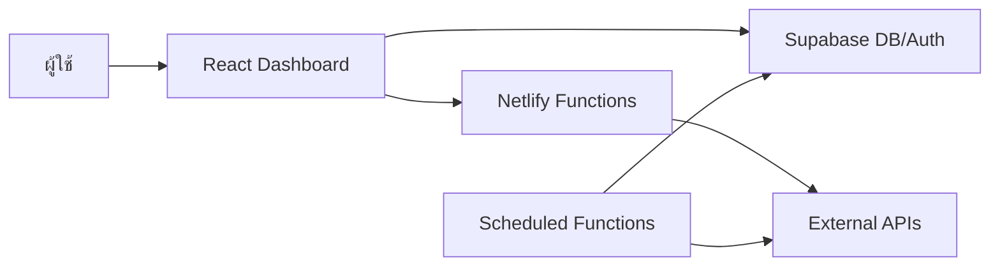

# Database Inventory and Live Data Sources

ตรวจสอบล่าสุด: 13 มิถุนายน 2026  
แหล่งตรวจสอบ: Supabase ปัจจุบัน + โค้ดในโปรเจกต์

## สรุปสั้น

ระบบนี้ใช้ Supabase เป็นฐานข้อมูลหลัก และใช้ Netlify Functions เป็นชั้น proxy/sync สำหรับข้อมูลภายนอก

ข้อมูลแบ่งได้ 3 แบบ:

1. ข้อมูลหลักใน DB  
   เช่น บุคลากร งบประมาณ แปลงใหญ่ GAP วิสาหกิจชุมชน เกษตรกร/กลุ่มเกษตรกร หมอพืช จุดความร้อน

2. ข้อมูลสดที่ดึงแล้วบันทึกลง DB  
   เช่น อากาศรายวัน จุดความร้อน ทะเบียนเกษตรกร พยากรณ์โรคและแมลง

3. ข้อมูลสดที่ดึงมาแสดงผลอย่างเดียว  
   เช่น ข่าวเกษตร ราคาสินค้าเกษตร ราคาน้ำมัน คุณภาพอากาศ น้ำในเขื่อน ความชื้นดิน แชทบอท

## ภาพรวมสถาปัตยกรรมข้อมูล

คำอธิบาย:

- React Dashboard อ่านข้อมูลจาก Supabase โดยตรงผ่าน `supabaseClient`
- ข้อมูลภายนอกที่ติด CORS หรือต้องใช้ API key จะผ่าน Netlify Functions
- ข้อมูลบางชุดมี scheduled sync แล้วบันทึกลง Supabase
- ข้อมูลบางชุดใช้ `useApiCache` เก็บ cache ใน browser/runtime เท่านั้น ไม่ลง DB

## กลุ่มระบบและแอดมิน

| ตาราง                 | จำนวนแถว | ความหมาย           | หมายเหตุ                                            |
| --------------------- | -------: | ------------------ | --------------------------------------------------- |
| `profiles`            |        7 | โปรไฟล์ผู้ใช้      | ผูกกับ Supabase Auth, เก็บ role/department/position |
| `personnel`           |      107 | บุคลากร            | รายชื่อเจ้าหน้าที่/ตำแหน่ง/หน่วยงาน                 |
| `budgets`             |      363 | งบประมาณ           | ข้อมูลโครงการ/ปีงบ/แหล่งงบ/ยอดงบ                    |
| `assets`              |      600 | ทรัพย์สิน/ครุภัณฑ์ | มีข้อมูลจริงแล้ว แม้เอกสารเก่าบางไฟล์ยังบอก 0       |
| `site_statistics`     |        1 | สถิติระบบเว็บ      | ใช้นับ/เก็บสถิติภาพรวม                              |
| `audit_logs`          |        0 | ประวัติแก้ไขข้อมูล | โค้ดรองรับ log แต่ DB สดตอนตรวจมี 0 แถว             |
| `website_evaluations` |        0 | แบบประเมินเว็บไซต์ | ผู้ใช้ส่งได้, admin อ่านได้                         |

คำอธิบาย:

- กลุ่มนี้เป็นข้อมูลบริหารระบบ ไม่ใช่ข้อมูลเกษตรภาคสนามโดยตรง
- `profiles` เป็นฐานของ RBAC เช่น admin/editor/viewer
- `audit_logs` ถูก insert จากฟังก์ชัน admin เช่น update/delete user แต่ตอนตรวจไม่มีข้อมูลค้างอยู่

## กลุ่มยุทธศาสตร์และสารสนเทศ

| ตาราง                       | จำนวนแถว | ความหมาย                | หมายเหตุ                 |
| --------------------------- | -------: | ----------------------- | ------------------------ |
| `farmer_registry`           |        8 | ทะเบียนเกษตรกรล่าสุด    | ระดับอำเภอ/จังหวัด       |
| `farmer_registry_snapshots` |       22 | snapshot ทะเบียนเกษตรกร | เก็บประวัติจากการ scrape |
| `agricultural_areas`        |        7 | พื้นที่เกษตร            | รายอำเภอ                 |
| `learning_centers`          |        7 | ศูนย์เรียนรู้ ศพก.      | รายอำเภอ                 |
| `daily_weather`             |      164 | อากาศ/ฝนรายวัน          | sync จาก Open-Meteo      |
| `gis_areas`                 |        0 | พื้นที่ GIS             | ยังไม่มีข้อมูล           |
| `disasters`                 |        0 | ภัยพิบัติ               | ยังไม่มีข้อมูล           |

คำอธิบาย:

- `farmer_registry` คือสถานะล่าสุด
- `farmer_registry_snapshots` คือประวัติย้อนหลังแต่ละรอบ scrape
- `daily_weather` เป็นข้อมูลสดที่ถูกเก็บลง DB เพื่อใช้ dashboard และ AI forecast
- `agricultural_areas` และ `learning_centers` เป็นข้อมูลพื้นฐานรายอำเภอ

## กลุ่มส่งเสริมและพัฒนาการผลิต

| ตาราง                      | จำนวนแถว | ความหมาย           | หมายเหตุ                  |
| -------------------------- | -------: | ------------------ | ------------------------- |
| `large_plots`              |       71 | แปลงใหญ่           | สินค้า/พื้นที่/สมาชิก/ปี  |
| `certifications`           |    1,963 | GAP/ใบรับรอง       | ข้อมูลมาตรฐานการผลิต      |
| `crop_production`          |        0 | ผลผลิตพืช          | ยังไม่มีข้อมูล            |
| `coconut_aromatic_surveys` |        1 | สำรวจมะพร้าวน้ำหอม | ใช้วิเคราะห์ต้นทุน/ผลผลิต |

คำอธิบาย:

- `large_plots` ใช้หลายหน้า เช่น production dashboard, map, farmer institutes widget
- `certifications` เป็นตารางใหญ่สุดตอนตรวจ มี 1,963 แถว
- `crop_production` ยังเป็น shell/table เตรียมไว้
- `coconut_aromatic_surveys` มีข้อมูลทดลอง/ชุดสำรวจ 1 แถว

## กลุ่มส่งเสริมและพัฒนาเกษตรกร

| ตาราง                          | จำนวนแถว | ความหมาย                   | หมายเหตุ                                       |
| ------------------------------ | -------: | -------------------------- | ---------------------------------------------- |
| `community_enterprises`        |      344 | วิสาหกิจชุมชน              | รายกลุ่ม/อำเภอ/สมาชิก                          |
| `smart_farmer_sf`              |      506 | Smart Farmer               | รายบุคคล                                       |
| `young_smart_farmer_ysf`       |      120 | Young Smart Farmer         | รายบุคคล                                       |
| `agricultural_career_groups`   |      445 | กลุ่มส่งเสริมอาชีพการเกษตร | รายกลุ่ม                                       |
| `housewife_farmer_groups`      |      254 | กลุ่มแม่บ้านเกษตรกร        | รายกลุ่ม                                       |
| `young_farmer_groups_detailed` |      341 | กลุ่มยุวเกษตรกร            | รายกลุ่ม                                       |
| `farmer_institutes`            |        7 | view รวมสถาบันเกษตรกร      | สร้างจากหลายตาราง                              |
| `agri_tourism`                 |        0 | ท่องเที่ยวเชิงเกษตร        | ยังไม่มีข้อมูล                                 |
| `smart_farmers`                |        0 | legacy/hub                 | ใช้ `smart_farmer_sf` แทน                      |
| `farmer_groups`                |        0 | legacy/hub                 | ใช้ `housewife_farmer_groups` และชุดละเอียดแทน |
| `young_farmer_groups`          |        0 | legacy/hub                 | ใช้ `young_farmer_groups_detailed` แทน         |

คำอธิบาย:

- กลุ่มนี้เป็นฐานข้อมูลเกษตรกร/องค์กรเกษตรกรหลัก
- `farmer_institutes` ไม่ใช่ table เก็บข้อมูลจริงแบบปกติ แต่เป็น view รวมข้อมูลจาก:
  - `community_enterprises`
  - `housewife_farmer_groups`
  - `young_farmer_groups_detailed`
  - `agricultural_career_groups`
  - `smart_farmer_sf`
  - `young_smart_farmer_ysf`
- ตาราง legacy/hub ยังว่าง เพราะระบบย้ายไปใช้ตารางที่ละเอียดกว่า

## กลุ่มอารักขาพืช

| ตาราง                     | จำนวนแถว | ความหมาย                 | หมายเหตุ                     |
| ------------------------- | -------: | ------------------------ | ---------------------------- |
| `forecast_plots`          |       62 | แปลงพยากรณ์              | แปลง/พื้นที่เสี่ยง           |
| `ai_disease_forecasts`    |       18 | พยากรณ์โรคและแมลงด้วย AI | เก็บผลจาก scheduled forecast |
| `pest_centers`            |       46 | ศูนย์จัดการศัตรูพืชชุมชน | ศจช.                         |
| `plant_doctors`           |       34 | หมอพืช                   | รายชื่อ/พื้นที่              |
| `soil_fertilizer_centers` |       20 | ศูนย์จัดการดินปุ๋ยชุมชน  | ศดปช.                        |
| `fire_hotspots`           |      211 | จุดความร้อน/PM2.5        | sync จาก GISTDA              |
| `pest_outbreaks`          |        0 | การระบาดศัตรูพืช         | ยังไม่มีข้อมูล               |
| `biocontrol_stock`        |        0 | สต็อกชีวภัณฑ์            | ยังไม่มีข้อมูล               |

คำอธิบาย:

- `fire_hotspots` เป็นข้อมูลสดจาก GISTDA ที่เก็บลง DB
- `ai_disease_forecasts` ใช้ข้อมูลอากาศ + ข้อมูลพื้นที่ + AI วิเคราะห์ แล้ว upsert ลง DB
- `forecast_plots` เป็นฐานแปลงสำหรับการพยากรณ์
- `pest_outbreaks` มี schema แล้ว แต่ยังไม่มีข้อมูล จึงทำให้ AI forecast ใช้ข้อมูล outbreak ได้น้อยหรือไม่มี

## กลุ่มคำขอข้อมูล

| ตาราง                      | จำนวนแถว | ความหมาย        | หมายเหตุ       |
| -------------------------- | -------: | --------------- | -------------- |
| `data_requests`            |        0 | คำขอข้อมูล      | ยังไม่มีรายการ |
| `data_request_assignments` |        0 | การมอบหมายคำขอ  | ยังไม่มีรายการ |
| `data_request_responses`   |        0 | คำตอบ/ผลตอบกลับ | ยังไม่มีรายการ |

คำอธิบาย:

- กลุ่มนี้รองรับ workflow คำขอข้อมูลภายใน
- RLS แยกสิทธิ์ admin/editor ตาม department/district

## กลุ่มชุมชน

| ตาราง            | จำนวนแถว | ความหมาย            | หมายเหตุ       |
| ---------------- | -------: | ------------------- | -------------- |
| `forum_posts`    |        0 | โพสต์กระดานสนทนา    | ยังไม่มีข้อมูล |
| `forum_comments` |        0 | ความเห็นกระดานสนทนา | ยังไม่มีข้อมูล |

คำอธิบาย:

- โครงสร้างรองรับ community/forum
- ตอนตรวจยังไม่มีข้อมูลจริง

## ข้อมูลสดที่ดึงแล้วเก็บลง DB

### 1. อากาศรายวัน

ไฟล์:

- `netlify/functions/sync-weather.js`

แหล่งข้อมูล:

- Open-Meteo Archive API
- Open-Meteo Forecast API

ปลายทาง DB:

- `daily_weather`

รอบทำงาน:

- cron `0 22 * * *`
- วันละครั้ง เวลา 22:00 ตาม cron ของ Netlify

ข้อมูลที่เก็บ:

- `date`
- `tavg`
- `tmin`
- `tmax`
- `prcp`
- `wspd`
- `pres`

คำอธิบาย:

- ฟังก์ชันดึงย้อนหลังประมาณ 90 วันจาก archive
- ดึง forecast ปัจจุบัน/ใกล้ปัจจุบันอีกชุด
- merge ตามวันที่
- upsert ลง `daily_weather` โดยใช้ `date` เป็น conflict key

### 2. จุดความร้อน

ไฟล์:

- `netlify/functions/sync-hotspots.js`

แหล่งข้อมูล:

- GISTDA API
- endpoint VIIRS 30 days

ปลายทาง DB:

- `fire_hotspots`

รอบทำงาน:

- cron `0 6 * * *`
- วันละครั้ง เวลา 06:00

ข้อมูลที่เก็บ:

- `latitude`
- `longitude`
- `acq_date`
- `acq_time`
- `satellite`
- `instrument`
- `confidence`
- `bright_ti4`
- `bright_ti5`
- `frp`
- `daynight`
- `district`
- `subdistrict`
- `land_use`
- `village`
- `risk_level`
- `source`

คำอธิบาย:

- ดึงจุดความร้อนทั้งจังหวัดนครปฐมจาก GISTDA
- map properties จาก feature เป็น row ของ DB
- upsert ด้วย key `latitude,longitude,acq_date,acq_time`
- ignore duplicate

### 3. ทะเบียนเกษตรกร

ไฟล์:

- `netlify/functions/sync-farmer-registry.js`
- `scripts/scrape_farmer_registry.js`

แหล่งข้อมูล:

- DOAE Farmer Registry
- ต้อง login ด้วย `DOAE_USERNAME` และ `DOAE_PASSWORD`

ปลายทาง DB:

- `farmer_registry`
- `farmer_registry_snapshots`

รอบทำงาน:

- cron `0 0 */3 * *`
- ทุก 3 วัน เวลา 00:00 UTC หรือ 07:00 ไทย

ข้อมูลที่เก็บ:

- จำนวนครัวเรือน
- เป้าหมาย
- จำนวนปรับปรุง ทบก./Farmbook/e-form
- จำนวนแปลง
- พื้นที่ไร่
- จำนวนยกเลิก
- รวมสุทธิ
- ปีข้อมูล
- วันที่ตัดยอด

คำอธิบาย:

- `farmer_registry` = สถานะล่าสุด
- `farmer_registry_snapshots` = ประวัติรายรอบ scrape
- ฟังก์ชันมี guard: ถ้า snapshot ล่าสุดใหม่กว่า 2.5 วัน จะ skip

### 4. พยากรณ์โรคและแมลง AI

ไฟล์:

- `netlify/functions/forecast-disease-insect.js`
- `netlify/functions/forecast-disease-insect-daily.js`
- `netlify/functions/forecast-disease-insect-background.js`

แหล่งข้อมูล:

- `daily_weather` จาก Supabase
- `pest_outbreaks` จาก Supabase
- Open-Meteo Forecast API
- Gemini API หรือ KKU API

ปลายทาง DB:

- `ai_disease_forecasts`

รอบทำงาน:

- cron `*/15 * * * *`
- ทุก 15 นาที
- handler เช็กก่อนว่ามีพยากรณ์ของวันนี้แล้วหรือยัง ถ้ามีแล้วจะ skip/exit early

ข้อมูลที่เก็บ:

- วันที่พยากรณ์
- ระดับความเสี่ยง
- โรค/แมลงที่คาดการณ์
- พืชที่เกี่ยวข้อง
- เหตุผล/คำแนะนำ
- payload จาก AI

คำอธิบาย:

- ระบบนี้เป็น self-healing/retry
- แม้ cron ถี่ 15 นาที แต่ไม่ได้สร้าง record ซ้ำตลอด
- ถ้าพยากรณ์วันนี้ยังไม่มี หรือรอบก่อนล้มเหลว ระบบจะลองใหม่

## ข้อมูลสดที่ดึงมาแสดง ไม่เก็บลง DB

| ส่วนแสดงผล                | แหล่งข้อมูล                          | วิธีดึง                                                | Cache                 |
| ------------------------- | ------------------------------------ | ------------------------------------------------------ | --------------------- |
| `WeatherWidget`           | Open-Meteo                           | browser fetch                                          | `useApiCache`         |
| `AirQualityWidget`        | Open-Meteo Air Quality, BigDataCloud | browser fetch                                          | `useApiCache`         |
| `SoilMoistureWidget`      | Open-Meteo                           | browser fetch                                          | `useApiCache`         |
| `DamReservoirWidget`      | RID reservoir API                    | browser fetch                                          | `useApiCache`         |
| `AgriPricesWidget`        | MOC, Bangchak                        | Netlify proxy                                          | `useApiCache`         |
| `AgriculturalPrices` page | MOC, Bangchak                        | Netlify proxy                                          | `useApiCache`         |
| `HotspotWidget`           | GISTDA                               | Netlify proxy                                          | `useApiCache`         |
| `AgriGovNewsWidget`       | DOAE/NPT/ESC/ICTC WordPress          | Netlify proxy + fallback proxy                         | `useApiCache`         |
| `AgriMediaNewsWidget`     | RSS feeds                            | Netlify proxy + rss2json/allorigins/corsproxy fallback | `useApiCache`         |
| `DoaeNewsWidget`          | DOAE Nakhon Pathom WordPress         | Netlify proxy                                          | `useApiCache`         |
| `DoaeHqNewsWidget`        | DOAE HQ WordPress                    | Netlify proxy                                          | `useApiCache`         |
| `EscNewsWidget`           | ESC DOAE WordPress                   | Netlify proxy                                          | `useApiCache`         |
| `LandingChatbot`          | KKU Chatbot API                      | direct/proxy fetch                                     | session/browser state |
| `SituationRoom` AI        | AI proxy                             | Netlify function                                       | browser/runtime       |

คำอธิบาย:

- ข้อมูลกลุ่มนี้เป็น live display
- ไม่ insert/update Supabase
- เมื่อ cache หมดหรือผู้ใช้ refresh จะ fetch ใหม่
- เหมาะกับข้อมูลที่เปลี่ยนเร็ว หรือไม่จำเป็นต้องเก็บ audit/history

## Netlify Functions ที่เป็น proxy

| Function                      | แหล่งภายนอก                        | ใช้ทำอะไร                           |
| ----------------------------- | ---------------------------------- | ----------------------------------- |
| `moc-price-proxy.js`          | `https://mex.moc.go.th`            | ราคาสินค้าเกษตร                     |
| `bangchak-oil-price-proxy.js` | `https://oil-price.bangchak.co.th` | ราคาน้ำมัน                          |
| `gistda-proxy.js`             | `https://api-gateway.gistda.or.th` | จุดความร้อน GISTDA                  |
| `doae-npt-proxy.js`           | `https://nakhonpathom.doae.go.th`  | ข่าว/WordPress สำนักงานเกษตรจังหวัด |
| `doae-hq-proxy.js`            | `https://www.doae.go.th`           | ข่าวกรมส่งเสริมการเกษตร             |
| `doae-esc-proxy.js`           | `https://esc.doae.go.th`           | ข่าว ESC                            |
| `ictc-proxy.js`               | `https://ictc.doae.go.th`          | ข่าว/ข้อมูล ICTC                    |
| `agritec-proxy.js`            | `https://www.nstda.or.th/agritec`  | ข่าว/ข้อมูล AgriTec                 |
| `rss-proxy.js`                | RSS หลายแหล่ง                      | ข่าวเกษตร                           |
| `kku-proxy.js`                | `https://gen.ai.kku.ac.th`         | KKU chatbot/API                     |
| `ai-proxy.js`                 | Gemini/OpenRouter/NVIDIA/KKU       | AI chat/completion                  |

คำอธิบาย:

- proxy แก้ CORS
- proxy ซ่อน API key ฝั่ง server
- proxy ทำให้ frontend เรียก endpoint ภายในโดเมนตัวเองได้

## ตารางที่ dashboard ใช้เป็น source กลาง

ไฟล์ source:

- `src/domain/datasetCatalog.js`

หน้าที่:

- กำหนดกลุ่มงาน
- กำหนด table ในแต่ละกลุ่ม
- map table ไป route
- รวม config สำหรับ dashboard/search/chatbot
- ลด drift ระหว่างหน้า dashboard, global search, chatbot

กลุ่มใน catalog:

1. กลุ่มยุทธศาสตร์และสารสนเทศ
2. กลุ่มส่งเสริมและพัฒนาการผลิต
3. กลุ่มส่งเสริมและพัฒนาเกษตรกร
4. กลุ่มอารักขาพืช

หมายเหตุ:

- กลุ่มแอดมิน เช่น `profiles`, `budgets`, `assets`, `personnel` มีใช้ในหน้า admin แต่ไม่ได้อยู่ใน `DASHBOARD_GROUPS` หลักทุกตัว
- บาง table มีอยู่ใน schema แต่ไม่แสดงเป็นเมนูหลัก เพราะยังว่างหรือเป็น legacy/hub

## จุดที่ข้อมูลเอกสารเก่าไม่ตรงกับ DB สด

| รายการ                 | เอกสารเก่า | DB สด |
| ---------------------- | ---------: | ----: |
| `assets`               |          0 |   600 |
| `audit_logs`           |         65 |     0 |
| `daily_weather`        |        147 |   164 |
| `fire_hotspots`        |        204 |   211 |
| `ai_disease_forecasts` |          9 |    18 |
| `profiles`             |          5 |     7 |

คำอธิบาย:

- DB มีการเปลี่ยนหลังเอกสารเดิมถูกเขียน
- ควรใช้ไฟล์นี้เป็น snapshot ล่าสุด ณ 13 มิถุนายน 2026
- ถ้าต้องการตัวเลขปัจจุบันอีกครั้ง ต้อง query Supabase ใหม่

## ข้อสังเกตสำคัญ

1. ตารางว่างหลายตัวเป็น feature ที่เตรียมไว้แล้ว  
   เช่น `crop_production`, `disasters`, `agri_tourism`, `pest_outbreaks`, `biocontrol_stock`, `data_requests`, `forum_posts`

2. ตาราง legacy/hub ไม่ควรใช้เป็น source หลัก  
   เช่น `smart_farmers`, `farmer_groups`, `young_farmer_groups`

3. ข้อมูลสดมีทั้งแบบเก็บ DB และไม่เก็บ DB  
   ต้องแยกให้ชัดเวลาอธิบายระบบหรือทำรายงาน

4. AI forecast ขึ้นกับคุณภาพข้อมูล upstream  
   ถ้า `pest_outbreaks` ยังว่าง AI จะพึ่ง weather/forecast/logic มากกว่า outbreak history

5. ข้อมูลบางตารางมี privacy concern  
   เช่น `smart_farmer_sf`, `young_smart_farmer_ysf`, `plant_doctors`, `personnel` มี field ส่วนบุคคล จึงมี `dataPrivacy` และ column grant/RLS ช่วยควบคุม

## ไฟล์โค้ดอ้างอิงหลัก

| ไฟล์                                            | ใช้ทำอะไร                          |
| ----------------------------------------------- | ---------------------------------- |
| `src/domain/datasetCatalog.js`                  | catalog กลุ่มงาน/table/route       |
| `src/hooks/dashboard/dataFetchers.js`           | ดึง count/chart/map/community data |
| `src/hooks/useApiCache.js`                      | cache API ฝั่ง frontend            |
| `src/supabaseClient.js`                         | Supabase client                    |
| `netlify/functions/sync-weather.js`             | sync อากาศลง DB                    |
| `netlify/functions/sync-hotspots.js`            | sync จุดความร้อนลง DB              |
| `netlify/functions/sync-farmer-registry.js`     | schedule scrape ทะเบียนเกษตรกร     |
| `scripts/scrape_farmer_registry.js`             | scrape DOAE แล้ว update DB         |
| `netlify/functions/forecast-disease-insect.js`  | AI forecast ลง DB                  |
| `netlify/functions/ai-proxy.js`                 | proxy AI provider                  |
| `netlify/functions/moc-price-proxy.js`          | proxy ราคาสินค้าเกษตร              |
| `netlify/functions/bangchak-oil-price-proxy.js` | proxy ราคาน้ำมัน                   |
| `netlify/functions/rss-proxy.js`                | proxy RSS ข่าว                     |

## สรุปสำหรับนำเสนอ

ระบบมีฐานข้อมูลหลักครบ 5 หมวดงาน:

- ระบบ/แอดมิน
- ยุทธศาสตร์และสารสนเทศ
- ส่งเสริมและพัฒนาการผลิต
- ส่งเสริมและพัฒนาเกษตรกร
- อารักขาพืช

ข้อมูลสดที่บันทึกลงฐานแล้วมี 4 ชุดหลัก:

- อากาศรายวัน
- จุดความร้อน GISTDA
- ทะเบียนเกษตรกร DOAE
- พยากรณ์โรคและแมลงด้วย AI

ข้อมูลสดที่แสดงผลอย่างเดียวมีหลายชุด:

- อากาศปัจจุบัน
- คุณภาพอากาศ
- ความชื้นดิน
- น้ำในเขื่อน
- ราคาสินค้าเกษตร
- ราคาน้ำมัน
- ข่าวจากหน่วยงานรัฐ/สื่อเกษตร
- แชทบอท/AI completion

ภาพรวม: ระบบไม่ได้เป็น dashboard static อย่างเดียว แต่เป็น dashboard แบบ hybrid คือมีทั้งฐานข้อมูลจังหวัด, scheduled sync, live API proxy, และ AI analysis layer
