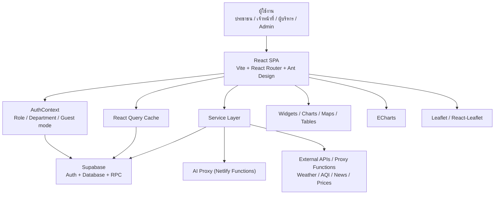

# สรุประบบ NPT Smart Agri Dashboard

## ระบบนี้คืออะไร

NPT Smart Agri Dashboard คือระบบศูนย์กลางข้อมูลเกษตรของจังหวัดนครปฐม พัฒนาเป็นเว็บแอปพลิเคชันเพื่อรวมข้อมูลที่กระจัดกระจายหลายแหล่ง (เช่น Excel, Google Sheet, รายงาน PDF, ระบบส่วนกลาง) ให้มาอยู่ในระบบเดียวกัน ใช้ได้ทั้งแบบสาธารณะ (Public Portal) สำหรับเผยแพร่ข้อมูลทั่วไป และแบบภายใน (Internal Dashboard) สำหรับเจ้าหน้าที่และผู้บริหารในการติดตาม วิเคราะห์ ค้นหา และจัดการข้อมูล

แนวคิดหลักของระบบ:

- **รวมข้อมูลเกษตรจังหวัดไว้ในจุดเดียว:** แก้ปัญหาข้อมูลแยกส่วนในหลายฝ่ายงาน
- **แสดงผลข้อมูลหลากหลายรูปแบบ:** แสดงข้อมูลเป็นแดชบอร์ดสรุป ตัวเลขสำคัญ ตารางข้อมูล กราฟสถิติ และแผนที่เชิงพื้นที่
- **ค้นหาและจัดการข้อมูลได้ง่าย:** มีระบบค้นหาข้ามตาราง (Global Search) และตารางจัดการข้อมูล (CRUD Table)
- **ใช้ AI เป็นผู้ช่วย:** แชทบอทวิเคราะห์ข้อมูล ถามตอบด้วยภาษาธรรมชาติ และระบบพยากรณ์โรคพืชด้วย AI
- **แบ่งสิทธิ์ผู้ใช้งานชัดเจน:** ควบคุมการเข้าถึงด้วยระบบสิทธิ์ตามบทบาทและฝ่ายงาน (Role-Based Access Control)
- **ลดขั้นตอนและภาระงาน:** ลดเวลาประสานงานรวบรวมไฟล์และทำรายงานสรุปเสนอผู้บริหาร

---

## สถาปัตยกรรมระบบ (System Architecture)

ระบบออกแบบและพัฒนาแบบแยกชั้นการทำงาน (Layered Architecture) ดังแสดงในผังระบบต่อไปนี้:



---

## ระบบย่อยทั้งหมดในโปรเจกต์ (Subsystems)

### 1. Public Data Portal

ส่วนแสดงผลสาธารณะสำหรับเผยแพร่ข้อมูลเกษตรจังหวัดนครปฐมให้ประชาชนทั่วไปและภาคีเครือข่ายเข้าถึงได้โดยไม่ต้องลงชื่อเข้าสู่ระบบ

**หน้าเว็บหลักและเส้นทาง (Routes):**

- `/` - Landing Page หน้าแรกของโครงการ (Public Portal)
- `/interactive-dashboard` - หน้าแสดงผลสถิติสาธารณะแบบโต้ตอบ (Interactive Dashboard)
- `/public/large-plots` - ข้อมูลแปลงใหญ่สาธารณะ
- `/public/smart-farmers` - ข้อมูล Smart Farmer และ Young Smart Farmer สาธารณะ
- `/public/community-enterprises` - ข้อมูลวิสาหกิจชุมชนสาธารณะ
- `/public/agri-tourism` - ข้อมูลแหล่งท่องเที่ยวเชิงเกษตรสาธารณะ
- `/public/farmer-institutes` - ข้อมูลสถาบันเกษตรกรสาธารณะ
- `/public/agricultural-areas` - ข้อมูลภาพรวมพื้นที่การเกษตร

**วิดเจ็ตแสดงข้อมูลสนับสนุน (Widgets):**

- **สภาพอากาศปัจจุบันและการพยากรณ์:** ดึงข้อมูลสดแสดงสภาพอากาศและอุณหภูมิรายวัน
- **คุณภาพอากาศ (AQI/PM2.5):** ตรวจวัดคุณภาพอากาศแบบเรียลไทม์รายอำเภอ
- **ราคาสินค้าเกษตร:** ตรวจสอบราคากลางจากกระทรวงพาณิชย์ (MOC)
- **จุดความร้อนและ PM2.5 (Fire Hotspots):** ตรวจจับจุดความร้อนเชิงพื้นที่จากข้อมูลดาวเทียม GISTDA
- **ข่าวสารเกษตรกร:** ข่าวสารประชาสัมพันธ์จากเกษตรจังหวัด เกษตรอำเภอ และกรมส่งเสริมการเกษตร

---

### 2. Internal Dashboard & Domain Modules

หน้าแดชบอร์ดและระบบจัดการข้อมูลเฉพาะกลุ่มงานภายใน สำหรับเจ้าหน้าที่และผู้บริหาร (ต้องลงชื่อเข้าสู่ระบบก่อนเข้าใช้งาน)

#### 2.1 ฝ่ายบริหารทั่วไป (Admin)

**เส้นทาง:** `/dashboard/admin/*`

| หน้า           | ไฟล์หลัก               | หน้าที่และรายละเอียด                                         |
| -------------- | ---------------------- | ------------------------------------------------------------ |
| Dashboard      | `AdminDashboard.jsx`   | แดชบอร์ดสรุปสถิติด้านการบริหารของสำนักงาน                    |
| บุคลากร        | `Personnel.jsx`        | จัดการข้อมูล ทำเนียบ และสิทธิ์ของบุคลากรภายในจังหวัด         |
| พัสดุ/ครุภัณฑ์ | `Assets.jsx`           | บันทึกและติดตามพัสดุ ครุภัณฑ์ และอุปกรณ์สำนักงาน             |
| งบประมาณ       | `Budgets.jsx`          | ติดตาม จัดสรร และวางแผนงบประมาณโครงการส่งเสริมการเกษตร       |
| จัดการผู้ใช้   | `UserManagement.jsx`   | กำหนดสิทธิ์การเข้าใช้งานระบบและมอบหมายสิทธิ์ของบัญชีผู้ใช้   |
| Audit Log      | `AuditLog.jsx`         | ตรวจสอบบันทึกประวัติการทำกิจกรรมและการแก้ไขข้อมูลสำคัญในระบบ |
| กิจกรรมล่าสุด  | `RecentActivities.jsx` | แสดงประวัติการบันทึกข้อมูลและแก้ไขไฟล์ล่าสุดรายวัน           |

#### 2.2 กลุ่มยุทธศาสตร์และสารสนเทศ (Strategy)

**เส้นทาง:** `/dashboard/strategy/*`

| หน้า            | ไฟล์หลัก                 | หน้าที่และรายละเอียด                                                    |
| --------------- | ------------------------ | ----------------------------------------------------------------------- |
| Dashboard       | `StrategyDashboard.jsx`  | ภาพรวมยุทธศาสตร์ ตัวชี้วัดเป้าหมาย และแผนงานระดับจังหวัด                |
| ทะเบียนเกษตรกร  | `FarmerRegistry.jsx`     | ค้นหาและตรวจสอบข้อมูลประวัติการขึ้นทะเบียนเกษตรกรรายบุคคล               |
| GIS / แผนที่    | `SmartMap.jsx`           | แผนที่สืบค้นพิกัดเชิงพื้นที่ แสดงขอบเขตอำเภอและแปลงเกษตรกรรม            |
| พื้นที่การเกษตร | `AgriculturalAreas.jsx`  | จำแนกข้อมูลพื้นที่เพาะปลูกตามประเภทพืชและแหล่งน้ำรายอำเภอ               |
| ศูนย์เรียนรู้   | `LearningCenters.jsx`    | จัดการฐานข้อมูลและทำเนียบศูนย์เรียนรู้การเพิ่มประสิทธิภาพการผลิต (ศพก.) |
| สภาพอากาศรายวัน | `DailyWeather.jsx`       | บันทึกสถิติสภาพอากาศ ปริมาณน้ำฝนรายวัน เพื่อวิเคราะห์แนวโน้ม            |
| ภัยพิบัติ       | -                        | _(ระบบจะเปลี่ยนเส้นทางไปยังฝ่ายพัฒนาเกษตรกรเพื่อความสอดคล้องของภารกิจ)_ |
| ราคาสินค้าเกษตร | `AgriculturalPrices.jsx` | วิเคราะห์และติดตามความเคลื่อนไหวราคาสินค้าเกษตรรายวัน                   |

#### 2.3 กลุ่มส่งเสริมและพัฒนาการผลิต (Production)

**เส้นทาง:** `/dashboard/production/*`

| หน้า          | ไฟล์หลัก                    | หน้าที่และรายละเอียด                                                  |
| ------------- | --------------------------- | --------------------------------------------------------------------- |
| Dashboard     | `ProductionDashboard.jsx`   | ภาพรวมข้อมูลแปลงใหญ่ มาตรฐานสินค้า และสถิติการผลิตพืชเศรษฐกิจ         |
| แปลงใหญ่      | `LargePlots.jsx`            | จัดการข้อมูลแปลงใหญ่ กลุ่มเป้าหมาย ผู้ประสานงาน และผลผลิตของแปลง      |
| มาตรฐาน GAP   | `Certifications.jsx`        | บันทึกทะเบียนและวันหมดอายุใบรับรองมาตรฐาน GAP และมาตรฐานเกษตรอินทรีย์ |
| ผลผลิตพืช     | `CropProduction.jsx`        | ติดตามข้อมูลต้นทุน ราคา และปริมาณผลผลิตพืชหลักของจังหวัด              |
| มะพร้าวน้ำหอม | `CoconutAromaticSurvey.jsx` | ระบบบันทึกและวิเคราะห์ข้อมูลการสำรวจการผลิตมะพร้าวน้ำหอมของจังหวัด    |

#### 2.4 กลุ่มส่งเสริมและพัฒนาเกษตรกร (Development)

**เส้นทาง:** `/dashboard/development/*`

| หน้า                | ไฟล์หลัก                         | หน้าที่และรายละเอียด                                                |
| ------------------- | -------------------------------- | ------------------------------------------------------------------- |
| Dashboard           | `DevelopmentDashboard.jsx`       | แดชบอร์ดสรุปสถิติด้านกลุ่มองค์กรและสถาบันเกษตรกรในจังหวัด           |
| วิสาหกิจชุมชน       | `CommunityEnterprises.jsx`       | จัดการทำเนียบกลุ่มวิสาหกิจชุมชนที่จดทะเบียน ผลิตภัณฑ์ และสมาชิก     |
| Smart Farmer        | `SmartFarmerSf.jsx`              | ทะเบียนข้อมูลประเมินทักษะและติดตามสถิติของ Smart Farmer             |
| Young Smart Farmer  | `YoungSmartFarmerYsf.jsx`        | ทะเบียนข้อมูลประเมินทักษะและติดตามสถิติของ Young Smart Farmer       |
| กลุ่มส่งเสริมอาชีพ  | `AgriculturalCareerGroups.jsx`   | จัดการข้อมูลกลุ่มส่งเสริมอาชีพเกษตรกรรมและกลุ่มแม่บ้านเกษตรกร       |
| กลุ่มแม่บ้านเกษตรกร | `FarmerGroups.jsx`               | ฐานข้อมูลสมาชิกกลุ่มแม่บ้านเกษตรกรและกิจกรรมกลุ่ม                   |
| กลุ่มยุวเกษตรกร     | `YoungFarmerGroupsDashboard.jsx` | จัดการทำเนียบกลุ่มยุวเกษตรกรในโรงเรียนและสมาชิกยุวเกษตรกร           |
| สถาบันเกษตรกร       | `FarmerInstitutes.jsx`           | ข้อมูลกลุ่มเกษตรกร สหกรณ์การเกษตร และกลุ่มวิชาการที่เข้มแข็ง        |
| ท่องเที่ยวเชิงเกษตร | `AgriTourism.jsx`                | ฐานข้อมูลวิสาหกิจและแหล่งท่องเที่ยวเชิงเกษตรในชุมชน                 |
| ภัยพิบัติ           | `strategy/Disasters.jsx`         | บันทึกสถิติความเสียหายและการช่วยเหลือเกษตรกรจากภัยพิบัติทางธรรมชาติ |

#### 2.5 กลุ่มอารักขาพืช (Protection)

**เส้นทาง:** `/dashboard/protection/*`

| หน้า                  | ไฟล์หลัก                    | หน้าที่และรายละเอียด                                                   |
| --------------------- | --------------------------- | ---------------------------------------------------------------------- |
| Dashboard             | `ProtectionDashboard.jsx`   | ภาพรวมสถานการณ์ระบาดศัตรูพืช แปลงพยากรณ์ และข้อมูลการพยากรณ์ล่วงหน้า   |
| แปลงพยากรณ์           | `PestOutbreaks.jsx`         | ติดตามแปลงพยากรณ์การระบาดของศัตรูพืชและแมลงสำคัญในพื้นที่              |
| ศูนย์จัดการศัตรูพืช   | `PestCenters.jsx`           | จัดการฐานข้อมูลและทำเนียบศูนย์จัดการศัตรูพืชชุมชน (ศจช.)               |
| ศูนย์จัดการดินปุ๋ย    | `SoilFertilizerCenters.jsx` | จัดการฐานข้อมูลและทำเนียบศูนย์จัดการดินและปุ๋ยชุมชน (ศดปช.)            |
| จุดความร้อน (Hotspot) | `FireHotspots.jsx`          | แผนที่แสดงพิกัดจุดความร้อนรายอำเภอเพื่อเฝ้าระวังไฟป่าและฝุ่น PM2.5     |
| แพทย์พืช              | `PlantDoctors.jsx`          | ทะเบียนและทำเนียบแพทย์พืช/ผู้เชี่ยวชาญด้านอารักขาพืชในจังหวัด          |
| AI พยากรณ์โรค         | `AiDiseaseForecast.jsx`     | ระบบใช้ปัญญาประดิษฐ์ประมวลผลสภาพแวดล้อมเพื่อคาดการณ์โอกาสการเกิดโรคพืช |

#### 2.6 ชุมชนเกษตรกร (Community)

**เส้นทาง:** `/dashboard/community/*`

| หน้า         | ไฟล์หลัก          | หน้าที่และรายละเอียด                                               |
| ------------ | ----------------- | ------------------------------------------------------------------ |
| Farmer Forum | `FarmerForum.jsx` | กระดานข่าว ถามตอบ ปรึกษาปัญหาระหว่างเจ้าหน้าที่กับเกษตรกรในพื้นที่ |

#### 2.7 ระบบคำขอข้อมูล (Data Requests Workflow)

**เส้นทาง:** `/dashboard/data-requests`

| หน้า          | ไฟล์หลัก           | หน้าที่และรายละเอียด                                                                                           |
| ------------- | ------------------ | -------------------------------------------------------------------------------------------------------------- |
| Data Requests | `DataRequests.jsx` | ระบบสั่งการขอข้อมูลจากอำเภอ เจ้าหน้าที่สามารถสร้างคำขอข้อมูลและให้อำเภอกรอกข้อมูลกลับเข้ามาในระบบผ่านหน้าตาราง |

---

### 3. AI Chatbot

แชทบอทผู้ช่วยอัจฉริยะ (เช่น "น้องข้าวหลาม") สำหรับช่วยให้ผู้ใช้งานสามารถค้นหา วิเคราะห์ และสรุปข้อมูลในฐานข้อมูลด้วยภาษาธรรมชาติ

**คุณสมบัติหลัก:**

- รองรับการถามคำถามภาษาธรรมชาติ เช่น _"อำเภอสามพรานมีแปลงใหญ่กี่กลุ่ม ปลูกพืชชนิดใดบ้าง"_
- ใช้เทคนิค Intent Extraction ค้นหาชุดข้อมูลและคำนวณตัวเลขทางสถิติ (Count, Total, Average, Ranking) จากฐานข้อมูลจริงมาจัดเตรียมเป็น Context ที่ถูกต้องก่อนส่งให้ AI เพื่อป้องกันการตอบคำตอบแบบคาดเดา (Hallucination)
- แสดงคำตอบคู่กับตารางสรุปข้อมูลหรือแผนภูมิประกอบเพื่อให้ง่ายต่อการเปรียบเทียบ
- มี Serverless API Proxy ป้องกัน API Key จากฝั่ง Client และเชื่อมต่อกับ AI Providers ชั้นนำ (Gemini, OpenRouter, NVIDIA NIM)
- **KKU Chatbot:** เพิ่มระบบแชทบอทตอบคำถามเกษตรสาธารณะบนหน้าแรกผ่าน API ร่วมกับหน่วยงานภายนอก

---

### 4. Global Search

ระบบค้นหากลางที่ช่วยให้เจ้าหน้าที่สามารถพิมพ์คำเดียวแล้วระบุตำแหน่งข้อมูลที่เกี่ยวข้องในทุกตารางได้อย่างรวดเร็ว

**คุณสมบัติหลัก:**

- เรียกใช้ Supabase RPC `global_search` ในฐานข้อมูลเพื่อผลลัพธ์ที่รวดเร็วสูงสุด
- มีกลไกสำรอง (Fallback) ในกรณีที่ RPC ขัดข้อง โดยทำการ Query ข้อมูลข้ามหลายตารางพร้อมกันแบบขนาน (Parallel Query)
- แสดงผลลัพธ์แยกตามประเภทกลุ่มงานเพื่อความง่ายในการตรวจสอบและกดลิงก์เชื่อมโยงไปยังหน้าจัดการข้อมูลนั้นๆ

---

### 5. Smart Map & GIS System

ระบบแสดงผลข้อมูลเชิงพื้นที่และสืบค้นพิกัดแปลงเกษตรอย่างละเอียด

**คุณสมบัติหลัก:**

- ใช้ **Leaflet** ร่วมกับ **React-Leaflet** เพื่อแสดงแผนที่แบบโต้ตอบ
- แสดงขอบเขตการปกครองรายอำเภอของจังหวัดนครปฐมโดยอ้างอิงไฟล์ GeoJSON
- แสดงข้อมูลเชิงพิกัดของแหล่งท่องเที่ยวเชิงเกษตร แปลงใหญ่ จุดความร้อน (Hotspots) และศูนย์ ศพก. บนแผนที่
- ปรับปรุงการใช้งานบนอุปกรณ์พกพา (Mobile Touch Interaction) และจัดระเบียบแผนที่เชิงชั้นข้อมูล (Layers Control)

---

### 6. Data Management Component

ส่วนจัดการข้อมูลสากล (CRUD Table Component) เพื่อให้การจัดการข้อมูลตารางต่างๆ มีมาตรฐานและความมั่นคงในการใช้งานร่วมกัน

**คุณสมบัติหลัก:**

- แสดงข้อมูลในลักษณะตารางกริดที่กรอง ค้นหา และเรียงลำดับได้
- รองรับการทำ CSV Export เพื่อส่งออกรายงาน และ CSV Import เพื่อนำเข้าข้อมูลจากไฟล์สเปรดชีต
- บันทึกการเพิ่ม แก้ไข ลบข้อมูลย้อนหลังอัตโนมัติลงในตาราง `audit_logs`
- ป้องกันปัญหาระบบพังระหว่างทำงานโดยใช้ Error Boundary แยกเฉพาะส่วนตารางข้อมูล

---

## Netlify Functions (Serverless Proxy)

ระบบใช้งาน Netlify Functions เพื่อประมวลผลเบื้องหลัง ทำการ Sync ข้อมูล และช่วยซ่อนความลับระบบ (API Keys) ไว้ที่ฝั่ง Server (มีทั้งหมด 19 ฟังก์ชัน) ดังนี้:

| ชื่อฟังก์ชัน                    | ไฟล์ฟังก์ชัน                       | หน้าที่และรายละเอียด                                                   |
| ------------------------------- | ---------------------------------- | ---------------------------------------------------------------------- |
| **AI Proxy**                    | `ai-proxy.js`                      | ตัวกลางสำหรับเรียกใช้งาน AI (Gemini, OpenRouter, NVIDIA)               |
| **KKU Proxy**                   | `kku-proxy.js`                     | ตัวกลางสำหรับเรียกใช้บริการ KKU Chatbot ในหน้าสาธารณะ                  |
| **RSS Proxy**                   | `rss-proxy.js`                     | ดึงข้อมูลข่าวสารประชาสัมพันธ์รูปแบบ RSS Feeds จากเว็บเกษตร             |
| **WordPress Proxy**             | `wp-proxy.js`                      | ดึงข่าวประชาสัมพันธ์จากระบบ WordPress นครปฐมและกรมส่งเสริมฯ            |
| **MOC Price Proxy**             | `moc-price-proxy.js`               | ดึงราคาสินค้าเกษตรแบบเรียลไทม์จากกรมการค้าภายใน (MOC)                  |
| **Bangchak Oil Price**          | `bangchak-oil-price-proxy.js`      | ดึงข้อมูลราคาน้ำมันขายปลีกรายวันของบางจาก                              |
| **GISTDA Proxy**                | `gistda-proxy.js`                  | ดึงข้อมูลพิกัดจุดความร้อนรายวัน (Fire Hotspots) จากระบบดาวเทียม GISTDA |
| **Sync Hotspots**               | `sync-hotspots.js`                 | ฟังก์ชันอัตโนมัติเพื่อนำเข้าพิกัด Hotspots ลงในฐานข้อมูล               |
| **Sync Weather**                | `sync-weather.js`                  | ฟังก์ชันอัตโนมัติเพื่อนำเข้าข้อมูลสภาพอากาศรายวันจาก Meteostat         |
| **Sync Farmer Registry**        | `sync-farmer-registry.js`          | ฟังก์ชันจำลองสำหรับนำเข้าและซิงค์ข้อมูลทะเบียนเกษตรกร                  |
| **Public Certifications**       | `public-certifications.js`         | ให้ข้อมูลมาตรฐาน GAP และเกษตรอินทรีย์แก่หน้าสาธารณะ                    |
| **Public Farmer Institutes v2** | `public-farmer-institutes-v2.js`   | ให้ข้อมูลสถาบันเกษตรกรแก่หน้าสาธารณะ                                   |
| **DOAE HQ Proxy**               | `doae-hq-proxy.js`                 | ดึงข้อมูลบริการกลางจากกรมส่งเสริมการเกษตรส่วนกลาง                      |
| **DOAE NPT Proxy**              | `doae-npt-proxy.js`                | ดึงข้อมูลบริการเฉพาะพื้นที่สำนักงานเกษตรจังหวัดนครปฐม                  |
| **DOAE ESC Proxy**              | `doae-esc-proxy.js`                | ดึงข้อมูลจากศูนย์บริการของอำเภอและหน่วยงานภาคสนาม                      |
| **ICTC Proxy**                  | `ictc-proxy.js`                    | ดึงข้อมูลจากศูนย์เทคโนโลยีสารสนเทศและการสื่อสาร (ICTC)                 |
| **Agritec Proxy**               | `agritec-proxy.js`                 | ดึงข้อมูลบริการวิชาการเกษตรและสถิติเทคโนโลยี Agritec                   |
| **Forecast Disease Insect**     | `forecast-disease-insect.js`       | คำนวณความน่าจะเป็นของการระบาดของโรคพืชและแมลงล่วงหน้า                  |
| **Forecast Disease Daily**      | `forecast-disease-insect-daily.js` | ประมวลผลและอัปเดตสถิติความเสี่ยงรายวัน                                 |

---

## ระบบสิทธิ์และการเข้าถึงข้อมูล (Role-Based Access Control)

ระบบแบ่งประเภทผู้ใช้งานและกำหนดความสามารถในการจัดการสิทธิ์ RLS ในระดับฐานข้อมูล เพื่อควบคุมการแก้ไขข้อมูล ดังนี้:

### ระดับสิทธิ์การเข้าใช้งาน (Roles Matrix)

| ระดับสิทธิ์ | สิทธิ์การทำงานในระบบ                                                                                                        |
| ----------- | --------------------------------------------------------------------------------------------------------------------------- |
| **Guest**   | เข้าถึงหน้าหลัก (Landing Page) ดูสถิติสาธารณะได้บางส่วน ไม่อนุญาตให้ใช้ AI Chatbot, ค้นหาข้ามตาราง และแก้ไขฐานข้อมูล        |
| **Viewer**  | ล็อกอินเพื่อเข้าสู่แดชบอร์ด ดูข้อมูลภายในของกลุ่มงานตนเองและข้อมูลทั่วไปของระบบได้ อ่านข้อมูลได้แต่ไม่สามารถแก้ไข           |
| **Editor**  | ล็อกอินเพื่อดูและแก้ไข ปรับปรุง เพิ่ม ลบ ข้อมูลในกลุ่มงานที่ตนเองสังกัดได้ สามารถเริ่มกระบวนการ Data Requests ได้           |
| **Admin**   | ผู้ดูแลระบบสูงสุด เห็นเมนูครบทุกกลุ่มงาน สามารถจัดการสิทธิ์สมาชิก ตรวจสอบประวัติระบบ (Audit Logs) และจัดการข้อมูลได้ทั้งหมด |

### การจัดสรรสิทธิ์ตามฝ่ายงาน (Department Mapping)

ระบบใช้ข้อมูลฝ่ายงาน (Department) เพื่อจัดกลุ่มและสิทธิ์การเข้าถึงเมนูและตารางข้อมูลโดยอัตโนมัติ:

| ฝ่ายงาน (Department)             | สรุปคีย์ (Group Key) | การเข้าถึงเส้นทางหลัก      |
| -------------------------------- | -------------------- | -------------------------- |
| **ฝ่ายบริหารทั่วไป**             | `admin`              | `/dashboard/admin/*`       |
| **กลุ่มยุทธศาสตร์และสารสนเทศ**   | `strategy`           | `/dashboard/strategy/*`    |
| **กลุ่มส่งเสริมและพัฒนาการผลิต** | `production`         | `/dashboard/production/*`  |
| **กลุ่มส่งเสริมและพัฒนาเกษตรกร** | `development`        | `/dashboard/development/*` |
| **กลุ่มอารักขาพืช**              | `protection`         | `/dashboard/protection/*`  |

---

## โครงสร้างโฟลเดอร์โครงการ (Directory Structure)

```text
/workspace
├── src/
│   ├── App.jsx                      # การตั้งค่า Routing หลัก, App Shell และ Provider ทั้งหมด
│   ├── main.jsx                     # Entry point หลักของ React SPA
│   ├── supabaseClient.js            # การตั้งค่าเชื่อมต่อ Supabase Client
│   │
│   ├── components/                  # แฟ้มเก็บคอมโพเนนต์ที่ใช้ร่วมกันในระบบ
│   │   ├── Chatbot/                 # ส่วนแสดงผลและปุ่ม AI Chatbot ภายในระบบ
│   │   ├── DataTable/               # คอมโพเนนต์ CrudTable และ CsvImportModal
│   │   ├── ErrorBoundary/           # ป้องกันหน้าระบบล่มจากความเสียหายในโค้ดย่อย
│   │   ├── LandingChatbot/          # แชทบอทตอบคำถามบนหน้า Landing Page
│   │   ├── Layout/                  # แถบเมนูด้านข้าง (Sidebar) แถบด้านบน (Header) และโครงสร้างหลัก (AppLayout)
│   │   ├── Map/                     # คอมโพเนนต์พิกัดแผนที่และการพยากรณ์โรค
│   │   ├── Search/                  # คอมโพเนนต์ค้นหากลาง
│   │   └── widgets/                 # วิดเจ็ตข้อมูลต่างๆ (ราคา, สภาพอากาศ, ข่าวสาร, คุณภาพอากาศ)
│   │
│   ├── contexts/
│   │   └── AuthContext.jsx          # จัดการข้อมูลการลงชื่อเข้าใช้งาน เซสชัน สิทธิ์ และฝ่ายงาน
│   │
│   ├── hooks/                       # Custom Hooks สำหรับดึงข้อมูลและจัดการสถานะ
│   │   ├── useDashboardData.js      # ดึงข้อมูลตัวเลขและสถิติภาพรวมแดชบอร์ดจาก Supabase
│   │   ├── useSupabase.js           # Query ข้อมูลสำหรับ CRUD หน้าต่างๆ
│   │   ├── useApiCache.js           # จัดการ cache ข้อมูลและตัวดึงข้อมูลภายนอก
│   │   └── dashboard/
│   │       ├── config.js            # กำหนดค่าตัวแปรสถิติของแต่ละกลุ่มงาน
│   │       ├── dataFetchers.js      # ส่วนดึงข้อมูลภาพรวมแดชบอร์ด
│   │       └── selectors.js         # จัดกลุ่มผลรวมสถิติรายอำเภอ
│   │
│   ├── pages/                       # หน้าเว็บหลักแยกประเภทตามหมวดหมู่
│   │   ├── admin/                   # หน้าข้อมูลของฝ่ายบริหารทั่วไป (พัสดุ, บุคลากร, งบประมาณ, ผู้ดูแลระบบ)
│   │   ├── strategy/                # หน้าข้อมูลกลุ่มยุทธศาสตร์ (พื้นที่เกษตร, แหล่งเรียนรู้, แผนที่, สภาพอากาศ)
│   │   ├── production/              # หน้าข้อมูลกลุ่มส่งเสริมการผลิต (แปลงใหญ่, ใบรับรอง GAP, มะพร้าวน้ำหอม)
│   │   ├── development/             # หน้าข้อมูลกลุ่มพัฒนาเกษตรกร (วิสาหกิจชุมชน, Smart Farmer, ท่องเที่ยว)
│   │   ├── protection/              # หน้าข้อมูลกลุ่มอารักขาพืช (แปลงระบาด, ศจช., ศดปช., แพทย์พืช, จุดความร้อน)
│   │   ├── community/               # หน้าเว็บ Farmer Forum สื่อสารกับคนในพื้นที่
│   │   ├── dataRequests/            # หน้าระบบคำขอข้อมูลและการทำงานแบบตารางกริด
│   │   ├── Chatbot.jsx              # หน้าใช้งาน AI Chatbot แบบเต็มรูปแบบ
│   │   ├── Dashboard.jsx            # หน้าแดชบอร์ดสรุปสถิติด้านในระบบ
│   │   ├── InteractiveDashboard.jsx # หน้าสถิติสาธารณะ
│   │   ├── LandingPage.jsx          # หน้าแรกของระบบ
│   │   ├── Login.jsx                # หน้าลงชื่อเข้าสู่ระบบ
│   │   ├── SearchResults.jsx        # หน้าแสดงผลการค้นหาข้ามระบบ
│   │   └── SmartMap.jsx             # หน้าแผนที่รายละเอียดพิกัดแผนที่ GIS
│   │
│   ├── services/                    # บริการกลางเชื่อมต่อข้อมูล
│   │   ├── aiService.js             # จัดการส่งข้อมูลสนทนากับ AI Proxy
│   │   ├── chatbotDataService.js    # ค้นหา บริหารข้อมูล และคำนวณตัวเลขสำหรับเป็นบริบท AI
│   │   └── globalSearchService.js   # บริการประมวลผลคำค้นหาข้ามตาราง
│   │
│   └── utils/                       # ฟังก์ชันอำนวยความสะดวกกลาง
│       ├── auditLog.js              # บันทึกความเคลื่อนไหวข้อมูลลงใน audit_logs
│       ├── chatbotConstants.js      # ข้อมูลคงที่และ Prompt เริ่มต้นของบอท
│       ├── coconutAromatic.js       # คำนวณราคาและผลสำรวจมะพร้าวน้ำหอม
│       ├── csv.js                   # จัดการแปลงและจัดรูปแบบ CSV
│       └── geo.js                   # การคำนวณพิกัดภูมิศาสตร์และการแปลงพิกัด UTM
│
├── netlify/
│   └── functions/                   # Serverless Functions สำหรับประมวลผลที่ Netlify Backend
│
├── supabase/                        # สคริปต์ SQL, โครงสร้างตาราง (Schema) และนโยบายความปลอดภัย
│
├── tests/                           # ชุดตรวจสอบการทดลองระบบ E2E (Playwright)
│
└── public/                          # Static Assets สื่อและสไตล์ชีทคงที่
```

---

## เทคโนโลยีและเวอร์ชันที่ใช้งาน (Tech Stack)

| ประเภทเทคโนโลยี           | ชื่อเครื่องมือ / แพ็กเกจ     | เวอร์ชัน      |
| ------------------------- | ---------------------------- | ------------- |
| **Frontend Framework**    | React                        | 19.2.0        |
| **Build Tool**            | Vite                         | 7.3.1         |
| **Routing**               | React Router DOM             | 7.13.1        |
| **UI Design System**      | Ant Design                   | 6.3.1         |
| **Icons Library**         | @ant-design/icons            | 6.1.0         |
| **Data Fetching & Cache** | TanStack React Query         | 5.95.2        |
| **Backend Service**       | Supabase JS Client           | 2.97.0        |
| **Database Engine**       | PostgreSQL (Supabase Hosted) | -             |
| **Map & GIS**             | Leaflet / React-Leaflet      | 1.9.4 / 5.0.0 |
| **Data Visualization**    | ECharts                      | 6.1.0         |
| **Report Export**         | jsPDF / html2canvas          | 4.2.0 / 1.4.1 |
| **Date Parser**           | dayjs                        | 1.11.19       |
| **Geo Math Utility**      | utm                          | 1.1.1         |
| **Serverless Backend**    | Netlify Functions            | 5.2.0         |
| **Unit Testing**          | Vitest / Testing Library     | 4.1.4         |
| **E2E Testing**           | Playwright                   | 1.59.1        |
| **Code Style & Linting**  | ESLint                       | 9.39.1        |

---

## สรุปคำสั่งที่ใช้งานบ่อย (Frequent Commands)

```bash
# 1. รันเซิร์ฟเวอร์สำหรับพัฒนาในเครื่อง (Local Development)
npm run dev

# 2. คอมไพล์โปรเจกต์สำหรับการใช้งานจริงบนระบบจำลอง (Production Build)
npm run build

# 3. คอมไพล์โปรเจกต์สำหรับใช้งานบน Netlify
npm run build:netlify

# 4. แสดงตัวอย่างระบบที่คอมไพล์แล้วในเครื่อง
npm run preview

# 5. ตรวจสอบโค้ดด้วยระบบ Lint เพื่อหาจุดบกพร่องในสไตล์การเขียน
npm run lint

# 6. ตรวจสอบโค้ดเฉพาะในโฟลเดอร์ src
npm run lint:src

# 7. ตรวจสอบการทำยูนิตเทส (Unit Test)
npm run test

# 8. ตรวจสอบและสแกน E2E Test (Playwright)
npm run test:e2e

# 9. พรีเรนเดอร์หน้าเว็บ (Prerender Pages)
npm run prerender
```

---

## ข้อมูลที่ระบบรองรับ (Data Inventory)

| หมวดหมู่ข้อมูล                   | แหล่งตารางข้อมูล (Supabase)                                                                                                                                                                                     | การจัดแสดงและสถิติหลัก                                                                                                           |
| -------------------------------- | --------------------------------------------------------------------------------------------------------------------------------------------------------------------------------------------------------------- | -------------------------------------------------------------------------------------------------------------------------------- |
| **ยุทธศาสตร์ (Strategy)**        | `farmer_registry`, `gis_areas`, `agricultural_areas`, `learning_centers`, `daily_weather`                                                                                                                       | ข้อมูลพื้นที่เกษตรกรรม จำนวนประชากรผู้ขึ้นทะเบียนรายอำเภอ พิกัด GIS ที่ตั้ง ศพก. และสถิติอากาศน้ำฝน                              |
| **ส่งเสริมการผลิต (Production)** | `large_plots`, `certifications`, `crop_production`, `coconut_aromatic_surveys`                                                                                                                                  | ข้อมูลพืชแปลงใหญ่ จำนวนใบรับรองมาตรฐาน GAP สัดส่วนพืชหลัก และผลการสำรวจมะพร้าวน้ำหอมนครปฐม                                       |
| **พัฒนาเกษตรกร (Development)**   | `community_enterprises`, `smart_farmer_sf`, `young_smart_farmer_ysf`, `agricultural_career_groups`, `housewife_farmer_groups`, `young_farmer_groups_detailed`, `farmer_institutes`, `agri_tourism`, `disasters` | ทะเบียนวิสาหกิจชุมชน ข้อมูลการประเมิน Smart Farmer/YSF สถิติกลุ่มส่งเสริมอาชีพ สถาบันเกษตร และข้อมูลผู้ได้รับผลกระทบจากภัยพิบัติ |
| **อารักขาพืช (Protection)**      | `forecast_plots`, `pest_centers`, `soil_fertilizer_centers`, `fire_hotspots`, `ai_disease_forecasts`, `plant_doctors`                                                                                           | ข้อมูลการคาดการณ์ศัตรูพืช ข้อมูลพิกัดของกลุ่ม ศจช. ดินปุ๋ยชุมชน (ศดปช.) จุดความร้อนจากดาวเทียม และทะเบียนแพทย์พืชประจำอำเภอ      |
| **การบริหารจัดการ (Admin)**      | `profiles`, `personnel`, `assets`, `budgets`, `audit_logs`                                                                                                                                                      | ทะเบียนบุคลากร งบประมาณจัดสรรรายโครงการ (งบประมาณรวม 767,495 บาท 123 รายการ) บันทึกประวัติการแก้ไข และรายชื่อผู้ใช้งาน           |

---

## การรักษาความปลอดภัยและนโยบายข้อมูล (Security & Data Governance)

เพื่อความน่าเชื่อถือและความมั่นคงปลอดภัยของข้อมูลของหน่วยงาน ระบบได้บังคับใช้นโยบายความปลอดภัยดังนี้:

### 1. ความมั่นคงปลอดภัยฝั่งฐานข้อมูล (Supabase RLS Hardening)

ระบบได้บังคับใช้งานนโยบายความปลอดภัยระดับแถวข้อมูล (Row Level Security - RLS) ผ่านไฟล์ `rls_role_hardening.sql` โดยกำหนดให้:

- **ไม่อนุญาตให้ผู้ใช้ทั่วไป (Guest)** หรือผู้รับบริการภายนอก แก้ไข ลบ หรือเปลี่ยนแปลงข้อมูลใดๆ ในระดับฐานข้อมูลโดยเด็ดขาด
- ตารางข้อมูลความมั่นคงสูง เช่น ประวัติผู้ใช้ (`profiles`), งบประมาณ (`budgets`), บันทึกพัสดุ (`assets`), ทำเนียบเจ้าหน้าที่ (`personnel`), ระบบคำขอข้อมูล (`data_requests`) และบันทึกประวัติการทำงาน (`audit_logs`) จะไม่อนุญาตให้ผู้อื่นแก้ไขได้ นอกเหนือจากผู้ใช้ที่มีบทบาทเป็น `admin` หรือ `editor` เท่านั้น
- การจัดการนโยบาย RLS จะกระทำโดยอัตโนมัติที่ระดับฐานข้อมูล (Database Level) เพื่อป้องกันข้อมูลรั่วไหลถึงแม้จะไม่มีการควบคุมเพิ่มเติมที่ระบบหน้าต่าง (Client App)

### 2. นโยบายข้อมูลสาธารณะ (Public Data Access Guidelines)

ข้อมูลสำหรับการนำเสนอใน Public Data Portal จะถูกส่งผ่าน RPC หรือ Serverless Endpoint ที่ผ่านการปรับแต่งค่าความปลอดภัย (Sanitization) และจำกัดฟิลด์ข้อมูลสำคัญ:

- ปกปิดและจำกัดการเปิดเผยข้อมูลส่วนบุคคลที่อ่อนไหว เช่น หมายเลขบัตรประชาชน ที่อยู่โดยละเอียด และเบอร์โทรศัพท์ของเกษตรกร
- แสดงข้อมูลในลักษณะภาพรวมระดับตำบล หรืออำเภอ (Aggregated Data) บนหน้าแผนที่สาธารณะ

### 3. การลบข้อมูลสำคัญออกจากรหัสระบบ (Secrets Isolation & Key Rotation)

- หลีกเลี่ยงการใช้ API Key แบบฮาร์ดโค้ด (Hardcoded Fallback Keys) ในโค้ดหลักของโปรเจกต์ เช่น คีย์ของ Supabase, GISTDA, Gemini, Meteostat
- ข้อมูลความลับและกุญแจสำคัญทั้งหมดถูกย้ายไปควบคุมที่ระดับตัวแปรสภาพแวดล้อม (Environment Variables) บน Netlify Environment และ GitHub Secrets โดยการเรียกใช้ความสามารถจะกระทำผ่าน Netlify Functions เท่านั้น
- ไฟล์คู่มือการตั้งค่าสภาพแวดล้อมจัดทำไว้ที่ `docs/reference/ENVIRONMENT.md` พร้อมวิธีสร้างและหมุนเวียนกุญแจสำคัญเพื่อความปลอดภัยเชิงระบบ

### 4. การจัดการความเสี่ยงจากระบบภายนอก (Dependency Audit)

- หลีกเลี่ยงการใช้แพ็กเกจ `xlsx` ที่มีรายงานช่องโหว่ความมั่นคงสูงและไม่มีตัวอัปเดต โดยหันมาประมวลผลผ่านตารางข้อมูลแบบ CSV-first (ใช้ CSV Utilities กลางในการประมวลผล)
- ฟังก์ชันการจัดการ AI Proxy เพิ่มระบบ payload validation ป้องกันการโจมตีเพื่อการส่งประมวลผลขนาดใหญ่เกินจำเป็น (Max token controls)

---

## ประโยชน์และผลสัมฤทธิ์เชิงนวัตกรรม (Project Impact)

- **ก่อนปรับปรุงระบบ (Before):** ข้อมูลอยู่กระจัดกระจายหลายหน่วยงาน หลายไฟล์ Excel/PDF การค้นหาใช้เวลานาน เจ้าหน้าที่ต้องเสียเวลาทำรายงานสถิติซ้ำซ้อน ผู้บริหารเห็นแนวโน้มสถานการณ์ล่าช้า
- **หลังปรับปรุงระบบ (After):** ข้อมูลเชื่อมโยงอยู่ในฐานข้อมูลกลาง (Supabase) แดชบอร์ดสรุปภาพรวมจังหวัดเรียลไทม์ (ECharts) ค้นหาข้อมูลได้ในวินาทีเดียว (Global Search) ผู้ช่วย AI อำนวยความสะดวกในการจัดหาคำตอบ และแผนที่ GIS (Leaflet) ชี้ตำแหน่งภัยพิบัติและจุดความร้อนได้อย่างแม่นยำ พร้อมระบบสิทธิ์ความปลอดภัยที่เชื่อถือได้

---

## จุดที่ควรเตรียมเพิ่มก่อนส่งประกวด (Contest Readiness Checklist)

- [ ] ตรวจสอบว่า `npm run build` และ `npm run test` ทำงานผ่านสมบูรณ์โดยไม่มีจุดพัง (local และ CI/CD)
- [ ] เตรียมข้อมูลตัวอย่าง (Seeded Sample Data) ที่สมบูรณ์และล้างข้อมูลส่วนบุคคล (PII Cleansing) ออกหมดแล้ว
- [ ] บันทึกภาพหน้าจอหลัก (Screenshots) สำรองกรณีสัญญาณอินเทอร์เน็ตบนเวทีเกิดขัดข้อง
- [ ] ซักซ้อม Demo Story และกำหนดการทำงานของผู้ช่วย AI เพื่อเล่าผลลัพธ์ของระบบให้กรรมการเห็นได้ชัดภายในเวลา 5 นาที
- [ ] ติดตั้งระบบ Early Warning และ Alert (ถ้าพร้อมพัฒนาต่อเชิงระบบ)

---

## สรุปสั้นสำหรับนำเสนอ (Pitching Abstract)

> **NPT Smart Agri Dashboard** เป็นแพลตฟอร์มศูนย์กลางข้อมูลเกษตรจังหวัดนครปฐมที่รวบรวมข้อมูลจาก 5 กลุ่มงานหลักไว้ในระบบเดียว แสดงผลผ่านแดชบอร์ดสรุปที่กระชับ แผนที่เชิงพื้นที่เชิงโต้ตอบ และสถิติกราฟข้อมูลอัจฉริยะ พร้อมผู้ช่วย AI "น้องข้าวหลาม" สำหรับถามตอบและสรุปผลข้อมูลราชการด้วยภาษาธรรมชาติ ระบบนี้นอกจากจะเพิ่มความโปร่งใสและสร้างความสะดวกรวดเร็วในการเข้าถึงข้อมูลแก่สาธารณะแล้ว ยังช่วยลดภาระงานทำรายงานของเจ้าหน้าที่ และเป็นระบบสนับสนุนการตัดสินใจเชิงกลยุทธ์ (Decision Support System) ให้กับผู้บริหารจังหวัดเพื่อการก้าวสู่ยุคเกษตรอัจฉริยะอย่างยั่งยืน
