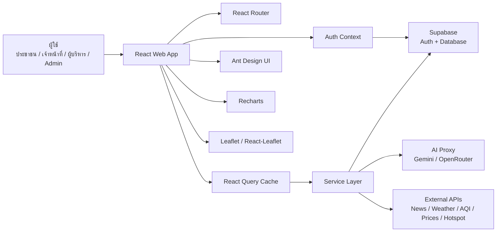

# สรุประบบ NPT Smart Agri Dashboard

## ระบบนี้คืออะไร

NPT Smart Agri Dashboard คือระบบศูนย์กลางข้อมูลเกษตรของจังหวัดนครปฐม พัฒนาเป็นเว็บแอปเพื่อรวมข้อมูลที่กระจัดกระจายหลายแหล่งให้มาอยู่ในระบบเดียว ใช้ได้ทั้งแบบสาธารณะสำหรับเผยแพร่ข้อมูล และแบบภายในสำหรับเจ้าหน้าที่/ผู้บริหารใช้ติดตาม วิเคราะห์ ค้นหา และจัดการข้อมูล

แนวคิดหลักของระบบ:

- รวมข้อมูลเกษตรจังหวัดไว้ในจุดเดียว
- แสดงข้อมูลเป็น Dashboard, ตาราง, กราฟ และแผนที่
- ให้เจ้าหน้าที่ค้นหาและจัดการข้อมูลได้ง่าย
- ใช้ AI เป็นผู้ช่วยถามตอบและสรุปข้อมูล
- รองรับการใช้งานตามบทบาทผู้ใช้ เช่น admin, editor, viewer
- ลดเวลารวบรวมข้อมูลและทำรายงานจากหลายไฟล์/หลายระบบ

## ระบบทำอะไรได้บ้าง

### 1. Public Data Portal

ส่วนสาธารณะสำหรับเผยแพร่ข้อมูลเกษตรจังหวัดให้คนทั่วไปหรือผู้เกี่ยวข้องดูได้โดยไม่ต้องเข้าสู่ระบบ

ทำได้:

- แสดงหน้า Landing Page ของศูนย์ข้อมูลเกษตร
- แสดงภาพรวมข้อมูลเกษตรจังหวัดนครปฐม
- แสดง dashboard แบบ interactive
- แสดงข้อมูลบางชุดแบบ public detail page
- แสดงข่าว สภาพอากาศ AQI ราคาเกษตร และข้อมูลเฝ้าระวัง
- แสดงแผนที่และข้อมูลเชิงพื้นที่

หน้าหลัก:

- `/`
- `/interactive-dashboard`
- `/public/large-plots`
- `/public/smart-farmers`
- `/public/community-enterprises`
- `/public/agri-tourism`
- `/public/farmer-institutes`
- `/public/agricultural-areas`

### 2. Internal Dashboard

ส่วนใช้งานภายในสำหรับเจ้าหน้าที่ หลัง login เข้าระบบ

ทำได้:

- ดู dashboard ภาพรวม
- เข้าเมนูตามกลุ่มงาน
- ดูและจัดการข้อมูลแต่ละหมวด
- ใช้ตารางข้อมูลแบบ CRUD
- ค้นหาข้อมูลข้ามหลายตาราง
- ดูข้อมูลตามสิทธิ์และบทบาท
- ใช้งาน AI chatbot

หน้าหลัก:

- `/dashboard`
- `/dashboard/search`
- `/dashboard/chatbot`

### 3. ระบบข้อมูลตามกลุ่มงาน

ระบบแบ่งข้อมูลตามโครงสร้างงานเกษตร เพื่อให้ทีมใช้งานง่าย

กลุ่ม Admin:

- Dashboard ผู้ดูแลระบบ
- บุคลากร
- ทรัพย์สิน
- งบประมาณ
- จัดการผู้ใช้
- Audit log
- กิจกรรมล่าสุด

กลุ่ม Strategy:

- ทะเบียนเกษตรกร
- GIS
- พื้นที่การเกษตร
- ศูนย์เรียนรู้
- KPI / แผนงาน
- ภัยพิบัติ
- สภาพอากาศรายวัน

กลุ่ม Production:

- แปลงใหญ่
- ใบรับรอง/มาตรฐาน
- ข้อมูลการผลิตพืช

กลุ่ม Development:

- วิสาหกิจชุมชน
- Smart Farmer
- กลุ่มเกษตรกร
- สถาบันเกษตรกร
- ท่องเที่ยวเชิงเกษตร

กลุ่ม Protection:

- แปลงพยากรณ์/การระบาดศัตรูพืช
- ศูนย์จัดการศัตรูพืชชุมชน
- ศูนย์จัดการดินปุ๋ยชุมชน
- จุดความร้อน/Hotspot

กลุ่ม Community:

- Farmer Forum / กระดานข่าวถามตอบ

### 4. AI Chatbot

ผู้ช่วย AI สำหรับถามตอบข้อมูลจากระบบและช่วยสรุปข้อมูล

ทำได้:

- รับคำถามภาษาธรรมชาติ
- ดึงข้อมูลที่เกี่ยวข้องจากฐานข้อมูล
- สรุปคำตอบให้เจ้าหน้าที่อ่านง่าย
- ช่วยสร้างตารางหรือกราฟประกอบคำตอบ
- รองรับการเลือก model AI
- ใช้ proxy กลางเพื่อเรียก AI provider

ตัวอย่างคำถามที่ควร demo:

- "อำเภอไหนมีแปลงใหญ่มากที่สุด"
- "สรุปข้อมูล Smart Farmer ในจังหวัด"
- "พื้นที่เกษตรแต่ละอำเภอเป็นอย่างไร"
- "มีข้อมูลภัยพิบัติหรือจุด hotspot อะไรบ้าง"

ไฟล์หลัก:

- `src/pages/Chatbot.jsx`
- `src/services/chatbotDataService.js`
- `src/services/aiService.js`
- `src/components/Chatbot/*`

### 5. Global Search

ระบบค้นหาข้อมูลข้ามหลายตาราง

ทำได้:

- ค้นหาจากคำเดียวแล้วเจอข้อมูลหลายหมวด
- ใช้ Supabase RPC ถ้ามี
- fallback เป็น query หลายตารางแบบขนาน
- แสดงผลในหน้า search

ไฟล์หลัก:

- `src/pages/SearchResults.jsx`
- `src/components/Search/GlobalSearch.jsx`
- `src/services/globalSearchService.js`

### 6. Data Management

ระบบจัดการข้อมูลด้วยตาราง ใช้ซ้ำได้หลายหน้า

ทำได้:

- แสดงข้อมูลเป็นตาราง
- เพิ่ม/แก้ไข/ลบข้อมูล
- import CSV
- บันทึกกิจกรรมบางส่วนลง audit log
- ใช้กับข้อมูลหลายประเภทในระบบ

ไฟล์หลัก:

- `src/components/DataTable/CrudTable.jsx`
- `src/components/DataTable/CsvImportModal.jsx`
- `src/utils/auditLog.js`

### 7. Map / GIS / Spatial View

ระบบมีส่วนแผนที่และข้อมูลพื้นที่

ทำได้:

- แสดงแผนที่จังหวัด/อำเภอ
- ใช้ข้อมูลเขตอำเภอนครปฐม
- แสดงข้อมูลเชิงพื้นที่บางหมวด
- รองรับ Leaflet และ React-Leaflet

ไฟล์หลัก:

- `src/components/Map/ForecastMap.jsx`
- `src/components/widgets/LandingMap.jsx`
- `src/data/nakhon_pathom_districts.json`
- `src/utils/geo.js`

### 8. Widgets ข้อมูลภายนอก

ระบบมี widget สำหรับข้อมูลสนับสนุนหลายด้าน

ตัวอย่าง widget:

- ข่าวเกษตร
- ข่าวกรมส่งเสริมการเกษตร
- ข่าว RSS
- สภาพอากาศ
- สรุปฝน
- AQI / คุณภาพอากาศ
- ราคาสินค้าเกษตร
- เขื่อน/อ่างเก็บน้ำ
- Hotspot
- Soil moisture

ไฟล์หลัก:

- `src/components/widgets/*`
- `netlify/functions/*-proxy.js`

## โครงสร้างระบบ

ภาพรวม flow:



โครงสร้างโฟลเดอร์หลัก:

```text
src/
  App.jsx
  main.jsx
  supabaseClient.js

  components/
    Chatbot/
    DataTable/
    Layout/
    Map/
    Search/
    widgets/

  contexts/
    AuthContext.jsx

  hooks/
    useDashboardData.js
    useProductionData.js
    useDevelopmentData.js
    useProtectionData.js
    useSupabase.js
    useApiCache.js

  pages/
    admin/
    community/
    development/
    production/
    protection/
    strategy/
    Chatbot.jsx
    Dashboard.jsx
    InteractiveDashboard.jsx
    LandingPage.jsx
    Login.jsx
    SearchResults.jsx

  services/
    aiService.js
    chatbotDataService.js
    globalSearchService.js

  styles/
  utils/

supabase/
netlify/
tests/
public/
```

## โครงสร้างการเข้าถึงระบบ

ระบบแบ่งผู้ใช้โดยประมาณ:

- Public user: เข้า landing page และ public dashboard ได้
- Authenticated user: เข้า dashboard ภายในได้
- Admin: จัดการผู้ใช้, audit log, ข้อมูลสำคัญ
- Editor/Staff: ใช้งานข้อมูลตามกลุ่มงานและสิทธิ์ที่กำหนด

กลไกหลัก:

- `AuthProvider` เก็บข้อมูล user, profile, role, department
- `ProtectedRoute` กันหน้า `/dashboard/*`
- `AdminRoute` กันหน้า admin เฉพาะบางส่วน
- Sidebar กรองเมนูตาม role และ department

ไฟล์หลัก:

- `src/contexts/AuthContext.jsx`
- `src/App.jsx`
- `src/components/Layout/Sidebar.jsx`
- `src/components/Layout/AppLayout.jsx`

## เทคโนโลยีที่ใช้

### Frontend

- `React 19`
- `Vite`
- `React Router DOM`
- `Ant Design`
- `@ant-design/icons`
- CSS modules/files แยกตามหน้าและ component

ใช้ทำ:

- เว็บแอปแบบ Single Page Application
- routing หลายหน้า
- dashboard UI
- form, table, modal, menu, layout

### Data Fetching / Cache

- `@tanstack/react-query`
- custom hooks ใน `src/hooks`

ใช้ทำ:

- cache ข้อมูล
- ลดการเรียกข้อมูลซ้ำ
- จัดการ loading/error state
- รวมข้อมูลจากหลายตารางสำหรับ dashboard

### Backend / Database / Auth

- `Supabase`
- `@supabase/supabase-js`
- PostgreSQL
- Supabase Auth
- RLS / policies ฝั่งฐานข้อมูล

ใช้ทำ:

- login/logout
- เก็บ profile และ role
- เก็บข้อมูลเกษตรหลายหมวด
- query ข้อมูลสำหรับ dashboard
- RPC เช่น global search

ไฟล์ config:

- `src/supabaseClient.js`
- `.env.local`
- `.env.example`
- `supabase/`

### Visualization

- `Recharts`
- `Leaflet`
- `React-Leaflet`

ใช้ทำ:

- กราฟ
- chart dashboard
- แผนที่
- ข้อมูลเชิงพื้นที่

### AI Integration

- AI proxy ผ่าน Netlify Functions
- รองรับแนวคิด provider เช่น Gemini / OpenRouter
- service กลาง `aiService.js`

ใช้ทำ:

- chatbot
- วิเคราะห์คำถาม
- สรุปข้อมูลจากฐานข้อมูล
- แสดงคำตอบพร้อมตาราง/กราฟ

### File / Report Utilities

- CSV utilities
- `jspdf`
- `html2canvas`

ใช้ทำ:

- import/export spreadsheet
- เตรียม export เอกสาร/ภาพ/รายงาน
- ใช้กับ flow ที่เกี่ยวกับ CSV หรือรายงาน

### Serverless / Proxy

- Netlify Functions

ใช้ทำ:

- proxy API ภายนอก
- ซ่อนบาง endpoint/API logic จาก frontend
- ดึงข่าว, RSS, ราคา, GISTDA, weather sync, AI proxy

ตัวอย่างไฟล์:

- `netlify/functions/ai-proxy.js`
- `netlify/functions/rss-proxy.js`
- `netlify/functions/gistda-proxy.js`
- `netlify/functions/moc-price-proxy.js`
- `netlify/functions/sync-hotspots.js`
- `netlify/functions/sync-weather.js`

### Testing / Quality

- `Vitest`
- `Playwright`
- `ESLint`
- `@testing-library/react`

ใช้ทำ:

- unit test
- e2e test
- lint code
- ตรวจ flow ระบบผ่าน browser

คำสั่งหลัก:

```bash
npm run test
npm run test:e2e
npm run lint
npm run build
```

### Deployment

- Netlify
- `netlify.toml`
- build output: `dist`

ใช้ทำ:

- deploy frontend
- deploy Netlify Functions
- SPA redirect

## ฟังก์ชันที่เหมาะใช้เล่าในการประกวด

### ฟังก์ชันหลัก 1: Dashboard รวมข้อมูลเกษตรจังหวัด

คุณค่า:

- ลดเวลาค้นหาข้อมูล
- เห็นภาพรวมเร็ว
- ใช้ประกอบการตัดสินใจเชิงพื้นที่

### ฟังก์ชันหลัก 2: AI Chatbot ผู้ช่วยข้อมูล

คุณค่า:

- เจ้าหน้าที่ถามข้อมูลได้ด้วยภาษาธรรมชาติ
- ลดภาระการค้นเอกสารหรือเปิดหลายตาราง
- ทำให้ข้อมูลเข้าถึงง่ายขึ้น

### ฟังก์ชันหลัก 3: ระบบค้นหาข้ามตาราง

คุณค่า:

- ค้นข้อมูลจากหลายหมวดได้ในที่เดียว
- ลดขั้นตอนเข้าเมนูหลายหน้า
- เหมาะกับงานตอบคำถามเร่งด่วน

### ฟังก์ชันหลัก 4: Public Portal

คุณค่า:

- เผยแพร่ข้อมูลเกษตรให้ประชาชนและภาคีเห็น
- เพิ่มความโปร่งใส
- ทำให้ข้อมูลราชการเข้าถึงง่าย

### ฟังก์ชันหลัก 5: Data Management

คุณค่า:

- เจ้าหน้าที่จัดการข้อมูลได้เอง
- ลดการพึ่งพาไฟล์แยก
- รองรับการนำเข้าข้อมูลจาก CSV/Excel

### ฟังก์ชันต่อยอด: Data Request

อยู่ใน branch:

```text
codex-data-requests-excel
```

แนวคิด:

- จังหวัดสร้างคำขอข้อมูล
- อำเภอกรอกข้อมูลผ่านตารางคล้าย Excel
- ระบบรวมผลลัพธ์กลับมาในฐานข้อมูลเดียว
- ลดการส่งไฟล์หลายรอบ
- ใช้ AI ช่วยอ่านโครงสร้างจาก Excel/Google Sheet เดิม

หากจะใช้ส่งประกวด ควรตรวจและเลือกว่าจะ merge เข้าระบบหลักหรือ demo แยก

## ข้อมูลที่ระบบรองรับ

ตัวอย่างข้อมูล:

- ทะเบียนเกษตรกร
- พื้นที่เกษตร
- GIS
- แปลงใหญ่
- ศูนย์เรียนรู้
- Smart Farmer
- วิสาหกิจชุมชน
- กลุ่มเกษตรกร
- สถาบันเกษตรกร
- ท่องเที่ยวเชิงเกษตร
- การผลิตพืช
- ใบรับรอง/มาตรฐาน
- ภัยพิบัติ
- จุด Hotspot
- ศัตรูพืช
- ศูนย์จัดการดินปุ๋ย
- ราคาสินค้าเกษตร
- ข่าวเกษตร
- สภาพอากาศ
- AQI

## จุดแข็งเชิงนวัตกรรม

- ไม่ใช่แค่เว็บแสดงข้อมูล แต่เป็นระบบรวมข้อมูล + ค้นหา + AI + dashboard
- ใช้เทคโนโลยีที่เหมาะกับงานราชการและขยายผลได้
- แยก public กับ internal ชัดเจน
- เชื่อมฐานข้อมูลจริงด้วย Supabase
- รองรับ role และสิทธิ์ผู้ใช้
- ลดงาน manual จาก Excel และการค้นข้อมูลหลายแหล่ง
- มีโครงสร้างพร้อมต่อยอด เช่น Data Request, AI assistant, API proxy

## จุดที่ควรเตรียมเพิ่มก่อนส่งประกวด

- ตัวเลขก่อน/หลังใช้ระบบ เช่น เวลารวบรวมข้อมูลลดลงเท่าไร
- ข้อมูลตัวอย่างที่สะอาด ไม่ใช่ข้อมูลลับ
- screenshot หน้าสำคัญ
- demo flow 1-3 นาที
- infographic architecture + impact
- คลิปสั้น 1 นาที
- เช็ก Supabase RLS และ permission
- เช็ก production deploy ให้เปิดได้เสถียร
- เลือกว่าจะนำ branch `codex-data-requests-excel` เข้า demo หรือยัง

## สรุปสั้นสำหรับใช้พูด

NPT Smart Agri Dashboard เป็นแพลตฟอร์มศูนย์ข้อมูลเกษตรจังหวัดนครปฐมที่รวมข้อมูลจากหลายกลุ่มงานไว้ในระบบเดียว แสดงผลผ่าน Dashboard แผนที่ ตาราง และกราฟ พร้อมผู้ช่วย AI สำหรับถามตอบและสรุปข้อมูล ช่วยให้เจ้าหน้าที่และผู้บริหารเข้าถึงข้อมูลได้เร็วขึ้น ลดขั้นตอนการรวบรวมรายงาน และต่อยอดเป็นระบบขอข้อมูลจากอำเภอหรือระบบข้อมูลเกษตรระดับจังหวัดที่ขยายผลได้ในอนาคต
