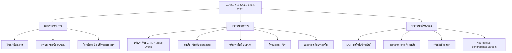

# บทที่ 1: บทสรุปผู้บริหารและภาพรวม

> **บทถัดไป:** [บท 2: จีโนมและวิวัฒนาการ](02-จีโนมและวิวัฒนาการ.md)

---

## 1.1 บทสรุปผู้บริหาร

การทบทวนนี้รวบรวมงานวิจัยกล้วยไม้ (วงศ์ Orchidaceae) ที่สำคัญที่สุดในรอบ 6 ปีที่ผ่านมา (ค.ศ. 2020 – กลางปี 2026) ครอบคลุมทั้งสายวิทยาศาสตร์พื้นฐาน สายการค้า และสายการแพทย์ สาระสำคัญโดยสังเขปมี 7 ข้อ:

### ข้อที่ 1: ยกระดับจากจีโนมรายชนิดสู่ pangenome ระดับสกุล

ช่วง 5 ปีที่ผ่านมา จีโนมกล้วยไม้ก้าวกระโดดจาก "การถอดรหัสชนิดตัวอย่าง" ไปสู่การวิเคราะห์ระดับสกุลทั้งสกุล:

- งาน _pangeneric genome_ ของ **Dendrobium 17 จีโนมระดับโครโมโซม** (Nature Plants 2025) — pangenome ระดับสกุลชิ้นแรกของกล้วยไม้
- งาน _comparative genomics_ ของ **Dendrobium 24 ชนิด บวก genome skimming อีก 204 ชนิด** (Nature Communications 2026) — ชุดข้อมูลใหญ่ที่สุดเท่าที่เคยมีในวงศ์
- งานจีโนม **Vanilla planifolia ครบ 16 คู่โครโมโซม** (BMC Genomics 2026) — ไขปริศนา _partial endoreplication_ ซึ่งเป็นอุปสรรคเฉพาะของจีโนมกล้วยไม้ และวางรากฐานการปรับปรุงพันธุ์ต้าน Fusarium

### ข้อที่ 2: กล้วยไม้สีน้ำเงินแท้ — หมุดหมายที่สำเร็จแล้ว

- **Phalaenopsis 'Blue Gene' (311NR)** ของบริษัท ISK ญี่ปุ่น — กล้วยไม้สีฟ้าแท้เชิงพาณิชย์รายแรกของโลก วางตลาดปี 2022 หลังพัฒนานาน **17 ปี** ผ่านการประเมิน USDA-APHIS แล้ว
- งาน blueprint ระดับโมเลกุลอธิบายว่าทำไมกล้วยไม้ส่วนใหญ่จึงมีแต่ cyanidin ไม่มี delphinidin (Liang et al., BMC Plant Biology 2020) — transient expression ได้ delphinidin 53.6%
- เส้นทาง non-GMO ด้วยการผสมข้ามสกุล Phalaenopsis × Rhynchostylis coelestis ได้ Rhynchonopsis Tariflor Blue Kid '1030-4' (Wu et al., HortScience 2022)

### ข้อที่ 3: CRISPR ก้าวข้ามคอขวดของกล้วยไม้

- งานแรกของวงศ์: Dendrobium officinale, transformants บวก 93.6% (Kui et al., 2017)
- Multiplex editing: ตัด MADS 3 ยีนพร้อมกัน ได้ non-chimeric triple mutants **60%** (Tong et al., 2020)
- ล่าสุดปี 2026: **VIGE แบบ transgene-free** ผ่านไวรัส CymMV ได้ indel **47% ใน 20 วัน** ไม่ต้อง transformation ถาวร — หลบเลี่ยงกฎระเบียบ GMO ของ EU/ญี่ปุ่น

### ข้อที่ 4: กล้วยไม้คือห้องทดลองธรรมชาติของวิวัฒนาการดอกไม้

- กลไก MADS-box เอกลักษณ์เฉพาะ: labellum, column, pollinia, เมล็ดไร้เอนโดสเปิร์ม
- การล่อแมลงแบบ sexual deception ถูกถอดรหัสทั้งจีโนม (Ophrys sphegodes, 2024)
- ไมคอร์ไรซาแบบผูกขาดชนิด (Tulasnella) และ CAM photosynthesis ที่เกิดซ้ำหลายสายวิวัฒน์

### ข้อที่ 5: วิกฤตการอนุรักษ์ที่รุนแรงที่สุดในบรรดาพืช

- ประมาณการ **55.6–69.2% ของกล้วยไม้โลกเสี่ยงสูญพันธุ์** (Biodiversity and Conservation 2025) สูงกว่าพืชมีดอกโดยรวม (41.7%)
- เทคโนโลยีการฟื้นฟูประชากร (fungus-seed bags, sgOMF, cryopreservation) ก้าวหน้าอย่างรวดเร็ว
- บทเรียนระยะยาว (Ghost orchid ติดตาม 7 ปี) เตือนว่า reintroduction ต้องทำครบทั้งพันธุกรรม แมลงผสมเกสร และ microsite

### ข้อที่ 6: สมุนไพรกล้วยไม้สู่หลักฐานเชิงกลไก

- โพลีแซ็กคาไรด์จาก Dendrobium officinale มีหลักฐานกลไกต้านเบาหวานผ่าน gut microbiota ระดับ quantitative (ยับยั้ง Helicobacter 94.57%)
- สาร phenanthrene จากกล้วยไม้ IC50 ระดับ 0.20–0.42 µM (แรงกว่า cisplatin 10–20 เท่า)
- การสังเคราะห์วานิลลินด้วยชีววิทยาสังเคราะห์ทำสถิติใหม่ **3,619 มก./ล. ในเครื่องปฏิกรณ์ 5 ลิตร** (2025)

### ข้อที่ 7: อุตสาหกรรมไทยยืนแถวหน้าตัดดอก แต่พลาดเทรนด์กระถาง

- ไทยส่งออกกล้วยไม้ตัดดอกปี 2567 มูลค่า 62.1 ล้านเหรียญสหรัฐ (อันดับ 1–2 ของโลกตามฐานข้อมูล)
- ตลาดโลกเปลี่ยนสู่กระถาง Phalaenopsis (CAGR 7.8%) ขณะที่ไทยยังพึ่ง Dendrobium ตัดดอกเกิน 90%
- งานวิจัยไทย (NPV, พันธุ์ต้านโรค, 1-MCP ไมโครบับเบิล, IoT โรงเรือน) พร้อมขยายผล แต่ยังขาดจีโนมกล้วยไม้การค้าของตัวเอง

---

## 1.2 ความรู้พื้นฐาน: วงศ์กล้วยไม้คืออะไร

### 1.2.1 ตัวเลขความหลากหลายระดับโลก

| ตัวชี้วัด                         | ตัวเลข                                       | หมายเหตุ                           |
| --------------------------------- | -------------------------------------------- | ---------------------------------- |
| ชนิดในวงศ์ Orchidaceae            | **~28,000 ชนิด** (สูงถึง 31,000 รวมสกุลย่อย) | วงศ์พืชดอกใหญ่ที่สุดในโลก          |
| สกุล                              | 700–800 สกุล                                 | —                                  |
| สัดส่วนต่อพืชมีดอก                | เกือบ 1 ใน 10                                | —                                  |
| สัดส่วนที่เป็นอิงอาศัย (epiphyte) | **~70%**                                     | อยู่บนต้นไม้พี่เลี้ยง (phorophyte) |
| สัดส่วนในบัญชี CITES              | **>70% ของชนิดทั้งหมดในบัญชี**               | มากกว่าพืชวงศ์อื่นใด               |
| ชนิดที่ถูกประเมินเชิงภูมิศาสตร์   | 25,434 ชนิด (89.3%)                          | hotspot: Neotropics + นิวกินี      |

### 1.2.2 กล้วยไม้ไทย

- **ประมาณ 1,100–1,300 ชนิด ใน 170–190 สกุล** (ตัวเลขหลักจาก รศ.ดร.อบฉันท์ ไทยทอง: 1,133 ชนิด 177 สกุล)
- การสำรวจเขตรักษาพันธุ์สัตว์ป่าเขาคระแก้วเพียงพื้นที่เดียวพบ 49 สกุล 95 ชนิด
- ชนิดเด่นระดับสัญลักษณ์: ฟ้ามุ่ย (Vanda coerulea), เอื้องเงิน เอื้องคำ เอื้องผึ้ง, เอื้องแปรงลิปสติก, รองเท้านารี 14–17 ชนิด
- สายพันธุ์ใหม่ยังถูกค้นพบต่อเนื่อง (2565–2566): Thrixspermum ใหม่ 6 ชนิด, Corybas papillatus (CR), Aphyllorchis periactinantha

### 1.2.3 การคัดเลือกต้นไม้พี่เลี้ยง

- ~70% ของกล้วยไม้ทั้งวงศ์เจริญบน phorophyte
- การเลือกต้นไม้พี่เลี้ยงขึ้นกับ **ความสามารถอุ้มน้ำของเปลือกไม้ (bark water storage capacity) มากกว่าเคมีของเปลือก** (American Journal of Botany 107(5):726–734, 2020)
- นัยเชิงการฟื้นฟูป่า: สงวนต้นไม้เปลือกอุ้มน้ำเป็น "ต้นแม่" ของกล้วยไม้

---

## 1.3 ทำไมกล้วยไม้จึงเป็นระบบแบบจำลอง (Model System) ระดับโลก

| ลักษณะเฉพาะ                                                  | นัยต่อการวิจัย                                   |
| ------------------------------------------------------------ | ------------------------------------------------ |
| เมล็ดไร้เอนโดสเปิร์ม ขนาดฝุ่น (dust-like)                    | ต้องพึ่งไมคอร์ไรซาในการงอก — แบบจำลอง symbiosis  |
| ดอกมีโครงสร้างเฉพาะ (labellum, column, pollinia)             | แบบจำลองวิวัฒนาการของยีน MADS-box และ speciation |
| กลยุทธ์ผสมเกสรหลากหลาย (deception, reward, sexual deception) | แบบจำลองวิวัฒนาการร่วมกับแมลงผสมเกสร             |
| CAM photosynthesis ในกล้วยไม้อิงอาศัย                        | แบบจำลองการปรับตัวต่อความเครียดน้ำ               |
| Dendrobium, Phalaenopsis เป็นพืชการค้าระดับโลก               | เชื่อมงานพื้นฐานสู่การประยุกต์เชิงพาณิชย์        |
| สมุนไพรแผนโบราณเอเชีย (Dendrobium, Gastrodia, Bletilla)      | แบบจำลอง drug discovery จากธรรมชาติ              |

### ตัวอย่างการประยุกต์ใช้เป็นแบบจำลอง

1. **การงอกแบบพึ่งพา (mycoheterotrophy เบื้องต้น):** เมล็ดกล้วยไม้ต้องได้รับเชื้อราสร้าง peloton ในเซลล์ก่อนจึงงอกได้ — ใช้ศึกษาวิกฤต "เช้า-กลางคืน" ของ symbiosis พืช-จุลินทรีย์
2. **การหลอกลวงแมลง:** ~30% ของกล้วยไม้ใช้ deception (ไม่ให้น้ำหวาน) — ระบบทดสอบทฤษฎี evolution ของการหลอกลวงและการเลียนแบบ
3. **CAM:** กล้วยไม้สลับ C3↔CAM ตามความเครียดน้ำ — เป้าหมายวิศวกรรมพืชทนแล้งในอนาคต
4. **ความต้านทานโรค:** กล้วยไม้มียีน NBS-LRR น้อยผิดปกติ (186 ยีน/4 จีโนม) — คำถามเปิดว่าเหตุใดวงศ์ที่มียีนป้องกันโรคน้อยจึงอยู่รอดมาได้

---

## 1.4 แผนภาพรวมทั้งคลัง (Mermaid)

---

## 1.5 ระเบียบวิธีรวบรวม

- ฐานข้อมูลหลัก: เว็บไซต์ผู้จัดพิมพ์วารสาร (Nature, Science, Elsevier, Wiley, Frontiers, MDPI, ACS), PubMed/PMC, Crossref
- แหล่งสถาบัน: CIRAD (วานิลลา), USDA-APHIS (Blue Gene), NSTDA/BIOTEC, กรมวิชาการเกษตร, สวนพฤกษศาสตร์สิริกิติ์, กระทรวงพาณิชย์
- ภาษา/เวลา: เน้นงาน 2020–กลางปี 2026 รวมงานพื้นฐานคลาสสิกที่จำเป็น
- ข้อจำกัดโดยรวม: ไม่ได้เข้าถึง Scopus/Web of Science แบบสมาชิก; งาน preprint อ้างด้วยความระมัดระวัง (ดูรายละเอียดใน [บท 11](11-ข้อเสนอเชิงนโยบายและแนวโน้มอนาคต.md))

---

_บทถัดไป: [02-จีโนมและวิวัฒนาการ.md](02-จีโนมและวิวัฒนาการ.md)_
